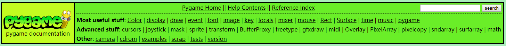
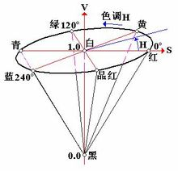
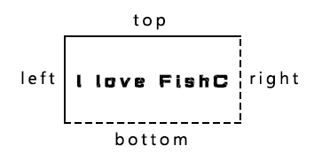
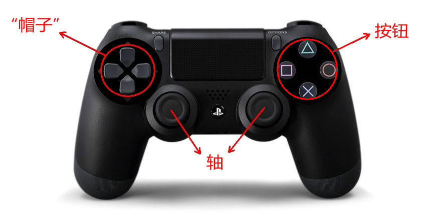
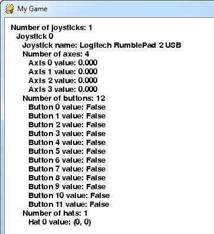

# Pygame详解：前言

Pygame官网：[https://www.pygame.org](https://www.pygame.org/)

Pygame的官网是有详细的文档的：https://www.pygame.org/docs/

下图是Pygame 的所有类和模块，都有对应的文档，



# Pygame详解（一）：Color类

## **class pygame.Color**

Pygame 中用于描述颜色的对象。

Color(name) -> Color

Color(r, g, b, a) -> Color

Color(rgbvalue) -> Color

## **方法 & 属性**

- pygame.Color.r — 获取或设置 Color 对象的红色值
- pygame.Color.g — 获取或设置 Color 对象的绿色值
- pygame.Color.b — 获取或设置 Color 对象的蓝色值
- pygame.Color.a — 获取或设置 Color 对象的 alpha 值
- pygame.Color.cmy — 获取或设置 Color 对象表示的 CMY 值
- pygame.Color.hsva — 获取或设置 Color 对象表示的 HSVA 值
- pygame.Color.hsla — 获取或设置 Color 对象表示的 HSLA 值
- pygame.Color.i1i2i3 — 获取或设置 Color 对象表示的 I1I2I3 值
- pygame.Color.normalize() — 返回 Color 对象的标准化 RGBA 值
- pygame.Color.correct_gamma() — 应用一定的伽马值调整 Color 对象
- pygame.Color.set_length() — 设置 Color 对象的长度（成员数量）

Pygame 使用 Color 类表示 RGBA 颜色值，每个颜色值的取值范围是 0 ~ 255。允许通过基本的算术运算创造新的颜色值，支持转换为其他颜色空间，例如 HSV 或 HSL，并让你调整单个颜色通道。当没有给出 alpha 的值是，默认是 255（不透明）。

“RGB值”可以是一个颜色名，一个 HTML 颜色格式的字符串，一个 16 进制数的字符串，或者一个整型像素值。HTML 格式是 "#rrggbbaa"，其中 "rr"，"gg"，"bb"，"aa" 都是 2 位的 16 进制数。代表 alpha 的 "aa" 是可选的。16 进制数的字符串组成形式为 "0xrrggbbaa"，当然，其中的 "aa" 也是可选的。

Pygame 1.9.0 之后，颜色对象支持与其他颜色对象进行等值比较（3 或 4 整型元组）。

在 Pygame 1.8.1 中有一个 bug，就是 alpha 的默认值被设置为 0，而不是 255。

Color 对象采用 C 级别的接口输出。输出为只读的一维无符号字节数组，分配与 color 对象相同的长度。对于 CPython 2.6 以后的版本，新的缓冲区接口（与数组接口具有相同的特性）也会被输出。Pygame 1.9.2 新增加的。

Color 的新实现在 Pygame 1.8.1 中完成。

## **方法 & 属性详解**

### **r**

获取或设置 Color 对象的红色值。

r -> int

Color 对象的红色值。

### **g**

获取或设置 Color 对象的绿色值。

g -> int

Color 对象的绿色值。

### **b**

获取或设置 Color 对象的蓝色值。

b -> int

Color 对象的蓝色值。

### **a**

获取或设置 Color 对象的 alpha 值。

a -> int

Color 对象的 alpha 值。

### **cmy**

获取或设置 Color 对象表示的 CMY 值。

cmy -> tuple

Color 对象表示的 CMY 值。CMY 每个分量的范围是 C = [0, 1]，M = [0, 1]，Y = [0, 1]。

注意：由于 RGB 值应设为 0 ~ 255，而 CMY 值为 0 ~ 1，因此无法绝对准确地返回所有 RGB 值对应的 CMY 值，会有少许偏差。

温馨提示：CMY 是青（Cyan）、洋红或品红（Magenta）和黄（Yellow）三种颜色的简写，是相减混色模式，用这种方法产生的颜色之所以称为相减色，乃是因为它减少了为视觉系统识别颜色所需要的反射光。由于彩色墨水和颜料的化学特性，用三种基本色得到的黑色不是纯黑色，因此在印刷术中，常常加一种真正的黑色（black ink），这种模型称为 CMYK 模型，广泛应用于印刷术。每种颜色分量的取值范围为0~100；CMY常用于纸张彩色打印方面。

### **hsva**

获取或设置 Color 对象表示的 HSVA 值。

hsva -> tuple

Color 对象表示的 HSVA 值。HSVA 每个分量的范围是 H = [0, 360]，S = [0, 100]，V = [0, 100]，A = [0, 100]。

注意：由于 RGB 值应设为 0 ~ 255，而 HSV 值为 0 ~ 100 和 0 ~ 360，因此无法绝对准确地返回所有 RGB 值对应的 HSV 值，会有少许偏差。

温馨提示：HSV 色彩模型中颜色的参数分别是：色调（H），饱和度（S），亮度（V）。RGB 和 CMY 颜色模型都是面向硬件的，而 HSV（Hue Saturation Value）颜色模型是面向用户的。HSV 模型的三维表示从 RGB 立方体演化而来。设想从 RGB 沿立方体对角线的白色顶点向黑色顶点观察，就可以看到立方体的六边形外形。六边形边界表示色彩，水平轴表示纯度，明度沿垂直轴测量。

 

### **hsla**

获取或设置 Color 对象表示的 HSLA 值。

hsla -> tuple

Color 对象表示的 HSLA 值。HSLA 每个分量的范围是 H = [0, 360]，S = [0, 1]，L = [0, 1]，A = [0, 1]。

注意：由于 RGB 值应设为 0 ~ 255，而 HSL 值为 0 ~ 1 和 0 ~ 360，因此无法绝对准确地返回所有 RGB 值对应的 HSL 值，会有少许偏差。

温馨提示：HSL 色彩模型是工业界的一种颜色标准，是通过对色相（H）、饱和度（S）、明度（L）三个颜色通道的变化以及它们相互之间的叠加来得到各式各样的颜色的，HSL 即是代表色相，饱和度，明度三个通道的颜色，这个标准几乎包括了人类视力所能感知的所有颜色，是目前运用最广的颜色系统之一。

### **i1i2i3**

获取或设置 Color 对象表示的 I1I2I3 值。

Color 对象表示的 I1I2I3 值。I1I2I3 每个分量的范围是 I1 = [0, 1]，I2 = [-0.5, 0.5]，I3 = [-0.5, 0.5]。

注意：由于 RGB 值应设为 0 ~ 255，而 I1I2I3 值为 0 ~ 1 和 -0.5 ~ 0.5，因此无法绝对准确地返回所有 RGB 值对应的 I1I2I3 值，会有少许偏差。

温馨提示：I1I2I3 是与 RGB 类似的颜色空间，转化公式为：I1 = (R + G + B) / 3，I2 = (G - B) / 2，I3 = (2G - R - B) / 4。

### **normalize()**

返回 Color 对象的标准化 RGBA 值。

normalize() -> tuple

返回 Color 对象的标准化 RGBA 值。每个分量的值是浮点数表示。

温馨提示：但这里每个分量的值不是整数范围 0 ~ 255，而是转化为浮点数范围 0 ~ 1。

### **correct_gamma()**

应用一定的伽马值调整 Color 对象。

correct_gamma (gamma) -> Color

应用一定的伽马值调整 Color 对象，并返回调整后的 RGBA 值。

### **set_length()**

设置 Color 对象的长度（成员数量）。

set_length(len) -> None

默认值是 4，它可以被设置为 1，2，3 或 4。这对于解压为 r，g，b 而不是 r，g，b，a 很有用。如果你希望得到一个 Color 对象的长度，你可以使用 len(color) 获得。

温馨提示：color.set_length(2) 它只是修改了 __len__()，而不是真的把其中两个成员扔掉……


# Pygame详解（二）：display 模块

## **pygame.display**

Pygame 中用于控制窗口和屏幕显示的模块。

注：为了适应语境，display 在该文档中有时翻译为“显示”，有时翻译为“显示界面”。

## **函数**

- pygame.display.init() — 初始化 display 模块
- pygame.display.quit() — 结束 display 模块
- pygame.display.get_init() — 如果 display 模块已经初始化，返回 True
- pygame.display.set_mode() — 初始化一个准备显示的窗口或屏幕
- pygame.display.get_surface() — 获取当前显示的 Surface 对象
- pygame.display.flip() — 更新整个待显示的 Surface 对象到屏幕上
- pygame.display.update() — 更新部分软件界面显示
- pygame.display.get_driver() — 获取 Pygame 显示后端的名字
- pygame.display.Info() — 创建有关显示界面的信息对象
- pygame.display.get_wm_info() — 获取关于当前窗口系统的信息
- pygame.display.list_modes() — 获取全屏模式下可使用的分辨率
- pygame.display.mode_ok() — 为显示模式选择最合适的颜色深度
- pygame.display.gl_get_attribute() — 获取当前显示界面 OpenGL 的属性值
- pygame.display.gl_set_attribute() — 设置当前显示模式的 OpenGL 属性值
- pygame.display.get_active() — 当前显示界面显示在屏幕上时返回 True
- pygame.display.iconify() — 最小化显示的 Surface 对象
- pygame.display.toggle_fullscreen() — 切换全屏模式和窗口模式
- pygame.display.set_gamma() — 修改硬件显示的 gama 坡道
- pygame.display.set_gamma_ramp() — 自定义修改硬件显示的 gama 坡道
- pygame.display.set_icon() — 修改显示窗口的图标
- pygame.display.set_caption() — Set the current window caption
- pygame.display.get_caption() — Get the current window caption
- pygame.display.set_palette() — Set the display color palette for indexed displays

这个模块提供控制 Pygame 显示界面（display）的各种函数。Pygame 的 Surface 对象即可显示为一个窗口，也可以全屏模式显示。当你创建并显示一个常规的 Surface 对象后，在该对象上的改变并不会立刻反映到可见屏幕上，你必须选择一个翻转函数来显示改动后的画面。

显示的原点是 (x=0, y=0) 的位置，及屏幕的左上角，坐标轴向右下角增长。

Pygame 的 display 事实上可以有几种初始化的方式。默认情况下，display 作为一个软件驱动的帧缓冲区。除此之外，你可以使用硬件加速和 OpenGL 支持的特殊模块。这些是通过给 pygame.display.set_mode() 传入 flags 参数来控制的。

Pygame 在任何时间内都只允许有一个显示界面。使用 pygame.display.set_mode() 创建的新显示界面会自动替换掉旧的。如果需要精确控制像素格式或显示分辨率，使用 pygame.display.mode_ok()，pygame.display.list_modes()，和 pygame.display.Info() 来查询显示界面相关的信息。

一旦 Surface 对象的显示界面被创建出来，这个模块的函数就只影响当前的显示界面。如果该模块未初始化， Surface 对象也会变为“非法”。如果新的显示模式被设置，当前的 Surface 对象将会自动切换到新的显示界面。

当一个新的显示模式被设置，会在 Pygame 的事件队列中放入几个相关事件。当用于希望关闭程序时，pygame.QUIT 事件会被发送；当显示界面获得和失去焦点时，窗口会得到 pygame.ACTIVEEVENT 事件；如果显示界面设置了 pygame.RESIZABLE 标志，那么当用户调整窗口尺寸时，pygame.VIDEORESIZE 事件会被发送；硬件显示指当接收到 pygame.VIDEOEXPOSE 事件时，将部分需要被重绘的窗口直接绘制到屏幕上。

一些显示环境拥有自动拉伸所有窗口的选项。当该选项被启动时，自动拉伸会扭曲 Pygame 窗口的外观。在 Pygame 的例子目录中，有一个演示代码（prevent_display_stretching.py）展示如何在微软系统（Vista 以上系统）中关闭 Pygame 显示的自动拉伸属性。

## **函数详解**

### **pygame.display.init()**

初始化 display 模块。

init() -> None

初始化 Pygame 的 display 模块。在初始化之前，display 模块无法做任何事情。但当你调用更高级别的 pygame.init()，变会自动调用 pygame.display.init() 进行初始化。

初始化后，Pygame 将自动从几个内部的显示后端中选择一个。显示模式由平台和当前用户权限决定。在 display 模块被初始化之前，可以通过环境变量 SDL_VIDEODRIVER 设置哪一个显示后端将被使用。具有多种显示后端的系统如下：

> Windows : windib, directx
> Unix : x11, dga, fbcon, directfb, ggi, vgl, svgalib, aalib

在一些平台上，可以将 Pygame 的 display 嵌入到已经存在的窗口中。如果这么做，环境变量 SDL_WINDOWID 必须被设置为一个包含窗口 ID 或句柄的字符串。当 Pygame 的 display 被初始化的时候，将检测环境变量。注意，在一个运行的窗口嵌入 display 会产生许多奇怪的副作用。

多次调用该函数并没有任何问题，但也不会有什么效果。

### **pygame.display.quit()**

结束 display 模块。

quit() -> None

这个函数会关闭整个 display 模块。这将意味着任何一个活跃的显示界面都将被关闭。当主程序退出时，该函数也会被自动调用。

多次调用该函数并没有任何问题，但也不会有什么效果。

### **pygame.display.get_init()**

如果 display 模块已经初始化，返回 True。

get_init() -> bool

如果 display 模块已经初始化，返回 True。

### **pygame.display.set_mode()**

初始化一个准备显示的窗口或屏幕。

set_mode(resolution=(0,0), flags=0, depth=0) -> Surface

这个函数将创建一个 Surface 对象的显示界面。传入的参数用于指定显示类型。最终创建出来的显示界面将是最大可能地匹配当前操作系统。

resolution 参数是一个二元组，表示宽和高。flags 参数是附件选项的集合。depth 参数表示使用的颜色深度。

返回的 Surface 对象可以像常规的 Surface 对象那样去绘制，但发生的改变最终会显示到屏幕上。

如果没有传入 resolution 参数，或者使用默认设置 (0, 0)，且 Pygame 使用 SDL1.2.10 以上版本，那么创建出来的 Surface 对象将与当前屏幕用户一样的分辨率。如果只有宽或高其中一项被设置为 0，那么 Surface 对象将使用屏幕分辨率的宽或高代替它。如果 SDL 版本低于 1.2.10，那么将抛出异常。

通常来说，最好的做法是不要传递 depth 参数。因为默认 Pygame 会根据当前操作系统选择最好和最快的颜色深度。如果你的游戏确实需要一个特殊的颜色格式，那么你可以通过控制 depth 参数来实现。Pygame 将为模拟一个非现成的颜色深度而耗费更多的时间。

当使用全屏显示模式的时候，有时候无法完全匹配到需要的分辨率。在这种情况下，Pygame 将自动选择最匹配的分辨率使用，而返回的 Surface 对象将保持与需求的分辨率一致。

flags 参数指定你想要的显示类型。提供几个选择给你，你可以通过位操作同时使用多个类型（管道操作符 "|"）。如果你传入 0 或没有传入 flags 参数，默认会使用软件驱动窗口。这儿是 flags 参数提供的几个可选项：

| **选项**          | **含义**                                              |
| ----------------- | ----------------------------------------------------- |
| pygame.FULLSCREEN | 创建一个全屏显示                                      |
| pygame.DOUBLEBUF  | 1. 双缓冲模式  2. 推荐和 HWSURFACE 或 OPENGL 一起使用 |
| pygame.HWSURFACE  | 硬件加速，只有在 FULLSCREEN 下可以使用                |
| pygame.OPENGL     | 创建一个 OPENGL 渲染的显示                            |
| pygame.RESIZABLE  | 创建一个可调整尺寸的窗口                              |
| pygame.NOFRAME    | 创建一个没有边框和控制按钮的窗口                      |

举个例子：

```python
# 在屏幕中创建一个 700 * 400 的窗口
screen_width=700
screen_height=400
screen=pygame.display.set_mode([screen_width, screen_height])
```

### **pygame.display.get_surface()**

获取当前显示的 Surface 对象。

get_surface() -> Surface

返回当前显示的 Surface 对象。如果没有设置任何显示模式，那么返回 None。

### **pygame.display.flip()**

更新整个待显示的 Surface 对象到屏幕上。

flip() -> None

这个函数将更新整个显示界面的内容。如果你的显示模式使用了 pygame.HWSURFACE（硬件加速）和 pygame.DOUBLEBUF（双缓冲）标志，那么将等待垂直会扫并切换显示界面。如果你使用不同类型的显示模式，那么它将简单的更新整个显示界面的内容。

当使用 pygame.OPENGL（使用 OPENGL 渲染）显示模式时，将创建一个 gl 缓冲切换区。

温馨提示：垂直回扫是与视频显示相关的时间测量，它代表了一个帧的结束和下一帧的开始时间之间的时间间隔。

### **pygame.display.update()**

更新部分软件界面显示。

update(rectangle=None) -> None

update(rectangle_list) -> None

这个函数可以看作是 pygame.display.flip() 函数在软件界面显示的优化版。它允许更新屏幕的部分内容，而不必完全更新。如果没有传入任何参数，那么该函数就像 pygame.display.flip() 那样更新整个界面。

你可以传递一个或多个矩形区域给该函数。一次性传递多个矩形区域比多次传递更有效率。如果传入的是一个空列表或者 None，那么将忽略参数。

该函数不能在 pygame.OPENGL 显示模式下调用，否则会抛出异常。

### **pygame.display.get_driver()**

获取 Pygame 显示后端的名字。

get_driver() -> name

初始化的时候，Pygame 会从多个可用的显示后端中选择一个。这个函数返回显示后端内部使用的名字。可以用来提供有关显示性能加速的一些信息。可以参考 pygame.display.set_mode() 的 SDL_VIDEODRIVER 环境变量。

### **pygame.display.Info()**

创建有关显示界面的信息对象。

Info() -> VideoInfo

创建一个对象，包含对当前图形环境一些属性的描述。在一些平台上，如果这个函数在 pygame.display.set_mode() 前被调用，可以提供一些关于默认显示模式的信息。也可以在设置完显示模式后调用该函数，以确认显示选项是否如愿以偿。

返回的 VideoInfo 对象包含以下这些属性：

| **属性**             | **含义**                                                     |
| -------------------- | ------------------------------------------------------------ |
| hw                   | 如果是 True，则表示启用硬件加速                              |
| wm                   | 如果是 True，则表示显示窗口模式                              |
| video_mem            | 表示显存是多少兆字节（mb），0 表示不清楚                     |
| bitsize              | 表示每个像素存放多少位                                       |
| bytesize             | 表示每个像素存放多少字节                                     |
| masks                | 4 个值用于打包像素的 RGBA 值                                 |
| shifts               | 4 个值用于打包像素的 RGBA 值                                 |
| losses               | 4 个值用于打包像素的 RGBA 值                                 |
| blit_hw              | 如果是 True，则表示加速硬件驱动的 Surface 对象绘制           |
| blit_hw_CC           | 如果是 True，则表示加速硬件驱动的 Surface 对象 colorkey 绘制 |
| blit_hw_A            | 如果是 True，则表示加速硬件驱动的 Surface 对象 pixel alpha 绘制 |
| blit_sw              | 如果是 True，则表示加速软件驱动的 Surface 对象绘制           |
| blit_sw_CC           | 如果是 True，则表示加速软件驱动的 Surface 对象 colorkey 绘制 |
| blit_sw_A            | 如果是 True，则表示加速软件驱动的Surface 对象 pixel alpha 绘制 |
| current_w, current_h | 1. 表示当前显示模式的宽和高（如果在 display.set_mode() 前被调用，则表示当前桌面的宽和高） 2. current_w, current_h 在 Pygame 1.8.0 以后，SDL 1.2.10 以后才支持 3. -1 表示错误，或者 SDL 版本太旧 |

### **pygame.display.get_wm_info()**

获取关于当前窗口系统的信息。

get_wm_info() -> dict

创建一个由操作系统填充数据的字典。一些操作系统可能不会往里边填充信息，则返回一个空字典。大多数平台将返回一个 "window" 键，对应的值是当前显示界面的系统 ID。

Pygame 1.7.1 新增加的。

### **pygame.display.list_modes()**

获取全屏模式下可使用的分辨率。

list_modes(depth=0, flags=pygame.FULLSCREEN) -> list

这个函数返回一个列表，包含指定颜色深度所支持的所有分辨率。如果显示模式非全屏，则返回一个空列表。如果返回 -1 表示支持任何分辨率（类似于窗口模式）。返回的列表由大到小排列。

如果颜色深度是 0，SDL 将选择当前/最合适的颜色深度显示。flags 参数默认值是 pygame.FULLSCREEN，但你可能需要添加额外的全屏模式标志。

### **pygame.display.mode_ok()**

为显示模式选择最合适的颜色深度。

mode_ok(size, flags=0, depth=0) -> depth

这个函数使用与 pygame.display.set_mode() 函数一样的参数。一般用于判断一个显示模式是否可用。如果显示模式无法设置，则返回 0。正常情况下将会返回显示需求的像素深度。

通常不用理会 depth 参数，除非一些支持多个显示深度的平台，它会提示哪个颜色深度是更合适的。

最有用的 flags 参数是 pygame.HWSURFACE，pygame.DOUBLEBUF 和 pygame.FULLSCREEN。如果这些标志不支持，那么该函数会返回 0。

### **pygame.display.gl_get_attribute()**

获取当前显示界面 OpenGL 的属性值。

gl_get_attribute(flag) -> value

在调用设置了 pygame.OPENGL 标志的 pygame.display.set_mode() 函数之后，检查 OpenGL 的属性值不失为一个好的习惯。参考 pygame.display.gl_set_attribute() 关于合法标志的列表。

### **pygame.display.gl_set_attribute()**

设置当前显示模式的 OpenGL 属性值。

gl_set_attribute(flag, value) -> None

当调用设置了 pygame.OPENGL 标志的 pygame.display.set_mode() 函数时，Pygame 会自动设置 OpenGL 的一些属性值，例如颜色和双缓冲区。OpenGL 其实还提供了其他一些属性值供你控制。在 flag 参数中传入属性名，并将其值设置在 value 参数中。这个函数必须在 pygame.display.set_mode() 前设置。

这些 OPENGL 标志是：

> GL_ALPHA_SIZE, GL_DEPTH_SIZE, GL_STENCIL_SIZE, GL_ACCUM_RED_SIZE,
> GL_ACCUM_GREEN_SIZE, GL_ACCUM_BLUE_SIZE, GL_ACCUM_ALPHA_SIZE,
> GL_MULTISAMPLEBUFFERS, GL_MULTISAMPLESAMPLES, GL_STEREO

### **pygame.display.get_active()**

当前显示界面显示在屏幕上时返回 True。

get_active() -> bool

pygame.display.set_mode() 函数被调用之后，Surface 对象将被显示在屏幕上。大多数窗口都支持隐藏，如果显示的 Surface 对象被隐藏和最小化，那么该函数将返回 False。

### **pygame.display.iconify()**

最小化显示的 Surface 对象。

iconify() -> bool

将显示的Surface 对象最小化或隐藏。并不是所有的操作系统都支持最小化显示界面。如果该函数调用成功，返回 True。

当显示界面最小化时，pygame.display.get_active() 返回 False。事件队列将接收到 ACTIVEEVENT 事件。

### **pygame.display.toggle_fullscreen()**

切换全屏模式和窗口模式。

toggle_fullscreen() -> bool

切换全屏模式和窗口模式。这个函数只在 unix x11 显示驱动下工作。在大多数情况下，建议调用 pygame.display.set_mode() 创建一个新的显示模式进行切换。

### **pygame.display.set_gamma()**

修改硬件显示的 gama 坡道。

set_gamma(red, green=None, blue=None) -> bool

设置硬件驱动显示的红色、绿色和蓝色伽马值。如果没有传递 green 和 blue 参数，它们将与 red 值相等。不是所有的操作系统和硬件都支持伽马坡道。如果函数修改成功，则返回 True。

伽马值为 1.0 创建一个线性颜色表，较低的值会使屏幕变暗，较高的值会使屏幕变量。

### **pygame.display.set_gamma_ramp()**

自定义修改硬件显示的 gama 坡道

set_gamma_ramp(red, green, blue) -> bool

使用自定义表设置硬件驱动显示的红色、绿色和蓝色伽马坡道。每个参数必须是 256 位整数的列表。每位整数应该在 0 和 0xffff 之间。不是所有的操作系统和硬件都支持伽马坡道。如果函数修改成功，则返回 True。

### **pygame.display.set_icon()**

修改显示窗口的图标。

set_icon(Surface) -> None

设置显示窗口执行时的图标。所有的操作系统默认都是以简单的 Pygame LOGO 作为图标。

你可以传入任何 Surface 对象作为图标，但大多数操作系统要求图标的大小是 32 * 32。图标可以设置 colorkey 透明度。

一些操作系统不允许修改显示中的窗口图标。对于这类操作系统，该函数需要再调用 pygame.display.set_mode() 前先创建并设置图标。

### **pygame.display.set_caption()**

设置当前窗口的标题栏。

set_caption(title, icontitle=None) -> None

如果显示窗口拥有一个标题栏，这个函数将修改窗口标题栏的文本。一些操作系统支持最小化窗口时切换标题栏，通过设置 icontitle 参数实现。

### **pygame.display.get_caption()**

获取当前窗口的标题栏。

get_caption() -> (title, icontitle)

返回当前窗口的标题栏和最小化标题栏，通常这两个值是一样的。

### **pygame.display.set_palette()**

设置显示界面的调色板。

set_palette(palette=None) -> None

这个函数将修改显示界面的 8 位调色板。这不会改变Surface 对象实际的调色板，仅用于 Surface 对象的显示。如果没有传入参数，将恢复系统默认调色板。调色板是一组 RGB 三元组序列。

# Pygame详解（三）：draw 模块

## **pygame.draw**

Pygame 中绘制图形的模块。

## **函数**

- pygame.draw.rect() — 绘制矩形
- pygame.draw.polygon() — 绘制多边形
- pygame.draw.circle() — 根据圆心和半径绘制圆形
- pygame.draw.ellipse() — 根据限定矩形绘制一个椭圆形
- pygame.draw.arc() — 绘制弧线
- pygame.draw.line() — 绘制线段
- pygame.draw.lines() — 绘制多条连续的线段
- pygame.draw.aaline() — 绘制抗锯齿的线段
- pygame.draw.aalines() — 绘制多条连续的线段（抗锯齿）

该模块用于在 Surface 对象上绘制一些简单的形状。这些函数将渲染到任何格式的 Surface 对象上。硬件渲染会比普通的软件渲染更耗时。

大部分函数用 width 参数指定图形边框的大小，如果 width = 0 则表示填充整个图形。

所有的绘图函数仅能在 Surface 对象的剪切区域生效。这些函数返回一个 Rect，表示包含实际绘制图形的矩形区域。

大部分函数都有一个 color 参数，传入一个表示 RGB 颜色值的三元组，当然也支持 RGBA 四元组。其中的 A 是 Alpha 的意思，用于控制透明度。不过该模块的函数并不会绘制透明度，而是直接传入到对应 Surface 对象的 pixel alphas 中。color 参数也可以是已经映射到 Surface 对象的像素格式中的整型像素值。

当这些函数在绘制时，必须暂时锁定 Surface 对象。许多连续绘制的函数可以通过一次性锁定直到画完再解锁来提高效率。

## **函数详解**

### **pygame.draw.rect()**

绘制矩形。

rect(Surface, color, Rect, width=0) -> Rect

在 Surface 对象上绘制一个矩形。Rect 参数指定矩形的位置和尺寸。width 参数指定边框的宽度，如果设置为 0 则表示填充该矩形。

### **pygame.draw.polygon()**

绘制多边形。

### polygon(Surface, color, pointlist, width=0) -> Rect

在 Surface 对象上绘制一个多边形。pointlist 参数指定多边形的各个顶点。width 参数指定边框的宽度，如果设置为 0 则表示填充该矩形。

绘制一个抗锯齿的多边形，只需要将 aalines() 的 closed 参数设置为 True 即可。

### **pygame.draw.circle()**

根据圆心和半径绘制圆形。

circle(Surface, color, pos, radius, width=0) -> Rect

在 Surface 对象上绘制一个圆形。pos 参数指定圆心的位置，radius 参数指定圆的半径。width 参数指定边框的宽度，如果设置为 0 则表示填充该矩形。

### **pygame.draw.ellipse()**

根据限定矩形绘制一个椭圆形。

ellipse(Surface, color, Rect, width=0) -> Rect

在 Surface 对象上绘制一个椭圆形。Rect 参数指定椭圆外围的限定矩形。width 参数指定边框的宽度，如果设置为 0 则表示填充该矩形。

### **pygame.draw.arc()**

绘制弧线。

arc(Surface, color, Rect, start_angle, stop_angle, width=1) -> Rect

在 Surface 对象上绘制一条弧线。Rect 参数指定弧线所在的椭圆外围的限定矩形。两个 angle 参数指定弧线的开始和结束位置。width 参数指定边框的宽度。

### **pygame.draw.line()**

绘制线段。

line(Surface, color, start_pos, end_pos, width=1) -> Rect

在 Surface 对象上绘制一条线段。两端以方形结束。

### **pygame.draw.lines()**

绘制多条连续的线段。

lines(Surface, color, closed, pointlist, width=1) -> Rect

在 Surface 对象上绘制一系列连续的线段。pointlist 参数是一系列短点。如果 closed 参数设置为 True，则绘制首尾相连。

### **pygame.draw.aaline()**

绘制抗锯齿的线段。

aaline(Surface, color, startpos, endpos, blend=1) -> Rect

在 Surface 对象上绘制一条抗锯齿的线段。blend 参数指定是否通过绘制混合背景的阴影来实现抗锯齿功能。该函数的结束位置允许使用浮点数。

### **pygame.draw.aalines()**

绘制多条连续的线段（抗锯齿）。

aalines(Surface, color, closed, pointlist, blend=1) -> Rect

在 Surface 对象上绘制一系列连续的线段（抗锯齿）。如果 closed 参数为 True，则首尾相连。blend 参数指定是否通过绘制混合背景的阴影来实现抗锯齿功能。该函数的结束位置允许使用浮点数。

下边是部分例子，仅供参考：


~~~python
import pygame, sys, math
from pygame.locals import *

pygame.init()

WHITE = (255,255,255)
BLACK = (0,0,0)
GREEN = (0,255,0)
RED = (255,0,0)
BLUE = (0,0,255)

points = [(200,175),(300,125),(400,175),(450,125),(450,225),(400,175),(300,225)]

size = width,height = 640,1000
screen = pygame.display.set_mode(size)
pygame.display.set_caption("Demo")

clock = pygame.time.Clock()
while True:
    for event in pygame.event.get():
        if event.type == pygame.QUIT:
            sys.exit()

    screen.fill(WHITE)

    pygame.draw.rect(screen, BLACK, (50,30,150,50),0)
    pygame.draw.rect(screen, BLACK, (250,30,150,50),1)
    pygame.draw.rect(screen, BLACK, (450,30,150,50),10)

    pygame.draw.polygon(screen, GREEN, points,0)

    pygame.draw.circle(screen, RED, (320,400), 25,1)
    pygame.draw.circle(screen, GREEN, (320,400), 75,1)
    pygame.draw.circle(screen, BLUE, (320,400), 125,1)

    pygame.draw.ellipse(screen, BLACK, (100,600,440,100),1)
    pygame.draw.ellipse(screen, BLACK, (220,550,200,200),1)

    pygame.draw.arc(screen, BLACK, (100,800,440,100), 0, math.pi,1)
    pygame.draw.arc(screen, BLACK, (220,750,200,200), math.pi, math.pi*2,1)

    pygame.display.update()

    clock.tick(10)
~~~


# Pygame详解（四）：event 模块

## **pygame.event**

用于处理事件与事件队列的 Pygame 模块。

## **函数**

- pygame.event.pump() — 让 Pygame 内部自动处理事件
- pygame.event.get() — 从队列中获取事件
- pygame.event.poll() — 从队列中获取一个事件
- pygame.event.wait() — 等待并从队列中获取一个事件
- pygame.event.peek() — 检测某类型事件是否在队列中
- pygame.event.clear() — 从队列中删除所有的事件
- pygame.event.event_name() — 通过 id 获得该事件的字符串名字
- pygame.event.set_blocked() — 控制哪些事件禁止进入队列
- pygame.event.set_allowed() — 控制哪些事件允许进入队列
- pygame.event.get_blocked() — 检测某一类型的事件是否被禁止进入队列
- pygame.event.set_grab() — 控制输入设备与其他应用程序的共享
- pygame.event.get_grab() — 检测程序是否共享输入设备
- pygame.event.post() — 放置一个新的事件到队列中
- pygame.event.Event() — 创建一个新的事件对象
- pygame.event.EventType — 代表 SDL 事件的 Pygame 对象

Pygame 通过事件队列控制所有的时间消息。该模块中的程序将帮你管理事件队列。输入队列很大程度依赖于 pygame 的 [display](https://blog.csdn.net/qq_41556318/article/details/85952413) 模块。如果 display 没有被初始化，显示模式没有被设置，那么事件队列就还没有开始真正工作。

常规的队列是由 pygame.event.EventType 定义的事件对象的组成，有多种方法来访问里边的事件对象：从简单的检测事件是否存在，到直接从栈中获取它们。

所有事件都有一个类型标识符，这个标识符对应的值定义在 NOEVENT 到 NUMEVENTS 之间（温馨提示：类似于 C 语言的宏定义，明白？）。用户可以自行定义事件，但类型标识符的值应该高于或等于 USEREVENT。

获取各种输入设备的状态，推荐你直接通过它们相应的模块（mouse，key 和 joystick）提供的函数访问，而不是通过事件队列； 如果你使用此函数，请记住，Pygame 需要通过一些方式与系统的窗口管理器和平台的其他部分进行通信。为了保持 Pygame 和系统同步，你需要调用 pygame.event.pump() 确保实时更新，你将在游戏的每次循环中调用这个函数。

事件队列提供了一些简单的过滤。通过阻止某些事件进入事件队列，可以略微提高游戏的性能（温馨提示：因为这样事件队列的尺寸就会小一些，所以说可以略微提升性能）。使用 pygame.event.set_allowed() 和 pygame.event.set_blocked() 来控制某些事件是否允许进入事件队列。默认所有事件都会进入事件队列。

事件子系统应该在主线程被调用。如果你希望从其他线程中投递事件消息进入事件队列，请使用 fastevent 包。

Joysticks（游戏手柄）只有在设备初始化后才会发送事件。

一个 EventType 事件对象包含一个事件类型标识符和一组成员数据（事件对象不包含方法，只有数据）。EventType 对象从 Python 的事件队列中获得，你也可以使用 pygame.event.Event() 函数创建自定义的新事件。

由于 SDL 的事件队列限制了事件数量的上限（标准的 SDL 1.2 限制为 128），所以当队列已满时，新的事件将会被扔掉。为了防止丢失事件消息，尤其是代表退出的输入事件（因为当用户点击退出按钮没有反应，往往会被认为“死机”了），你的程序必须定期检测事件，并对其进行处理。

为了加快事件队列的处理速度，可以使用 pygame.event.set_blocked() 函数阻止一些我们不关注的事件进入队列中。

所有的 EventType 实例对象都拥有一个事件类型标识符，属性名是 type。你也可以通过事件对象的 __dict__ 属性来完全访问其他属性。所有其他成员属性的值都是通过事件对象的字典来传递。

在做调试和实验时，你可以打印事件对象以及相应的类型和成员。来自系统的事件都有一个事件类型和对应的成员属性，下边是每个事件类型以及对应的成员属性列表：

| **事件类型**    | **成员属性**      |
| --------------- | ----------------- |
| QUIT            | none              |
| ACTIVEEVENT     | gain, state       |
| KEYDOWN         | unicode, key, mod |
| KEYUP           | key, mod          |
| MOUSEMOTION     | pos, rel, buttons |
| MOUSEBUTTONUP   | pos, button       |
| MOUSEBUTTONDOWN | pos, button       |
| JOYAXISMOTION   | joy, axis, value  |
| JOYBALLMOTION   | joy, ball, rel    |
| JOYHATMOTION    | joy, hat, value   |
| JOYBUTTONUP     | joy, button       |
| JOYBUTTONDOWN   | joy, button       |
| VIDEORESIZE     | size, w, h        |
| VIDEOEXPOSE     | none              |
| USEREVENT       | code              |

事件支持等值比较。如果两个事件具有相同的类型和属性值，那么认为两个事件是相等的。（Pygame 1.9.2 新增加的）

## **函数详解**

### **pygame.event.pump()**

让 Pygame 内部自动处理事件。

pump() -> None

对于游戏中的每一帧，你都需要通过某种形式去调用事件队列，这将确保你的程序在内部可以与操作系统的其他部分进行交互。如果你不打算使用其他事件函数，那么你应该调用 pygame.event.pump()，这将允许 Pygame 内部自动处理事件。

如果你的程序始终通过其他 event 模块的函数处理队列中的事件，那么该函数是没必要的。

事件队列中的内部处理是非常重要的事情。主窗口可能需要重新绘制或对系统做出响应。如果你太长时间没有调用事件队列，系统可能会认定你的程序已锁定（假死）。

### **pygame.event.get()**

从队列中获取事件。

get() -> Eventlist

get(type) -> Eventlist

get(typelist) -> Eventlist

这将获取并从队列中删除事件。如果指定一个或多个 type 参数，那么只获取并删除指定类型的事件。

请注意，如果你只从队列中获取和删除指定的事件，那么久而久之，队列可能被你不关注的事件所填满。

### **pygame.event.poll()**

从队列中获取一个事件。

poll() -> EventType instance

从队列中返回并删除一个事件。

如果事件队列为空，那么会立刻返回类型为 pygame.NOEVENT 的事件。

### **pygame.event.wait()**

等待并从队列中获取一个事件。

wait() -> EventType instance

从队列中返回并删除一个事件。如果队列为空，那么该函数将持续等待直至队列中有一个事件。当程序在等待时，它将保持睡眠状态。这对于希望与其他应用程序共享系统来说，是非常重要的。

### **pygame.event.peek()**

检测某类型事件是否在队列中。

peek(type) -> bool

peek(typelist) -> bool

如果参数指定的类型的事件存在于队列中，返回 True。

如果参数指定多个类型的事件，则只需队列中拥有其中的任何一个事件便返回 True。

### **pygame.event.clear()**

从队列中删除所有的事件。

clear() -> None

clear(type) -> None

clear(typelist) -> None

从队列中删除所有的事件，如果通过参数指定事件的类型，则删除该类型的所有事件。该函数的效果跟 pygame.event.get() 相同，只是没有返回任何东西。当处理完关注的事件后，清空整个队列可以提高一些效率。

### **pygame.event.event_name()**

通过 id 获得该事件的字符串名字。

event_name(type) -> string

Pygame 通过整数 id 代表事件类型。如果你需要将这些类型的事件展示给用户看，那么你需要将它们转换成字符串（一堆数字谁知道你想表示啥？）。该函数将返回事件类型对应的字符串名字。返回值是以单词大写的样式（小甲鱼温馨提示：DanCiDaXieDe）。

### **pygame.event.set_blocked()**

控制哪些事件禁止进入队列。

set_blocked(type) -> None

set_blocked(typelist) -> None

set_blocked(None) -> None

参数指定的类型的事件均不允许出现在事件队列中。默认是允许所有事件进入队列。多次禁止同一类型的事件并不会引发什么问题。

如果传入 None，则表示允许所有的事件进入队列。

### **pygame.event.set_allowed()**

控制哪些事件允许进入队列。

set_allowed(type) -> None

set_allowed(typelist) -> None

set_allowed(None) -> None

参数指定的类型的事件均允许出现在事件队列中。默认是允许所有事件进入队列。多次允许同一类型的事件并不会引发什么问题。

如果传入 None，则表示禁止所有的事件进入队列。

### **pygame.event.get_blocked()**

检测某一类型的事件是否被禁止进入队列。

get_blocked(type) -> bool

如果参数指定类型的事件被禁止进入队列，则返回 True。

### **pygame.event.set_grab()**

控制输入设备与其他应用程序的共享。

set_grab(bool) -> None

当你的程序运行在窗口环境中，它将与其他拥有焦点的应用程序分享鼠标和键盘设备的输入。如果你的程序设置事件独占为 True，那么你的程序将锁定所有的输入（小甲鱼温馨提示：不共享给其他程序了）。

最好不要经常独占输入，因为这将阻止用户在操作系统上的其他操作。

### **pygame.event.get_grab()**

检测程序是否共享输入设备。

get_grab() -> bool

当程序独占输入事件时，返回 True。使用 pygame.event.set_grab() 函数控制这一状态。

### **pygame.event.post()**

放置一个新的事件到队列中。

post(Event) -> None

该函数将放置一个新的事件到事件队列的末端。这些事件将最迟被其他队列函数获取。

该函数通常用于放置 pygame.USEREVENT（用户自定义事件）事件到队列中。尽管你可以放置所有类型的事件，但你需要确保为系统事件类型相应的属性传递合适的值。

如果 SDL 事件队列已满，将抛出 pygame.error 异常。

### **pygame.event.Event()**

创建一个新的事件对象。

Event(type, dict) -> EventType instance

Event(type, **attributes) -> EventType instance

根据参数给定的类型创建一个新的事件。dict 参数指定事件的属性以及相应的值。

### **class pygame.event.EventType**

代表 SDL 事件的 Pygame 对象。

pygame.event.EventType.type — SDL event type identifier.

pygame.event.EventType.__dict__ — vent object attribute dictionary

用于代表 SDL 事件的 Pygame 对象。通过 pygame.event.Event() 创建用户自定义事件。EventType 类型并不是直接可以被调用的。EventType 实例对象支持属性赋值和删除。

### **type**

SDL 事件类型标识符。

type -> int

只读。预定义事件标识符是 QUIT 和 MOUSEMOTION 等。对于用于创建的事件对象，这是传递给 pygame.event.Event() 的 type 参数。

### **\_\_dict\_\_**

事件对象的属性字典。

\_\_dict\_\_ -> dict

只读。事件类型指定的属性。例如，KEYDOWN 事件包含 unicode，key 和 mod 属性。

可变属性是 Pygame 1.9.2 新增加的。

# Pygame详解（五）：font 模块

## **pygame.font**

Pygame 中加载和表示字体的模块。

## **函数**

- pygame.font.init() —— 初始化字体模块
- pygame.font.quit() —— 还原字体模块
- pygame.font.get_init() —— 检查字体模块是否被初始化
- pygame.font.get_default_font() —— 获得默认字体的文件名
- pygame.font.get_fonts() —— 获取所有可使用的字体
- pygame.font.match_font() —— 在系统中搜索一种特殊的字体
- pygame.font.SysFont() —— 从系统字体库创建一个 Font 对象

## **类**

- pygame.font.Font  —— 从一个字体文件创建一个 Font 对象

字体模块可以在一个新的 Surface 对象上表示 TrueType 字体。它接受所有 UCS-2 字符（'u0001' 到 'uFFFF'）。此模块为可选择模块，并且依赖于 SDL_ttf。在使用之前，你需要先测试该模块是否可用，而且对其进行初始化。

通过使用现有的 Font 对象，可以完成大多数与字体有关的工作。Pygame.font 模块自身仅可以完成常规的初始化以及通过 pygame.font.Font() 创建 Font 对象。

你可以通过使用 pygame.font.SysFont() 函数从系统内加载字体。另外还有其他几个函数可以帮助你搜索系统的字体。

Pygame 配备了内建的默认字体。通过传递 "None" 为文件名访问此字体。

在 pygame 第一次导入之前，当pygame.font 模块确定环境变量 PYGAME_FREETYPE 时使用基于 pygame.ftfont 的 pygame.freetype 模块。 Pygame.ftfont 是一个pygame.font 可兼容模块，兼容绝大部分，除开其中某个字体模块单元测试：Pygame.ftfont 并没有基于字体模块的 SDL_ttf 的 UCS-2 字符限制，所以对于大于 'uFFFF' 的码点会产生异常。如果 pygame.freetype 是不可使用的，那么 SDL_ttf 字体模块将会被加载用于替代。

## **函数详解**

### **pygame.font.init()**

初始化字体模块。

init() -> None

在调用 pygame.init() 时，该函数会被自动调用。

该函数用于初始化字体模块。在使用其他任何函数前，该模块必须被初始化。

多次调用该函数是安全的。

### **pygame.font.quit()**

还原字体模块。

quit() -> None

手动还原 SDL_ttf 的字体系统。该函数会被 pygame.quit() 自动调用。

即使模块没有被初始化，调用该函数也是安全的。

### **pygame.font.get_init()**

检查字体模块是否被初始化。

get_init() -> bool

如果该字体模块已经初始化，返回 True，否则返回 False。

### **pygame.font.get_default_font()**

获得默认字体的文件名。

get_default_font() -> string

返回系统字体的文件名。

注意，并不是字体文件的完整路径。

这个文件通常与字体模块处于同一文件目录下，但是它也可以在程序附随的独立文档中。

### **pygame.font.get_fonts()**

获取所有可使用的字体。

get_fonts() -> list of strings

返回系统可使用的字体列表。

字体名将会被设置成小写、所有的空格和标点符号也会将被删除。

该函数在大多数系统内是有效的，但是一些系统如果没有找到字体库会返回一个空的列表。

### **pygame.font.match_font()**

在系统中搜索一种特殊的字体。

match_font(name, bold=False, italic=False) -> path

返回字体文件在系统中的完整路径。

如果你要搜索的字体是粗体或者斜体的，则要把 bold 参数和 italic 参数设置成 True，该函数将会尝试去搜索一个正确的字体族。

尝试搜索的 name 参数可以是一个用逗号隔开的列表。如果根据提供的名字没有找到任何东西，则返回 None 。

例子：

```python
print pygame.font.match_font('bitstreamverasans')


# output is: /usr/share/fonts/truetype/ttf-bitstream-vera/Vera.ttf


# (but only if you have Vera on your system)
```

### **pygame.font.SysFont()**

从系统字体库创建一个 Font 对象。

SysFont(name, size, bold=False, italic=False) -> Font

从系统字体库中加载并返回一个新的字体对象。

该字体将会匹配 bold（加粗）和 italic（斜体）参数的要求。

如果找不到一个合适的系统字体，该函数将会回退并加载默认的 pygame 字体。

尝试搜索的 name 参数可以是一个用逗号隔开的列表。

## **类 class pygame.font.Font**

从一个字体文件创建一个 Font 对象。

Font(filename, size) -> Font

Font(object, size) -> Font

## **方法**

- pygame.font.Font.render() —— 在一个新 Surface 对象上绘制文本
- pygame.font.Font.size() —— 确定多大的空间用于表示文本
- pygame.font.Font.set_underline() —— 控制文本是否用下划线渲染
- pygame.font.Font.get_underline() —— 检查文本是否绘制下划线
- pygame.font.Font.set_bold() —— 启动粗体字渲染
- pygame.font.Font.get_bold() —— 检查文本是否使用粗体渲染
- pygame.font.Font.set_italic() —— 启动斜体字渲染
- pygame.font.Font.metrics() —— 获取字符串参数每个字符的参数
- pygame.font.Font.get_italic() —— 检查文本是否使用斜体渲染
- pygame.font.Font.get_linesize() —— 获取字体文本的行高
- pygame.font.Font.get_height() —— 获取字体的高度
- pygame.font.Font.get_ascent() —— 获取字体顶端到基准线的距离
- pygame.font.Font.get_descent() —— 获取字体底端到基准线的距离

根据提供的文件名或者 python 文件对象加载一个新的字体。字体的高度是以像素为单位。如果文件名是 "None"，则加载 Pygame 的默认字体。如果一个字体无法由给定的参数加载，将会产生一个异常。一旦字体已经创建完毕，那么字体的尺寸将不能修改。

字体对象主要被用于在新 Surface 对象中渲染文本。文本可以渲染为仿真的粗体或者斜体特征，但最好是加载的字体本身就带有粗体或者斜体字形。可以用普通字符串或者 Unicode 编码字符来渲染文本。

## **方法详解**

### **pygame.font.Font.render()**

在一个新 Surface 对象上绘制文本。

render(text, antialias, color, background=None) -> Surface

该函数创建一个新的 Surface 对象，并在上边渲染指定的文本。Pygame 没有提供直接的方式在一个现有的 Surface 对象上绘制文本，取而代之的方法是：使用 Font.render() 函数创建一个渲染了文本的图像（Surface 对象），然后将这个图像绘制到目标 Surface 对象上。

仅支持渲染一行文本：“换行”字符不会被渲染。空字符（'x00'）被渲染将产生一个 TypeError 错误。Unicode 和 char（字节）字符串都可以被接受。对于 Unicode 字符串，仅 UCS-2 字符范围（'u0001' 到 'uFFFF'）被认为是有效的。任何编码值更大字符的字符会产生一个 UnicodeError 的错误；对于 char 字符串，默认的是使用 LATIN1 编码。color 参数决定的是文本的颜色（例如：(0, 0, 255) 表示蓝色）。可选参数 background 决定了文本的背景颜色。如果没有传递 background 参数，则对应区域内表示的文本背景将会被设置为透明。

返回的 Surface 对象将保持表示文本所需要的尺寸（与 Font.size() 所返回的尺寸相同）。如果将一个空字符串渲染为文本，将会返回一个空白 Surface 对象，它仅有一个像素点的宽度，但高度与字体高度一样。

由于取决于文本背景的类型和抗锯齿功能的使用，该函数将会返回不同类型的 Surface 对象。出于性能上的考虑，了解何种类型的图像会被使用是很有帮助的：如果抗锯齿功能没有被使用，返回的图像将采用二元调色的 8 位图像。此时如果背景是透明的，只设置一个 colorkey 来实现；抗锯齿图像会被渲染为 24 位 RGB 图像。此时如果背景是透明的，每个像素都将包含一个 alpha 通道。

优化：如果你已知文本最终将绘制在一个纯色的背景上，那么文本是抗锯齿的，你可以通过指定文本的背景色来提高性能（将文本背景色设置目标 Surface 对象的颜色）。使用这个技巧，你只需用一个 colorkey 即可保持透明信息，而不需要设置每个像素的 alpha 通道值（这样效率会低很多）。

如果你尝试渲染 '\n'，通常是显示为一个矩形（未知字符）。因此，你需要自己想办法处理换行。

字体渲染并不是线程安全的行为：在任何时候仅有一个线程可以渲染文本。

### **pygame.font.Font.size()**

确定多大的空间用于表示文本。

size(text) -> (width, height)

该函数返回渲染文本所需要的尺寸。这可以被用于在文本显示之前，确定文本的显示位置。当然也有助于实现自动换行和其他布局效果。

注意：大多数字体使用字距调整来调整指定字母间的宽度。例如，"ae" 的宽度并不总是等同于 'a' + 'e' 的宽度。

### **pygame.font.Font.set_underline()**

控制文本是否用下划线渲染。

set_underline(bool) -> None

启用后，所有字体的渲染都会包含下划线。下划线一般是和一个像素点一样细，与字体尺寸无关。

该函数可以与粗体和斜体模式混合使用。

### **pygame.font.Font.get_underline()**

检查文本是否绘制下划线。

get_underline() -> bool

如果字体下划线被启用，返回 True。

pygame.font.Font.set_bold()

启动粗体字渲染。

set_bold(bool) -> None

该函数启用文本的粗体渲染。该函数是通过虚拟拉伸实现加粗，对大多数字体格式来说并不是很好看。如果可能，请加载真粗体格式的字体文件。当渲染的字体为粗体时，该字体将比普通模式下更宽一些。

该函数可以和斜体及下划线模式混合使用。

### **pygame.font.Font.get_bold()**

检查文本是否使用粗体渲染。

get_bold() -> bool

如果字体的粗体渲染模式被启用，返回 True。

### **pygame.font.Font.set_italic()**

启动斜体字渲染。

set_italic(bool) -> None

该函数启用文本的斜体渲染。该函数是通过虚拟倾斜字体实现斜体，对大多数字体格式来说并不是很好看。如果可能，请加载真斜体格式的字体文件。当渲染的字体为斜体时，该字体将比普通模式下更宽一些。

该函数可以和粗体及下划线模式混合使用。

### **pygame.font.Font.metrics()**

获取字符串参数每个字符的参数。

metrics(text) -> list

返回一个列表，包含每个字符的属性元组。形式如：[(minx, maxx, miny, maxy, advance), (minx, maxx, miny, maxy, advance), ...] 

元组内各个元素的含义如下图：


列表内不可识别的字符对应的元组内参数均为 None。

### **pygame.font.Font.get_italic()**

检查文本是否使用斜体渲染。

get_italic() -> bool

如果字体的斜体渲染模式被启用，返回 True。

### **pygame.font.Font.get_linesize()**

获取字体文本的行高。

get_linesize() -> int

返回该字体下文本的单行的高度（以像素为单位）。

当需要渲染很多行文本时，推荐使用该返回值作为行间距。

### **pygame.font.Font.get_height()**

获取字体的高度。

get_height() -> int

返回实际渲染的文本的高度（以像素为单位）。

返回值是字体内每个字符的平均规格。

### **pygame.font.Font.get_ascent()**

获取字体顶端到基准线的距离。

get_ascent() -> int

获取字体顶端到基准线的距离（以像素为单位）。

以防大家脑补错方向，补充下图：


### **pygame.font.Font.get_descent()**

获取字体底端到基准线的距离。

get_descent() -> int

获取字体底端到基准线的距离（以像素为单位）。

# Pygame详解（六）：image 模块

## **pygame.image**

用于图像传输的 Pygame 模块。

## **函数**

- pygame.image.load() — 从文件加载新图片
- pygame.image.save() — 将图像保存到磁盘上
- pygame.image.get_extended() — 检测是否支持载入扩展的图像格式
- pygame.image.tostring() — 将图像转换为字符串描述
- pygame.image.fromstring() — 将字符串描述转换为图像
- pygame.image.frombuffer() — 创建一个与字符串描述共享数据的 Surface 对象

image 模块包含了加载和保存图像的函数，同时转换为 Surface 对象支持的格式。

注意：没有 Image 类；当一个图像被成功载入后，将转换为 Surface 对象。Surface 对象允许你在上边画线、设置像素、捕获区域等。

Image 是 Pygame 相当依赖的一个模块，支持载入的图像格式如下：

- JPG
- PNG
- GIF（无动画）
- BMP
- PCX
- TGA（无压缩）
- TIF
- LBM（和 PBM）
- PBM（和 PGM，PPM）
- XPM

支持保存为以下格式：

- BMP
- TGA
- PNG
- JPEG

其中，保存为 PNG 和 JPEG 格式是 Pygame 1.8 新增加的。

## **函数详解**

### **pygame.image.load()**

从文件加载新图片。

load(filename) -> Surface

load(fileobj, namehint=””) -> Surface

从文件加载一张图片，你可以传递一个文件路径或一个 Python 的文件对象。

Pygame 将自动判断图像的格式（比如 GIF 或位图）并创建一个新的 Surface 对象。有时它可能需要知道文件的后缀名（比如 GIF 图像应该以 ".gif" 为后缀）。如果你传入原始文件对象，你需要传入它对应的文件名到 namehint 参数中。

返回的 Surface 对象将包含与源文件相同的颜色格式，colorkey 和 alpha 透明度通道。你通常需要调用 Surface.convert() 函数进行转换，这样可以使得在屏幕上绘制的速度更快。

对于含有 alpha 通道的图片（支持部分位置透明，像 PNG 图像），需要使用 Surface.convert_alpha() 函数进行转换。

在某些环境下，Pygame 可能无法支持上述所有的图像格式，但至少无压缩的 BMP 格式是支持的。你可以调用 pygame.image.get_extended() 函数，如果返回 True，说明可以加载上述的格式（包含 PNG，JPG 和 GIF）。

你应该使用 os.path.join() 提高代码的兼容性：

```python
asurf = pygame.image.load(os.path.join('data', 'Python.png'))
```

### **pygame.image.save()**

将图像保存到磁盘上。

save(Surface, filename) -> None

该函数将保存 Surface 对象到磁盘上，支持存储为 BMP，TGA，PNG 或 JPEG 格式的图像。如果 filename 没有指定后缀名，那么默认是保存为 TGA 格式。TGA 和 BMP 格式是无压缩的文件。

保存为 PNG 和 JPEG 格式是 Pygame 1.8 新增的。

### **pygame.image.get_extended()**

检测是否支持载入扩展的图像格式。

get_extended() -> bool

如果 Pygame 支持上述所有的扩展图像格式，则返回 True。

### **pygame.image.tostring()**

将图像转换为字符串描述。

tostring(Surface, format, flipped=False) -> string

将图像转换为一个字符串描述，可以被 Python 的其他图像模块通过 "fromstring" 转换回图像。一些 Python 图像模块喜欢“自下而上”的存储格式（例如 PyOpenGL）。如果 flipped 参数为 True，那么字符串将会垂直翻转以适用这类图像模块。

format 参数可以是下表中任何一个字符串。注意：只有 8 位的 Surface 对象可以使用 "P" 格式。其他格式可以用于任何 Surface 对象上。

| **字符串**   | **含义**                                            |
| ------------ | --------------------------------------------------- |
| P            | 8 位调色板的 Surface 对象                           |
| RGB          | 24 位图像                                           |
| RGBX         | 32 位图像，不留空白                                 |
| RGBA         | 32 位图像，带 alpha 通道                            |
| ARGB         | 32 位图像，带 alpha 通道，并将 alpha 放在前边       |
| RGBA_PREMULT | 32 位图像，通过 alpha 通道缩放                      |
| ARGB_PREMULT | 32 位图像，通过 alpha 通道缩放，并将 alpha 放在前边 |

### **pygame.image.fromstring()**

将字符串描述转换为图像。

fromstring(string, size, format, flipped=False) -> Surface

该函数的使用跟 pygame.image.tostring() 相似。size 参数是一对表示宽度和高度的数字。一旦新的 Surface 对象创建成功，你就可以删除字符串描述。

size 和 format 参数指定的数据需要跟字符串描述相符，否则将抛出异常。

更快地将图片转换到 Pygame，请参考 pygame.image.frombuffer() 函数。

### **pygame.image.frombuffer()**

创建一个与字符串描述共享数据的 Surface 对象。

frombuffer(string, size, format) -> Surface

创建一个新的 Surface 对象，与字符串描述直接共享像素数据。该函数的使用跟 pygame.image.fromstring() 类似，但没法垂直翻转原始数据。

该函数的速度会比 pygame.image.fromstring() 快很多，因为该函数不需要申请和拷贝任何像素数据。

# Pygame详解（七）：key 模块

## **pygame.key**

与键盘相关的 Pygame 模块。

## **函数**

- pygame.key.get_focused() — 当窗口获得键盘的输入焦点时返回 True
- pygame.key.get_pressed() — 获取键盘上所有按键的状态
- pygame.key.get_mods() — 检测是否有组合键被按下
- pygame.key.set_mods() — 临时设置某些组合键为被按下状态
- pygame.key.set_repeat() — 控制重复响应持续按下按键的时间
- pygame.key.get_repeat() — 获取重复响应按键的参数
- pygame.key.name() — 获取按键标识符对应的名字

该模块包含处理与键盘操作相关的函数。当键盘按键被按下和释放时，事件队列将获得 pygame.KEYDOWN 和 pygame.KEYUP 事件消息。这两个消息均包含 key 属性，是一个整数的 id，代表键盘上具体的某个按键。

pygame.KYEDOWN 事件还有个额外的属性 unicode 和 scancode。unicode 代表一个按键翻译后的 Unicode 编码，这包含 shift 按键和组合键。scancode 是扫描码，不同键盘间该值可能不同。不过这对于特殊按键像多媒体键的选择是有用的。

温馨提示：当键盘按下的时候，键盘会发送一个扫描码给系统。扫描码是键盘反馈哪一个按键被按下的方式，不同类型的键盘扫描码不同。再由系统调用相应的函数将其转换为统一的 Unicode 编码。

key 属性的值是一个数字，为了方便使用，Pygame 将这些数字定义为以下这些常量：

| **KeyASCII**   | **ASCII** | **描述**                              |
| -------------- | --------- | ------------------------------------- |
| K_BACKSPACE    | \b        | 退格键（Backspace）                   |
| K_TAB          | \t        | 制表键（Tab）                         |
| K_CLEAR        |           | 清楚键（Clear）                       |
| K_RETURN       | \r        | 回车键（Enter）                       |
| K_PAUSE        |           | 暂停键（Pause）                       |
| K_ESCAPE       | ^[        | 退出键（Escape）                      |
| K_SPACE        |           | 空格键（Space）                       |
| K_EXCLAIM      | !         | 感叹号（exclaim）                     |
| K_QUOTEDBL     | "         | 双引号（quotedbl）                    |
| K_HASH         | #         | 井号（hash）                          |
| K_DOLLAR       | $         | 美元符号（dollar）                    |
| K_AMPERSAND    | &         | and 符号（ampersand）                 |
| K_QUOTE        | '         | 单引号（quote）                       |
| K_LEFTPAREN    | (         | 左小括号（left parenthesis）          |
| K_RIGHTPAREN   | )         | 右小括号（right parenthesis）         |
| K_ASTERISK     | *         | 星号（asterisk）                      |
| K_PLUS         | +         | 加号（plus sign）                     |
| K_COMMA        | ,         | 逗号（comma）                         |
| K_MINUS        | -         | 减号（minus sign）                    |
| K_PERIOD       | .         | 句号（period）                        |
| K_SLASH        | /         | 正斜杠（forward slash）               |
| K_0            | 0         | 0                                     |
| K_1            | 1         | 1                                     |
| K_2            | 2         | 2                                     |
| K_3            | 3         | 3                                     |
| K_4            | 4         | 4                                     |
| K_5            | 5         | 5                                     |
| K_6            | 6         | 6                                     |
| K_7            | 7         | 7                                     |
| K_8            | 8         | 8                                     |
| K_9            | 9         | 9                                     |
| K_COLON        | :         | 冒号（colon）                         |
| K_SEMICOLON    | ;         | 分号（semicolon）                     |
| K_LESS         | <         | 小于号（less-than sign）              |
| K_EQUALS       | =         | 等于号（equals sign）                 |
| K_GREATER      | >         | 大于号（greater-than sign）           |
| K_QUESTION     | ?         | 问号（question mark）                 |
| K_AT           | @         | at 符号（at）                         |
| K_LEFTBRACKET  | [         | 左中括号（left bracket）              |
| K_BACKSLASH    | \         | 反斜杠（backslash）                   |
| K_RIGHTBRACKET | ]         | 右中括号（right bracket）             |
| K_CARET        | ^         | 脱字符（caret）                       |
| K_UNDERSCORE   | _         | 下划线（underscore）                  |
| K_BACKQUOTE    | `         | 重音符（grave）                       |
| K_a            | a         | a                                     |
| K_b            | b         | b                                     |
| K_c            | c         | c                                     |
| K_d            | d         | d                                     |
| K_e            | e         | e                                     |
| K_f            | f         | f                                     |
| K_g            | g         | g                                     |
| K_h            | h         | h                                     |
| K_i            | i         | i                                     |
| K_j            | j         | j                                     |
| K_k            | k         | k                                     |
| K_l            | l         | l                                     |
| K_m            | m         | m                                     |
| K_n            | n         | n                                     |
| K_o            | o         | o                                     |
| K_p            | p         | p                                     |
| K_q            | q         | q                                     |
| K_r            | r         | r                                     |
| K_s            | s         | s                                     |
| K_t            | t         | t                                     |
| K_u            | u         | u                                     |
| K_v            | v         | v                                     |
| K_w            | w         | w                                     |
| K_x            | x         | x                                     |
| K_y            | y         | y                                     |
| K_z            | z         | z                                     |
| K_DELETE       |           | 删除键（delete）                      |
| K_KP0          |           | 0（小键盘）                           |
| K_KP1          |           | 1（小键盘）                           |
| K_KP2          |           | 2（小键盘）                           |
| K_KP3          |           | 3（小键盘）                           |
| K_KP4          |           | 4（小键盘）                           |
| K_KP5          |           | 5（小键盘）                           |
| K_KP6          |           | 6（小键盘）                           |
| K_KP7          |           | 7（小键盘）                           |
| K_KP8          |           | 8（小键盘）                           |
| K_KP9          |           | 9（小键盘）                           |
| K_KP_PERIOD    | .         | 句号（小键盘）                        |
| K_KP_DIVIDE    | /         | 除号（小键盘）                        |
| K_KP_MULTIPLY  | *         | 乘号（小键盘）                        |
| K_KP_MINUS     | -         | 减号（小键盘）                        |
| K_KP_PLUS      | +         | 加号（小键盘）                        |
| K_KP_ENTER     | \r        | 回车键（小键盘）                      |
| K_KP_EQUALS    | =         | 等于号（小键盘）                      |
| K_UP           |           | 向上箭头（up arrow）                  |
| K_DOWN         |           | 向下箭头（down arrow）                |
| K_RIGHT        |           | 向右箭头（right arrow）               |
| K_LEFT         |           | 向左箭头（left arrow）                |
| K_INSERT       |           | 插入符（insert）                      |
| K_HOME         |           | Home 键（home）                       |
| K_END          |           | End 键（end）                         |
| K_PAGEUP       |           | 上一页（page up）                     |
| K_PAGEDOWN     |           | 下一页（page down）                   |
| K_F1           |           | F1                                    |
| K_F2           |           | F2                                    |
| K_F3           |           | F3                                    |
| K_F4           |           | F4                                    |
| K_F5           |           | F5                                    |
| K_F6           |           | F6                                    |
| K_F7           |           | F7                                    |
| K_F8           |           | F8                                    |
| K_F9           |           | F9                                    |
| K_F10          |           | F10                                   |
| K_F11          |           | F11                                   |
| K_F12          |           | F12                                   |
| K_F13          |           | F13                                   |
| K_F14          |           | F14                                   |
| K_F15          |           | F15                                   |
| K_NUMLOCK      |           | 数字键盘锁定键（numlock）             |
| K_CAPSLOCK     |           | 大写字母锁定键（capslock）            |
| K_SCROLLOCK    |           | 滚动锁定键（scrollock）               |
| K_RSHIFT       |           | 右边的 shift 键（right shift）        |
| K_LSHIFT       |           | 左边的 shift 键（left shift）         |
| K_RCTRL        |           | 右边的 ctrl 键（right ctrl）          |
| K_LCTRL        |           | 左边的 ctrl 键（left ctrl）           |
| K_RALT         |           | 右边的 alt 键（right alt）            |
| K_LALT         |           | 左边的 alt 键（left alt）             |
| K_RMETA        |           | 右边的元键（right meta）              |
| K_LMETA        |           | 左边的元键（left meta）               |
| K_LSUPER       |           | 左边的 Window 键（left windows key）  |
| K_RSUPER       |           | 右边的 Window 键（right windows key） |
| K_MODE         |           | 模式转换键（mode shift）              |
| K_HELP         |           | 帮助键（help）                        |
| K_PRINT        |           | 打印屏幕键（print screen）            |
| K_SYSREQ       |           | 魔术键（sysrq）                       |
| K_BREAK        |           | 中断键（break）                       |
| K_MENU         |           | 菜单键（menu）                        |
| K_POWER        |           | 电源键（power）                       |
| K_EURO         |           | 欧元符号（euro）                      |

还有一个 mod 属性，用于描述组合键状态。

以下是组合键的常量定义：

| **KeyASCII** | **描述**                |
| ------------ | ----------------------- |
| KMOD_NONE    | 木有同时按下组合键      |
| KMOD_LSHIFT  | 同时按下左边的 shift 键 |
| KMOD_RSHIFT  | 同时按下右边的 shift 键 |
| KMOD_SHIFT   | 同时按下 shift 键       |
| KMOD_CAPS    | 同时按下大写字母锁定键  |
| KMOD_LCTRL   | 同时按下左边的 ctrl 键  |
| KMOD_RCTRL   | 同时按下右边的 ctrl 键  |
| KMOD_CTRL    | 同时按下 ctrl 键        |
| KMOD_LALT    | 同时按下左边的 alt 键   |
| KMOD_RALT    | 同时按下右边的 alt 键   |
| KMOD_ALT     | 同时按下 alt 键         |
| KMOD_LMETA   | 同时按下左边的元键      |
| KMOD_RMETA   | 同时按下右边的元键      |
| KMOD_META    | 同时按下元键            |
| KMOD_NUM     | 同时按下数字键盘锁定键  |
| KMOD_MODE    | 同时按下模式转换键      |

温馨提示：如果 mod & KMOD_CTRL 是真的话，表示用户同时按下了 Ctrl 键。

## **函数详解**

### **pygame.key.get_focused()**

当窗口获得键盘的输入焦点时返回 True。

get_focused() -> bool

当窗口获得键盘的输入焦点时返回 True，如果窗口需要确保不失去键盘焦点，可以使用 pygame.event.set_grab(True) 独占所有的输入接口。

温馨提示：注意，这样做你就无法将鼠标移出窗口客户区了，但你仍然可以通过 Ctrl - Alt - Delete 热键“解围”。

### **pygame.key.get_pressed()**

获取键盘上所有按键的状态。

get_pressed() -> bools

返回一个由布尔类型值组成的序列，表示键盘上所有按键的当前状态。使用 key 常量作为索引，如果该元素是 True，表示该按键被按下。

使用该函数获取一系列按钮被按下的状态，并不能正确的获取用户输入的文本。因为你无法知道用户按键的被按下的顺序，并且快速的连续按下键盘可能无法完全被捕获（在两次调用 pygame.key.get_pressed() 的过程中被忽略），也无法将这些按下的按键完全转化为字符值。实现此功能可以通过捕获 pygame.KEYDOWN 事件消息来实现。

### **pygame.key.get_mods()**

检测是否有组合键被按下。

get_mods() -> int

返回一个包含所有组合键位掩码的整数。使用位操作符 & 你可以检测某个组合键是否被按下。

温馨提示：假如 pygame.key.get_mods() 返回值存放在 mods 变量中，如果 mods & KMOD_CTRL 为 True，表示 ctrl 键正被按下。

### **pygame.key.set_mods()**

临时设置某些组合键为被按下状态。

set_mods(int) -> None

创建一个位掩码整数，包含你需要设置为被按下状态的组合键。

温馨提示：比如我们需要设置 ctrl 和 alt 组合键为按下状态，则可以 mods = KMOD_CTRL | KMOD_ALT，然后调用 pygame.key.set_mods(mods)，这样尽管用户没有按下 ctrl 和 alt 组合键，它们依然是显示被按下状态。

### **pygame.key.set_repeat()**

控制重复响应持续按下按键的时间。

set_repeat() -> None

set_repeat(delay, interval) -> None

当开启重复响应按键，那么用户持续按下某一按键，就会不断产生同一 pygame.KEYDOWN 事件。delay 参数设置多久后（单位是毫秒）开始发送第一个 pygame.KEYDOWN 事件。interval 参数设置发送两个事件之间的间隔。如果不传入任何参数，表示取消重复响应按键。

### **pygame.key.get_repeat()**

获取重复响应按键的参数。

get_repeat() -> (delay, interval)

当开启重复响应按键，那么用户持续按下某一按键，就会不断产生同一 pygame.KEYDOWN 事件。返回值是一个二元组，第一个元素 delay 表示多久后（单位是毫秒）开始发送第一个 pygame.KEYDOWN 事件。第二个元素 interval 表示发送两个事件之间的间隔。

默认情况下重复响应按键是没有开启的。

Pygame 1.8 新增加的。

### **pygame.key.name()**

获取按键标识符对应的名字。

name(key) -> string

获取一个按键标识符对应的字符串描述。

# Pygame详解（八）：locals 模块

## **pygame.locals**

Pygame 定义的常量。

这个模块包含了 Pygame 定义的各种常量。它的内容会被自动放入到 Pygame 模块的名字空间中。你可以使用

## from pygame.locals import *

将所有的 Pygame 常量导入。

各个常量的详细描述记录在 Pygame 各个模块的相关文档中。比如 pygame.display.set_mode() 方法用到的 HWSURFACE 常量，你就可以在 display 模块的文档中找到详细的说明；事件类型在 event 模块的文档中可以找到；当产生 KEYDOWN 或 KEYUP 事件时，key 属性描述具体哪个按键被按下，该值是以 K_ 开头的常量（MOD_ 开头的常量表示各种组合键被按下），在 key 模块的文档中可以找到；最后，TIME_RESOLUTION 被定义在 time 模块中。

# Pygame详解（九）：mixer 模块

## **pygame.mixer**

用于加载和播放声音的pygame模块

## **函数**

- pygame.mixer.init — 初始化混音器模块
- pygame.mixer.pre_init — 预设混音器初始化参数
- pygame.mixer.quit — 卸载混音器模块
- pygame.mixer.get_init — 测试混音器是否初始化
- pygame.mixer.stop — 停止播放所有通道
- pygame.mixer.pause — 暂停播放所有通道
- pygame.mixer.unpause — 恢复播放
- pygame.mixer.fadeout — 淡出停止
- pygame.mixer.set_num_channels — 设置播放频道的总数
- pygame.mixer.get_num_channels — 获取播放频道的总数
- pygame.mixer.set_reserved — 预留频道自动使用
- pygame.mixer.find_channel  — 找到一个未使用的频道
- pygame.mixer.get_busy — 测试混音器是否正在使用

## 类

- pygame.mixer.Sound  — 从文件或缓冲区对象创建新的Sound对象
- pygame.mixer.Channel  — 创建一个Channel对象来控制播放

此模块包含用于加载 Sound 对象和控制播放的类。混音器模块是可选的，取决于SDL_mixer。您的程序应该在使用它之前 测试 pygame.mixer 模块是否可用并进行初始化。

混音器模块具有有限数量的声音播放声道。通常程序会告诉 pygame 开始播放音频，它会自动选择一个可用的频道。默认为8个并发通道，但复杂的程序可以更精确地控制通道数量及其使用。

所有声音播放都混合在后台线程中。当您开始播放Sound对象时，它会在声音继续播放时立即返回。单个Sound对象也可以自动播放多次。

混音器还有一个特殊流通道用于音乐播放，可通过 [pygame.mixer.music ](https://blog.csdn.net/qq_41556318/article/details/86305046)模块访问。

混音器模块必须像其他 pygame 模块一样进行初始化，但它有一些额外的条件。pygame.mixer.init() 函数采用几个可选参数来控制播放速率和样本大小。Pygame将 默认为合理的值，但pygame无法执行声音重采样，因此应初始化混音器以匹配音频资源的值。

注意：不要使用较少的延迟声音，请使用较小的缓冲区大小。 默认设置为减少某些计算机上发出沙哑声音的可能性。 您可以在 pygame.mixer.init() 或者 pygame.init() 之前 通过调用pygame.mixer.pre_init（）预设混合器初始化参数来更改默认缓冲区。 例如：pygame.mixer.pre_init（44100，-16,2,1024）。在pygame 1.8中，默认大小从1024更改为3072。

## **函数详解**

### **pygame.mixer.init（）**

初始化混音器模块
init(frequency=22050, size=-16, channels=2, buffer=4096) -> None
初始化混音器模块以进行声音加载和播放。默认参数可以被改变以提供特定的音频混合。允许使用关键字参数。对于参数设置为零的向后兼容性，使用默认值（可能由pre_init调用更改）。

size参数表示每个音频样本使用的位数。如果值为负，则将使用带符号的样本值。正值表示将使用不带符号的音频样本。无效值会引发异常。

pygame 2中的新功能（使用SDL2编译时） - 大小可以是32（32位浮点数）。

channels参数用于指定是使用单声道还是立体声。1表示单声道，2表示立体声。不支持其他值（负值被视为1，大于2的值被视为2）。

buffer参数控制混音器中使用的内部采样数。默认值应适用于大多数情况。可以降低它以减少延迟，但可能会发生声音丢失。它可以被提升到更大的值，以确保播放永远不会跳过，但它会对声音播放施加延迟。缓冲区大小必须是2的幂（如果不是，则向上舍入到下一个最接近的2的幂）。

某些平台需要在 display 模块初始化后初始化pygame.mixer 模块。顶级pygame.init() 自动处理此问题，但无法将任何参数传递给 mixer init。为了解决这个问题，mixer 具有pygame.mixer.pre_init() 函数在使用顶层初始化之前设置正确默认值。

多次调用是安全的，但是在初始化混音器后，如果没有先调用 pygame.mixer.quit()，则无法更改播放参数 。

### **pygame.mixer.pre_init（）**

预设混音器初始化参数

pre_init(frequency=22050, size=-16, channels=2, buffersize=4096) -> None

调用 pre_init 可以更改调用 真正的初始化 pygame.mixer.init() 使用的默认值。允许使用关键字参数。设置自定义混音器播放值的最佳方法是 在调用顶级 pygame.init() 之前调用 pygame.mixer.pre_init()。对于向后兼容性参数，零值将替换为启动默认值。

### **pygame.mixer.quit（**）

退出混音器

quit() -> None

这将卸载 pygame.mixer，如果稍候重新初始化，则所有播放将停止并且任何加载的Sound对象可能与混音器不兼容。

### **pygame.mixer.get_init（）**

测试混音器是否初始化

get_init() -> (frequency, format, channels)

如果混合器已初始化，则返回正在使用的播放参数。如果混音器尚未初始化，则返回None

### **pygame.mixer.stop（）**

停止播放所有声道

stop() -> None

这将停止所有活动混音器通道的播放。

### **pygame.mixer.pause（）**

暂时停止播放所有声道

pause() -> None

这将暂时停止活动混音器通道上的所有播放。稍后可以 通过 pygame.mixer.unpause() 恢复播放

### **pygame.mixer.unpause（）**

恢复播放声道

unpause() -> None

这将在暂停后恢复所有活动声道。

### **pygame.mixer.fadeout（）**

停止前淡出所有声音的音量

fadeout(time) -> None

这将在设定时间上淡出所有活动通道上的音量，时间以毫秒为单位。声音静音后，播放将停止。

### **pygame.mixer.set_num_channels（）**

设置播放频道的总数

set_num_channels(count) -> None

设置调音台的可用频道数。默认值为8。可以增加或减少该值。如果该值减小，则截断的通道上播放的声音将停止。

### **pygame.mixer.get_num_channels（）**

获取播放频道的总数

get_num_channels() -> count

返回当前活动的播放通道数。

### **pygame.mixer.set_reserved（）**

预留频道自动使用

set_reserved(count) -> None

调音台可以保留任意数量的通道，这些通道不会被声音自动选择播放。如果声音当前正在预留频道播放，则不会停止。

这允许应用程序为重要声音保留特定数量的声道，这些声音不得被丢弃或具有可保证的频道。

### **pygame.mixer.find_channel（）**

找到一个未使用的频道

find_channel(force=False) -> Channel

这将找到并返回一个非活动的Channel对象。如果没有非活动通道，则此函数将返回None。如果没有非活动通道且force参数为True，则会找到运行时间最长的声道并返回它。

如果调音台有 pygame.mixer.set_reserved() 保留频道，则此处不会返回这些频道。

### **pygame.mixer.get_busy（）**

测试mixer 是否正忙

get_busy() -> bool

如果混音器正忙，则返回True。如果混音器处于空闲状态，则返回False。

## 类

### **pygame.mixer.Sound**

从文件或缓冲区对象创建新的Sound对象

> Sound(filename) -> Sound
> Sound(file=filename) -> Sound
> Sound(buffer) -> Sound
> Sound(buffer=buffer) -> Sound
> Sound(object) -> Sound
> Sound(file=object) -> Sound
> Sound(array=object) -> Sound

- pygame.mixer.Sound.play    -    开始播放声音
- pygame.mixer.Sound.stop    -    停止声音播放
- pygame.mixer.Sound.fadeout    -    淡出后停止声音播放
- pygame.mixer.Sound.set_volume    -    设置此声音的播放音量
- pygame.mixer.Sound.get_volume    -    获取播放音量
- pygame.mixer.Sound.get_num_channels    -    计算此声音播放的次数
- pygame.mixer.Sound.get_length    -    得到声音的长度
- pygame.mixer.Sound.get_raw    -    返回Sound样本的bytestring副本。

从文件名，python文件对象或可读缓冲区对象加载新的声音缓冲区。将执行有限的重新采样以帮助样本匹配混音器的初始化参数。Unicode字符串只能是文件路径名。Python 2.x字符串或Python 3.x字节对象可以是路径名或缓冲区对象。使用'file'或'buffer'关键字来避免歧义; 否则Sound可能会猜错。如果使用了array关键字，则该对象应该导出版本3，C级别数组接口，或者对于Python 2.6或更高版本，导出新的缓冲区接口（首先检查该对象的缓冲区接口。）

Sound对象表示实际的声音样本数据。更改Sound对象状态的方法将是Sound播放的所有实例。Sound对象还导出数组接口，对于Python 2.6或更高版本，还会导出新的缓冲区接口。

可以从OGG音频文件或未压缩的 WAV 文件加载声音。

注意：缓冲区将在内部复制，不会在它与Sound对象之间共享数据。

目前缓冲区和数组支持与sndarray.make_sound 数值数组一致，因为忽略了样本符号和字节顺序。这将通过正确处理符号和字节顺序或在不同时引发异常来改变。此外，截断源样本以适合音频样本大小。这不会改变。

pygame.mixer.Sound（buffer）是pygame 1.8中新增的pygame.mixer.Sound关键字参数和数组接口支持pygame 1.9.2中的新功能。

### **play（）**

开始播放声音

play(loops=0, maxtime=0, fade_ms=0) -> Channel

在可用频道上开始播放声音（即，在计算机的扬声器上）。 这将强制选择一个频道，因此如有必要，播放可能会切断当前正在播放的声音。

loops参数控制第一次播放后样本重复的次数。 值 5 表示声音将播放一次，然后重复播放五次，因此共播放六次。 默认值（0）表示声音不重复，因此只播放一次。 如果循环设置为-1，则Sound将无限循环（但是您仍然可以调用stop（）来停止它）。

maxtime参数可用于在给定的毫秒数后停止播放。

fade_ms参数将使声音以0音量开始播放，并在给定时间内逐渐升至全音量。 样本可以在淡入完成之前结束。

这将返回所选通道的Channel对象。

### **stop（）**

停止声音播放

stop() -> None

这将停止在任何活动频道上播放此声音。

### **fadeout（）**

淡出后停止声音播放

fadeout(time) -> None

这将在以毫秒为单位在时间参数上淡出后停止播放声音。Sound会在所有播放的频道上消失并停止。

### **set_volume（）**

设置此声音的播放音量

set_volume(value) -> None

这将设置此声音的播放音量（响度）。如果正在播放，这将立即影响声音。它也会影响此声音的任何未来播放。参数是从0.0到1.0的值。

### **get_volume（）**

获取播放音量

get_volume() -> value

返回0.0到1.0之间的值，表示此Sound的音量。

### **get_num_channels（）**

计算此声音播放的次数

get_num_channels() -> count

返回此声音正在播放的活动频道数。

### **get_length（）**

得到声音的长度

get_length() -> seconds

以秒为单位返回此声音的长度。

### **get_raw（）**

返回Sound样本的bytestring副本。

get_raw() -> bytes

将Sound对象缓冲区的副本作为字节（对于Python 3.x）或str（对于Python 2.x）对象返回。

pygame 1.9.2中的新功能。

## 类

### **pygame.mixer.Channel**

创建一个Channel对象来控制播放

Channel(id) -> Channel

- pygame.mixer.Channel.play    -    在特定频道播放声音
- pygame.mixer.Channel.stop    -    停止在频道上播放
- pygame.mixer.Channel.pause    -    暂时停止播放频道
- pygame.mixer.Channel.unpause    -    恢复暂停播放频道
- pygame.mixer.Channel.fadeout    -    淡出通道后停止播放
- pygame.mixer.Channel.set_volume    -    设置播放频道的音量
- pygame.mixer.Channel.get_volume    -    获得播放频道的音量
- pygame.mixer.Channel.get_busy    -    检查通道是否处于活动状态
- pygame.mixer.Channel.get_sound    -    得到当前播放的声音
- pygame.mixer.Channel.queue    -    排队Sound对象以跟随当前
- pygame.mixer.Channel.get_queue    -    返回排队的任何声音
- pygame.mixer.Channel.set_endevent    -    播放停止时让频道发送事件
- pygame.mixer.Channel.get_endevent    -    获取播放停止时频道发送的事件

返回其中一个当前通道的Channel对象。id必须是从0到 值pygame.mixer.get_num_channels() 的值。

Channel对象可用于精确控制Sounds的播放。一个频道只能播放一个声音。使用频道完全是可选的，因为pygame默认可以管理它们。

### **play（）**

在特定频道上播放声音

play(Sound, loops=0, maxtime=0, fade_ms=0) -> None

这将开始播放特定频道上的声音。 如果频道正在播放任何其他声音，它将被停止。

loops参数与Sound.play（）中的含义相同：它是第一次重复声音的次数。 如果是3，声音将播放4次（第一次，然后是三次）。 如果循环为-1，则播放将无限重复。

与Sound.play（）一样，maxtime参数可用于在给定的毫秒数后停止播放声音。

与Sound.play（）一样，fade_ms参数可以在声音中淡入淡出。

### **stop（）**

停止在频道上播放声音

stop() -> None

停止在频道上播放声音。播放停止后，频道可用于播放新的声音。

### **pause（）**

暂时停止播放频道

pause() -> None

暂时停止在频道上播放声音。它可以在之后调用 Channel.unpause() 恢复

### **unpause（）**

恢复暂停播放频道

unpause() -> None

在暂停的频道上恢复播放。

### **fadeout（）**

淡出通道后停止播放

fadeout(time) -> None

在给定时间参数上淡出声音后，以毫秒为单位停止播放通道。

### set_volume（）

设置播放频道的音量

set_volume(value) -> None

set_volume(left, right) -> None

设定播放声音的音量（响度）。当频道开始播放时，其音量值将被重置。这只会影响当前的声音。value参数介于0.0和1.0之间。

如果传递一个参数，则它将是两个发言者的音量。如果传递两个参数并且混音器处于立体声模式，则第一个参数将是左扬声器的音量，第二个参数将是右扬声器的音量。（如果第二个参数为None，则第一个参数将是两个扬声器的音量。）

如果频道正在播放set_volume()已调用的声音，则会同时考虑这两个呼叫。例如：


> sound = pygame.mixer.Sound("s.wav")
> channel = s.play()    # Sound plays at full volume by default
> sound.set_volume(0.9)  # Now plays at 90% of full volume.
> sound.set_volume(0.6)  # Now plays at 60% (previous value replaced).
> channel.set_volume(0.5) # Now plays at 30% (0.6 * 0.5).

### **get_volume（）**

获得播放频道的音量

get_volume() -> value

返回当前播放声音的通道音量。这没有考虑到使用的立体声分离 Channel.set_volume()。Sound对象也有自己的音量，与音频混合。

### **get_busy（）**

检查通道是否处于活动状态

get_busy() -> bool

如果通道正在主动混合声音，则返回true。如果通道空闲，则返回False。

### **get_sound（）**

得到当前播放的声音

get_sound() -> Sound

返回当前在此频道上播放的实际Sound对象。如果通道空闲，则返回None。

### **queue（）**

排队Sound对象以跟随当前

queue(Sound) -> None

当声音在频道上排队时，它将在当前声音结束后立即开始播放。每个通道一次只能排队一个声音。排队的声音仅在当前播放自动结束时播放。在对Channel.stop()或的任何其他呼叫中清除它 Channel.play()。

如果在频道上没有主动播放声音，则声音将立即开始播放。

### **get_queue（）**

返回排队的任何声音

get_queue() -> Sound

如果声音已在此频道上排队，则会返回该声音。一旦排队的声音开始播放，它将不再在队列中。

### **set_endevent（）**

播放停止时让频道发送事件

set_endevent() -> None

set_endevent(type) -> None

当为某个频道设置了一个尝试时，每当一个声音在该频道上播放时（不仅仅是第一次），它就会向一个游戏队列发送一个事件。使用pygame.event.get()一旦它发送到检索ENDEVENT。

请注意，如果您调用Sound.play(n)或Channel.play(sound,n)，结束事件仅发送一次：声音播放“n + 1”次后（请参阅Sound.play文档）。

如果在声音仍然播放时调用Channel.stop()或Channel.play()调用，则会立即发布事件。

type参数将是发送到队列的事件id。这可以是任何有效的事件类型，但一个好的选择是pygame.locals.USEREVENT和之间的值 pygame.locals.NUMEVENTS。如果没有给出类型参数，那么Channel将停止发送事件。

### **get_endevent（）**

获取播放停止时频道发送的事件

get_endevent() -> type

返回每次Channel完成声音播放时要发送的事件类型。如果没有功能返回该功能 pygame.NOEVENT。

# Pygame详解（十）：mouse 模块

## **pygame.mouse**

Pygame 中与鼠标工作相关的模块。

## **函数**

- pygame.mouse.get_pressed() —— 获取鼠标按键的情况（是否被按下）
- pygame.mouse.get_pos() —— 获取鼠标光标的位置
- pygame.mouse.get_rel() —— 获取鼠标一系列的活动
- pygame.mouse.set_pos() —— 设置鼠标光标的位置
- pygame.mouse.set_visible() —— 隐藏或显示鼠标光标
- pygame.mouse.get_focused() —— 检查程序界面是否获得鼠标焦点
- pygame.mouse.set_cursor() —— 设置鼠标光标在程序内的显示图像
- pygame.mouse.get_cursor() —— 获取鼠标光标在程序内的显示图像

这些函数可以用于获取目前鼠标设备的情况，也可以改变鼠标在程序内的显示光标。

当设置显示模式之后，事件队列将开始接收鼠标事件。当鼠标按键被按下时会产生 pygame.MOUSEBUTTONDOWN 事件，当鼠标按键被松开时会产生 pygame.MOUSEBUTTONUP 事件。这些事件包含了一个按键属性，用于表示具体由哪个按键所触发。

当鼠标滑轮被滚动时也会产生 pygame.MOUSEBUTTONDOWN 和 pygame.MOUSEBUTTONUP 事件。当鼠标滑轮往上滚动时，按键将会被设置成4；当鼠标滑轮向下滚动时，按键会被设置成 5。

任何时候鼠标移动都会产生一个 pygame.MOUSEMOTION 事件。鼠标的活动被拆分成小而精确的事件。当鼠标运动时，大量的运动事件会被放入相应的队列中等待处理。没有及时清除掉一些运动事件是队列被塞满的主要原因。

如果鼠标光标被隐藏并且输入被当前显示器占用，鼠标会进入虚拟输入模式，在此模式内，鼠标的相关活动不会因为屏幕的边界限制而停止。调用 pygame.mouse.set_visible() 方法和 [pygame.event.set_grab()](https://blog.csdn.net/qq_41556318/article/details/86303039) 方法进行设置。

## **函数详解**

### **pygame.mouse.get_pressed()**

获取鼠标按键的情况（是否被按下）。

get_pressed() -> (button1, button2, button3)

返回一个由布尔值组成的列表，代表所有鼠标按键被按下的情况。True 意味着在调用此方法时该鼠标按键正被按下。

注意1：获取所有的鼠标事件最好是使用 [pygame.event.wait()](https://blog.csdn.net/qq_41556318/article/details/86303039) 方法或者 [pygame.event.get()](https://blog.csdn.net/qq_41556318/article/details/86303039) 方法，然后检查确认所有事件是 MOUSEBUTTONDOWN、MOUSEBUTTONUP 或者 MOUSEMOTION。

注意2：在 X11 上一些 XServers 使用中间按键仿真机制。当你同时点击按键 1 和 3 时会发出一个按键 2 被按下的事件。

注意3：在使用此方法前记住要先调用 [pygame.event.get()](https://blog.csdn.net/qq_41556318/article/details/86303039) 方法，否则此方法将不会工作。

### **pygame.mouse.get_pos()**

获取鼠标光标的位置。

get_pos() -> (x, y)

返回鼠标光标的坐标 (x, y)。这个坐标以窗口左上角为基准点。光标位置可以被定位于窗口之外，但是通常被强制性限制在屏幕内。

### **pygame.mouse.get_rel()**

获取鼠标一系列的活动。

get_rel() -> (x, y)

返回在调用此方法之前的一系列活动坐标 (x, y)。鼠标光标的相关活动被限制在屏幕范围内，但是通过虚拟输入模式可以突破这个限制。此页面的顶部有虚拟输入模式的描述。

### **pygame.mouse.set_pos()**

设置鼠标光标的位置。

set_pos([x, y]) -> None

通过提供相应的参数来设置当前鼠标的位置。如果鼠标光标是可视的，则光标将会跳到新的坐标上。移动鼠标将会产生一个新的 pygame.MOUSEMOTION 事件。

### **pygame.mouse.set_visible()**

隐藏或显示鼠标光标。

set_visible(bool) -> bool

如果返回的布尔值为 True，鼠标光标将会是可视的。返回光标在调用该方法之前的可视化情况。

### **pygame.mouse.get_focused()**

检查程序界面是否获得鼠标焦点。

get_focused() -> bool

当 pygame 正在接受鼠标输入事件（或者用专业术语说，鼠标正在处于“active”或“focus”状态）返回值为 True。

一般情况下此方法用于窗口模式。在全屏模式下，该方法总会返回 True。

注意：在 MS Windows 系统中，一个窗口可以同时对鼠标和键盘事件保持监听。但是在 X-Windows 系统中，需要用一个窗口监听鼠标事件而另一个窗口监听键盘事件。pygame.mouse.get_focused() 可以表示 pygame 窗口是否在接收鼠标事件。

### p**ygame.mouse.set_cursor()**

设置鼠标光标在程序内的显示图像。

set_cursor(size, hotspot, xormasks, andmasks) -> None

当鼠标光标是可视的时，它将通过我们提供的位掩码数组显示为一个黑白色的位图。size 指定光标的宽度和高度。hotspot 指定光标的热点位置。xormasks 指定一组字节，用于进行按位异或掩码的计算。andmasks 指定一组字节，用于进行按位与掩码的计算。

光标的宽度必须是 8 的倍数，并且提供的位掩码数组必须与宽度、高度匹配。否则将抛出异常。

关于如何创建一个系统光标，请查看 pygame.cursor 模块。

### **pygame.mouse.get_cursor()**

获取鼠标光标在程序内的显示图像。

get_cursor() -> (size, hotspot, xormasks, andmasks)

获取关于系统光标的信息。返回值是与 pygame.mouse.set_cursor() 的传递参数相同的数据。

# Pygame详解（十一）：Rect 对象

## **class pygame.Rect**

Rect 是用于存储矩形坐标的 Pygame 对象。

Rect(left, top, width, height) -> Rect

Rect((left, top), (width, height)) -> Rect

Rect(object) -> Rect

## **属性 & 方法**

- pygame.Rect.copy() — 拷贝 Rect 对象
- pygame.Rect.move() — 移动 Rect 对象
- pygame.Rect.move_ip() — 原地移动 Rect 对象
- pygame.Rect.inflate() — 放大和缩小 Rect 对象的尺寸
- pygame.Rect.inflate_ip() — 原地放大和缩小 Rect 对象的尺寸
- pygame.Rect.clamp() — 将一个 Rect 对象移动到另一个 Rect 对象的中心
- pygame.Rect.clamp_ip() — 原地将一个 Rect 对象移动到另一个 Rect 对象的中心
- pygame.Rect.clip() — 获取两个 Rect 对象互相重叠的部分
- pygame.Rect.union() — 将两个 Rect 对象合并
- pygame.Rect.union_ip() — 原地将两个 Rect 对象合并
- pygame.Rect.unionall() — 将多个 Rect 对象合并
- pygame.Rect.unionall_ip() — 原地将多个 Rect 对象合并
- pygame.Rect.fit() — 按照一定的宽高比调整 Rect 对象
- pygame.Rect.normalize() — 翻转 Rect 对象（如果尺寸为负数）
- pygame.Rect.contains() — 检测一个 Rect 对象是否完全包含在该 Rect 对象内
- pygame.Rect.collidepoint() — 检测一个点是否包含在该 Rect 对象内
- pygame.Rect.colliderect() — 检测两个 Rect 对象是否重叠
- pygame.Rect.collidelist() — 检测该 Rect 对象是否与列表中的任何一个矩形有交集
- pygame.Rect.collidelistall() — 检测该 Rect 对象与列表中的每个矩形是否有交集
- pygame.Rect.collidedict() — 检测该 Rect 对象是否与字典中的任何一个矩形有交集
- pygame.Rect.collidedictall() — 检测该 Rect 对象与字典中的每个矩形是否有交集

Pygame 通过 Rect 对象存储和操作矩形区域。一个 Rect 对象可以由 left，top，width，height 几个值创建。Rect 也可以是由 Pygame 的对象所创建，它们拥有一个属性叫“rect”。

任何需要一个 Rect 对象作为参数的 Pygame 函数都可以使用以上值构造一个 Rect。这样使得作为参数传递的同时创建 Rect 成为可能。

Rect 对象中的大部分方法在修改矩形的位置、尺寸后会返回一个新的 Rect 拷贝，原始的 Rect 对象不会有任何改变。但有些方法比较特殊，它们会“原地”修改 Rect 对象（也就是说它们会改动原始的 Rect 对象），这些方法都会以 "ip" 作为后缀（小甲鱼温馨提示："ip" 即 "in-place" 的缩写，“原地”的意思）。

对了方便大家移动和对齐，Rect 对象提供以下这些虚拟属性：

> x,y
> top, left, bottom, right
> topleft, bottomleft, topright, bottomright
> midtop, midleft, midbottom, midright
> center, centerx, centery
> size, width, height
> w,h

上边这些属性均可以被赋值，例如：

```python
rect1.right = 10


rect2.center = (20,30)
```

给 size，width，height 属性赋值将改变矩形的尺寸；给其它属性赋值将移动矩形。注意：一些属性是整数，一些是整数对。

如果一个 Rect 对象的 width 或 height 非 0，那么将在非 0 测试中返回 True。一些方法返回尺寸为 0 的 Rect 对象，用于表示一个非法的矩形。

Rect 对象的坐标都是整数，size 的值可以是负数，但在大多数情况下被认为是非法的。

还有一些方法可以实现矩形间碰撞检测，大多数 Python 的容器可以用于检索其中的元素与某个 Rect 对象是否碰撞。

Rect 对象覆盖的范围并不包含 right 和 bottom 指定的边缘位置。

温馨提示，一图胜千言：

 

这样的话，如果一个 Rect 对象的 bottom 边框恰好是另一个 Rect 对象的 top 边框（即 rect1.bottom == rect2.top），那么两矩形就恰好没有重叠的显示在屏幕上，rect1.colliderect(rect2) 也将返回 False。

尽管 Rect 对象可以被继承，但 Rect 的方法返回的是一个全新的 Rect 对象，而不是其子对象。

## **属性 & 方法详解**

### **copy()**

拷贝 Rect 对象。

copy() -> Rect

返回一个新的 Rect 对象，拥有与该 Rect 对象相同的位置和尺寸。

Pygame 1.9 新增加的。

### **move()**

移动 Rect 对象。

move(x, y) -> Rect

返回一个新的 Rect 对象。x 和 y 参数可以是正数或负数，用于指定新对象的偏移地址。

### **move_ip()**

原地移动 Rect 对象。

move_ip(x, y) -> None

效果跟 move() 方法一样，区别是这个直接作用于当前 Rect 对象，而不是返回一个新的。

### **inflate()**

放大和缩小 Rect 对象的尺寸。

inflate(x, y) -> Rect

返回一个新的 Rect 对象。x 和 y 参数指定新的对象放大或缩小多少像素。新的对象保持与原始 Rect 对象在同一个中心上。

### **inflate_ip()**

原地放大和缩小 Rect 对象的尺寸。

inflate_ip(x, y) -> None

效果跟 inflate() 方法一样，区别是这个直接作用于当前 Rect 对象，而不是返回一个新的。

### **clamp()**

将一个 Rect 对象移动到另一个 Rect 对象的中心。

clamp(Rect) -> Rect

返回一个新的 Rect 对象，范围是以 Rect 参数指定的对象为中心，保持原始 Rect 对象的尺寸不变。如果原始 Rect 对象的尺寸比 Rect 参数的要大，那么保持中心重叠，尺寸不变。

### **clamp_ip()**

原地将一个 Rect 对象移动到另一个 Rect 对象的中心。

clamp_ip(Rect) -> None

效果跟 clamp() 方法一样，区别是这个直接作用于当前 Rect 对象，而不是返回一个新的。

### **clip()**

获取两个 Rect 对象互相重叠的部分。

clip(Rect) -> Rect

返回一个新的 Rect 对象，范围是原始 Rect 对象与 Rect 参数指定的对象互相重叠的部分。如果两个 Rect 对象没有任何重叠，则返回一个 (0, 0, 0, 0) 的 Rect 对象。

### **union()**

将两个 Rect 对象合并。

union(Rect) -> Rect

返回一个新的 Rect 对象，范围将包含原始 Rect 对象与 Rect 参数指定的对象。由于结果返回一个新的矩形，所以会产生一些多与的空间。

### **union_ip()**

原地将两个 Rect 对象合并。

union_ip(Rect) -> None

效果跟 union() 方法一样，区别是这个直接作用于当前 Rect 对象，而不是返回一个新的。

### **unionall()**

将多个 Rect 对象合并。

unionall(Rect_sequence) -> Rect

返回一个新的 Rect 对象，范围将包含 Rect_sequence 参数指定的序列中所有的 Rect 对象。

### **unionall_ip()**

原地将多个 Rect 对象合并。

unionall_ip(Rect_sequence) -> None

效果跟 unionall() 方法一样，区别是这个直接作用于当前 Rect 对象，而不是返回一个新的。

### **fit()**

按照一定的宽高比调整 Rect 对象。

fit(Rect) -> Rect

返回一个新的 Rect 对象，范围是 Rect 参数的对象按照原始 Rect 对象的宽高比调整得来。

举个例子：

```python
import pygame
import sys

pygame.init()

size = width, height = 300, 300
bg = (255, 255, 255) # RGB 白色

# 创建指定大小的窗口 Surface
screen = pygame.display.set_mode(size)
# 设置窗口标题
pygame.display.set_caption("Python Demo")

clock = pygame.time.Clock()

rect1 = pygame.Rect(0, 0, 100, 50)
rect2 = pygame.Rect(50, 50, 200, 200)

while True:
    for event in pygame.event.get():
        if event.type == pygame.QUIT:
            pygame.quit()
            sys.exit()

    screen.fill(bg)
    
    pygame.draw.rect(screen, (255, 0, 0), rect1)
    pygame.draw.rect(screen, (0, 255, 0), rect2)
    pygame.draw.rect(screen, (0, 0, 255), rect1.fit(rect2))

    pygame.display.flip()

    clock.tick(10)
```

结果如下：

 

### **normalize()**

翻转 Rect 对象（如果尺寸为负数）。

normalize() -> None

如果 width 或 height 存在负数，则做出相应的翻转，使其变为正数。翻转后的 Rect 仍然在原来的位置，只是修改其相应的属性值。

### **contains()**

检测一个 Rect 对象是否完全包含在该 Rect 对象内。

contains(Rect) -> bool

如果 Rect 参数指定的对象完全包含在该 Rect 对象内，返回 True，否则返回 False。

### **collidepoint()**

检测一个点是否包含在该 Rect 对象内。

collidepoint(x, y) -> bool

collidepoint((x,y)) -> bool

如果给定的点在该 Rect 对象内，返回 True，否则返回 False。

一个点在 Rect 的 right 或 bottom 边缘上时，并不被认为包含在该矩形内。

### **colliderect()**

检测两个 Rect 对象是否重叠。

colliderect(Rect) -> bool

如果两个 Rect 对象有任何重叠的地方，返回 True，否则返回 False。

注意：right 和 bottom 指定的边缘位置并不属于对应的矩形。

### **collidelist()**

检测该 Rect 对象是否与列表中的任何一个矩形有交集。

collidelist(list) -> index

返回值是第 1 个有相交的矩形所在列表中的索引号（如果有的话），否则返回 -1。

### **collidelistall()**

检测该 Rect 对象与列表中的每个矩形是否有交集。

collidelistall(list) -> indices

返回一个列表，包含所有与该 Rect 对象有交集的元素；如果一个都没有，返回一个空列表。

### **collidedict()**

检测该 Rect 对象是否与字典中的任何一个矩形有交集。

collidedict(dict) -> (key, value)

返回值是第 1 个有相交的矩形所在字典中的键和值；如果没有找到，返回 None。

注意：因为 Rect 对象不是哈希值，所以不能作为字典的键存在，因此比较的只有值。

### **collidedictall()**

检测该 Rect 对象与字典中的每个矩形是否有交集。

collidedictall(dict) -> [(key, value), ...]

返回一个列表，包含所有与该 Rect 对象有交集的键值对；如果一个都没有，返回一个空字典。

注意：因为 Rect 对象不是哈希值，所以不能作为字典的键存在，因此比较的只有值。

# Pygame详解（十二）：Surface 对象

## **pygame.Surface**

Pygame 中用于表示图像的对象。

Surface((width, height), flags=0, depth=0, masks=None) -> Surface

Surface((width, height), flags=0, Surface) -> Surface

## **属性 & 方法**

- pygame.Surface.blit() — 将一个图像（Surface 对象）绘制到另一个图像上方
- pygame.Surface.convert() — 修改图像（Surface 对象）的像素格式
- pygame.Surface.convert_alpha() — 修改图像（Surface 对象）的像素格式，包含 alpha 通道
- pygame.Surface.copy() — 创建一个 Surface 对象的拷贝
- pygame.Surface.fill() — 使用纯色填充 Surface 对象
- pygame.Surface.scroll() — 移动 Surface 对象
- pygame.Surface.set_colorkey() — 设置 colorkeys
- pygame.Surface.get_colorkey() — 获取 colorkeys
- pygame.Surface.set_alpha() — 设置整个图像的透明度
- pygame.Surface.get_alpha() — 获取整个图像的透明度
- pygame.Surface.lock() — 锁定 Surface 对象的内存使其可以进行像素访问
- pygame.Surface.unlock() — 解锁 Surface 对象的内存使其无法进行像素访问
- pygame.Surface.mustlock() —  检测该 Surface 对象是否需要被锁定
- pygame.Surface.get_locked() — 检测该 Surface 对象当前是否为锁定状态
- pygame.Surface.get_locks() — 返回该 Surface 对象的锁定
- pygame.Surface.get_at() — 获取一个像素的颜色值
- pygame.Surface.set_at() — 设置一个像素的颜色值
- pygame.Surface.get_at_mapped() — 获取一个像素映射的颜色索引号
- pygame.Surface.get_palette() —  获取 Surface 对象 8 位索引的调色板
- pygame.Surface.get_palette_at() — 返回给定索引号在调色板中的颜色值
- pygame.Surface.set_palette() — 设置 Surface 对象 8 位索引的调色板
- pygame.Surface.set_palette_at() — 设置给定索引号在调色板中的颜色值
- pygame.Surface.map_rgb() — 将一个 RGBA 颜色转换为映射的颜色值
- pygame.Surface.unmap_rgb() — 将一个映射的颜色值转换为 Color 对象
- pygame.Surface.set_clip() — 设置该 Surface 对象的当前剪切区域
- pygame.Surface.get_clip() — 获取该 Surface 对象的当前剪切区域
- pygame.Surface.subsurface() — 根据父对象创建一个新的子 Surface 对象
- pygame.Surface.get_parent() — 获取子 Surface 对象的父对象
- pygame.Surface.get_abs_parent() — 获取子 Surface 对象的顶层父对象
- pygame.Surface.get_offset() — 获取子 Surface 对象在父对象中的偏移位置
- pygame.Surface.get_abs_offset() — 获取子 Surface 对象在顶层父对象中的偏移位置
- pygame.Surface.get_size() — 获取 Surface 对象的尺寸
- pygame.Surface.get_width() — 获取 Surface 对象的宽度
- pygame.Surface.get_height() — 获取 Surface 对象的高度
- pygame.Surface.get_rect() — 获取 Surface 对象的矩形区域
- pygame.Surface.get_bitsize() — 获取 Surface 对象像素格式的位深度
- pygame.Surface.get_bytesize() — 获取 Surface 对象每个像素使用的字节数
- pygame.Surface.get_flags() — 获取 Surface 对象的附加标志
- pygame.Surface.get_pitch() — 获取 Surface 对象每行占用的字节数
- pygame.Surface.get_masks() — 获取用于颜色与映射索引号之间转换的掩码
- pygame.Surface.set_masks() — 设置用于颜色与映射索引号之间转换的掩码
- pygame.Surface.get_shifts() — 获取当位移动时在颜色与映射索引号之间转换的掩码
- pygame.Surface.set_shifts() — 设置当位移动时在颜色与映射索引号之间转换的掩码
- pygame.Surface.get_losses() — 获取最低有效位在颜色与映射索引号之间转换的掩码
- pygame.Surface.get_bounding_rect() — 获取最小包含所有数据的 [Rect](https://blog.csdn.net/qq_41556318/article/details/86304872) 对象
- pygame.Surface.get_view() — 获取 Surface 对象的像素缓冲区视图
- pygame.Surface.get_buffer() — 获取 Surface 对象的像素缓冲区对象
- pygame.Surface._pixels_address — 像素缓冲区地址

Pygame 的 Surface 对象用于表示任何一个图像，Surface 对象具有固定的分辨率和像素格式。Surface 对象通过 8 位索引调色板的 24 位色彩。

只需要指定尺寸，就能调用 pygame.Surface() 创建一个新的图像对象，创建出来的 Surface 默认是全黑色。如果没有指定其他参数，将创建出最适合当前显示器的 Surface 对象。

像素格式可以通过传递 depth 参数或一个已存在的 Surface 对象来控制。flags 参数是 Surface 对象额外功能的掩码。你可以传递任何下列标志的组合：

| HWSURFACE | 将创建出来的 Surface 对象存放于显存中 |
| --------- | ------------------------------------- |
| SRCALPHA  | 每个像素包含一个 alpha 通道           |

只能使用两个 flags 中的一个，并且无法支持所有的显示和格式。

高级用法可以结合 masks 和 depth 参数，masks 是由 4 个整数组（温馨提示：(R, G, B, A)），将于每个像素的颜色进行按位与计算。通常，Surface 对象不需要 masks 参数。

Surface 对象可以拥有许多其他额外的属性，例如 alpha 通道（控制透明度），colorkeys，源矩形剪切等。这些功能主要在一个 Surface 对象上绘制另一个 Surface 对象时发挥作用。 Pygame 在绘制时将会尽可能的尝试硬件加速，否则采用高度优化的绘制方式实现。

Pygame 支持三种透明度类型：colorkeys，surface alphas 和 pixel alphas（温馨提示：colorkeys 是指设置图像中的某个颜色值为透明，surface alphas 是调整整个图像的透明度，pixel alphas 则是独立设置图像中每一个像素的透明度）。surface alphas 可以和 colorkeys 混合使用，而 pixel alphas 不能和其他两个混合。

温馨提示：

- colorkeys 是设置图像中的某个颜色值为透明（任何像素的颜色值只要跟 colorkeys 的值相同即被设置为透明）；
- surface alphas 是调整整个图像的透明度，范围是 0 ~ 255（0 表示完全透明，255 表示完全不透明）；
- pixel alphas 是为图像中的每个像素设置一个独立的值，用于存放该像素的透明度。这是最精确的透明度设置，但也是最慢的。

Surface 对象支持像素访问。像素访问在硬件上实现的速度是很慢的，也不推荐大家这么做（但任性的 Pygame 还是提供了访问的途径……）。可以使用 get_at() 和 set_at() 方法获取和设置像素。简单的使用它们来访问某些像素是可以的，但如果用它们来进行所有的像素访问操作就会变得相当缓慢。

如果你打算做很多像素级别的操作，那么还是建议你使用 PixelArray 模块的方法，因为它提供了类似数组的方式来访问 Surface 对象上的像素。对于涉及数学运算的范围，建议使用 surfarray 模块，这个模块主要用于数学运算，因此速度很快，但需要 Numpy 模块的支持（温馨提示，NumPy 下载地址：https://pypi.python.org/pypi/numpy/#downloads）

任何函数如果需要访问 Surface 对象，需要将 Surface 先 lock()。这些函数可以独立 lock() 和 unlock() Surface 对象。但如果这些函数多次调用，就会有很多额外的上锁和解锁操作。最好的方法是在调用前先手动上锁，然后再完成所有调用后再手动解锁。所有需要锁定 Surface 对象的函数都在它们的文档中有仔细说明。一般情况下，完成函数的调用后要记得解锁哦^_^

Surface 对象内部会将像素的所有颜色重新编码为单一的数字。使用 map_rgb() 和 unmap_rgb() 方法可以手动地进行转换。

Surface 对象也可以引用部分其他 Surface 对象的内容。使用 subsurface() 方法创建即可创建子对象，其中任何 Surface 对象的改变均会影响到其他子对象。

每个 Surface 对象含有一个剪切区域，默认的剪切区域是整个对象表面。如果修改剪切区域，那么所有的绘制操作将只在剪切区域中生效。

## **属性 & 方法详解**

### **blit()**

将一个图像（Surface 对象）绘制到另一个图像上方。

blit(source, dest, area=None, special_flags = 0) -> Rect

将 source 参数指定的 Surface 对象绘制到该对象上。dest 参数指定绘制的位置，dest 的值可以是 source 的左上角坐标。如果传入一个 [Rect](https://blog.csdn.net/qq_41556318/article/details/86304872) 对象给 dest，那么 blit() 会使用它的左上角坐标，而不关 [Rect](https://blog.csdn.net/qq_41556318/article/details/86304872) 的大小什么事~_~

可选参数 area 是一个 [Rect](https://blog.csdn.net/qq_41556318/article/details/86304872) 对象，表示限定 source 指定的 Surface 对象的范围。

可选参数 special_flags 是 Pygame 1.8.0 新增的内容，用于指定混合的模式：BLEND_ADD，BLEND_SUB，BLEND_MULT，BLEND_MIN，BLEND_MAX；1.8.1 增加：BLEND_RGBA_ADD，BLEND_RGBA_SUB，BLEND_RGBA_MULT，BLEND_RGBA_MIN，BLEND_RGBA_MAX，BLEND_RGB_ADD，BLEND_RGB_SUB, BLEND_RGB_MULT，BLEND_RGB_MIN，BLEND_RGB_MAX；将来还可能添加更多新的标志。

返回值是一个 [Rect](https://blog.csdn.net/qq_41556318/article/details/86304872) 对象，表示实际绘制的矩形区域。

注意1：当绘制到一个 8 位的 Surface 对象上时，pixel alphas 会被忽略。

注意2：通过 colorkeys 和 surface alphas 设置透明度的 Surface 对象，通过 blit() 绘制自身可能会导致颜色有少许不同。

### **convert()**

修改图像（Surface 对象）的像素格式。

convert(Surface) -> Surface

convert(depth, flags=0) -> Surface

convert(masks, flags=0) -> Surface

convert() -> Surface

创建一个新的 Surface 对象并返回，可以定制该对象的像素格式。新的像素格式可以从其他已存在的 Surface 对象中获取。另外，depth，flags，masks 参数的使用跟调用 Surface() 相似。

如果没有传入任何参数，那么创建一个相同像素格式的 Surface 对象。

如果原来包含 alpha 通道（温馨提示：即 pixel alphas，见前边讲的透明度控制部分）的 Surface 对象，那么转换后（新创建）的 Surface 对象将不会保留。如果需要保留 alpha 通道，请使用 convert_alpha() 方法。

注意：为了让 pygame 可以更快的处理图像绘制，请加载一个图像（不带透明）后立刻使用 convert() 对其像素格式进行转换。

### **convert_alpha()**

修改图像（Surface 对象）的像素格式，包含 alpha 通道（温馨提示：即 pixel alphas，见前边讲的透明度控制部分）。

convert_alpha(Surface) -> Surface

convert_alpha() -> Surface

创建一个新的 Surface 对象并返回，可以定制该对象的像素格式。新的像素格式可以从其他已存在的 Surface 对象中获取。另外，depth，flags，masks 参数的使用跟调用 Surface() 相似。

与 convert() 方法不同，convert_alpha() 转换后的 Surface 对象将专门为 alpha 通道做优化，使其可以更快的进行绘制。

注意：为了让 pygame 可以更快的处理图像绘制，请加载一个图像（带透明）后立刻使用 convert_alpha() 对其像素格式进行转换。

### **copy()**

创建一个 Surface 对象的拷贝。

copy() -> Surface

对当前 Surface 对象进行拷贝，返回的 Surface 对象拥有相同的像素格式、调色板和透明度设置。

### **fill()**

使用纯色填充 Surface 对象。

fill(color, rect=None, special_flags=0) -> Rect

默认情况下使用纯色填充整个 Surface 对象。rect 参数可以限制填充的矩形范围，color 参数可以是 RGB 序列、RGBA 序列和映射的颜色索引号。如果使用 RGBA，则只有当 Surface 对象使用 pixel alphas，alpha 通道才会被填充。

可选参数 special_flags 是 Pygame 1.8.0 新增加的内容，用于指定混合的模式：BLEND_ADD，BLEND_SUB，BLEND_MULT，BLEND_MIN，BLEND_MAX；1.8.1 增加：BLEND_RGBA_ADD，BLEND_RGBA_SUB，BLEND_RGBA_MULT，BLEND_RGBA_MIN，BLEND_RGBA_MAX，BLEND_RGB_ADD，BLEND_RGB_SUB, BLEND_RGB_MULT，BLEND_RGB_MIN，BLEND_RGB_MAX；将来还可能添加更多新的标志。

返回值是一个 [Rect](https://blog.csdn.net/qq_41556318/article/details/86304872) 对象，表示实际绘制的矩形区域。

温馨提示：RGB 很多鱼油应该不陌生了，即三原色 R（Red），G（Green）和 B（Blue），它们每个颜色的值为 0 ~ 255，通过不同程度的混合可以得到非常多的其他颜色。RGBA 其实就是在三原色的基础上添加一个 A（alpha）通道，用于控制每个像素的透明度，范围依然是 0 ~ 255。

### **scroll()**

移动 Surface 对象。

scroll(dx=0, dy=0) -> None

dx 和 dy 参数分别控制水平和垂直位置的偏移量，值为正表示向右（向下），为负表示向左（向上）偏移。没有被覆盖的范围则保留原来的像素值。Surface 对象的剪切范围将影响移动后的结果。当 dx 和 dy 参数的值大于 Surface 对象的尺寸，你将看不到移动的结果，但并不会出错。

很多人可能会“想当然的”理解所谓的“移动”就是简单的移动图像到一个新的位置，其实这个方法并不是这样的……

请看，好好的一个 LOGO：


向右、向下移动 20 像素 2 次后的结果：


### **set_colorkey()**

设置 colorkeys。

set_colorkey(Color, flags=0) -> None

set_colorkey(None) -> None

设置当前 Surface 对象的 colorkeys，当绘制 Surface 对象时，将所有与 colorkeys 相同的颜色值绘制为透明。 Color 参数可以是 RGB 颜色，也可以是映射后的颜色索引号，如果传入 None，则取消 colorkeys 的设置。

如果 Surface 对象使用的是 pixel alphas 的方式设置透明度，那么 colorkeys 会被忽略（二者不能兼容）；如果 Surface 对象使用 surface alphas 方式设置透明度，那么二者可以混合设置。

可选参数 flags 可以设置为 pygame.RLEACCEL，提供非加速显示的情况下更好的性能。修改一个设置了 RLEACCEL 的 Surface 对象会变慢一些，但绘制到其他 Surface 对象上时会更快。

### **get_colorkey()**

获取当前的 colorkeys。

get_colorkey() -> RGB or None

返回 Surface 对象当前 colorkeys 的颜色值，如果没有设置 colorkeys，则返回 None。

### **set_alpha()**

设置整个图像的透明度。

set_alpha(value, flags=0) -> None

set_alpha(None) -> None

设置 Surface 对象的整体透明度（surface alpha），value 参数的范围是 0 ~ 255，0 表示完全透明，255 表示完全不透明。如果传入 None，那么取消 surface alphas 设置。

如果 Surface 对象使用的是 pixel alphas 的方式设置透明度，那么 surface alphas 会被忽略（二者不能兼容）；如果 Surface 对象使用 colorkeys 方式设置透明度，那么二者可以混合设置。

可选参数 flags 可以设置为 pygame.RLEACCEL，提供非加速显示的情况下更好的性能。修改一个设置了 RLEACCEL 的 Surface 对象会变慢一些，但绘制到其他 Surface 对象上时会更快。

注意：如果参数传入 None，pixel alphas 设置透明度的方式也会失效。

### **get_alpha()**

获取整个图像的透明度。

get_alpha() -> int_value or None

返回 Surface 对象当前的整体透明度，如果没有设置 surface alpha，则返回 None。

### **lock()**

锁定 Surface 对象的内存使其可以进行像素访问。

lock() -> None

锁定 Surface 的像素数据使得其可以访问。对于加速的 Surface 对象，像素数据可能存储在显存中或以非线性压缩的形式存储。当一个 Surface 对象锁定了像素内存，常规软件就可以对它进行访问。对 Surface 对象进行读取或写入需要将其先锁定。

一般情况下，不应该将 Surface 对象长期保持锁定状态。因为一旦 Surface 对象被锁定，常常无法进行绘制或者导致 Pygame 无法对其进行管理。

另外，并不是所有的 Surface 对象都需要锁定后才能访问。mustlock() 方法可以检测一个 Surface 对象是否确实需要锁定。对于有必要进行锁定和解锁的 Surface 对象，该过程并不会导致任何性能下降。

所有的 Pygame 函数在需要的时候都会自动锁定和解锁 Surface 对象。如果有部分代码需要反复锁定和解锁 Surface 对象很多次，那么将锁定和解锁这对操作封装成独立的块也是很有用的（温馨提示：就像文件操作的打开和关闭）。

嵌套的锁定和解锁是安全的，Surface 对象会在最终的锁定被解除的时候解锁。

### **unlock()**

解锁 Surface 对象的内存使其无法进行像素访问。

unlock() -> None

解锁已经锁定的 Surface 对象。解锁后的 Surface 对象才能再一次被绘制和被 Pygame 进行管理。

所有的 Pygame 函数在需要的时候都会自动锁定和解锁 Surface 对象。如果有部分代码需要反复锁定和解锁 Surface 对象很多次，那么将锁定和解锁这对操作封装成独立的块也是很有用的（温馨提示：就像文件操作的打开和关闭）。

嵌套的锁定和解锁是安全的，Surface 对象会在最终的锁定被解除的时候解锁。

### **mustlock()**

检测该 Surface 对象是否需要被锁定。

mustlock() -> bool

如果返回 True，说明该 Surface 对象需要被锁定才能访问像素数据。通常，纯软件的 Surface 对象不需要锁定。为了快捷安全地确认需要锁定的所有 Surface 对象，该方法是必要的。

所有的 Pygame 函数在需要的时候都会自动锁定和解锁 Surface 对象。如果有部分代码需要反复锁定和解锁 Surface 对象很多次，那么将锁定和解锁这对操作封装成独立的块也是很有用的（温馨提示：就像文件操作的打开和关闭）。

### **get_locked()**

检测该 Surface 对象当前是否为锁定状态。

get_locked() -> bool

当该 Surface 对象被锁定时（无论被重复锁定多少次），返回 True。

### **get_locks()**

返回该 Surface 对象的锁定。

get_locks() -> tuple

返回该 Surface 对象当前存在的锁定。

### **get_at()**

获取一个像素的颜色值。

get_at((x, y)) -> Color

返回指定像素点的 RGBA 颜色值。如果 Surface 对象的每个像素没有包含 alpha 通道，那么 alpha（A）的值将永远是 255（不透明）。如果指定像素的位置超出 Surface 对象的范围，将抛出 IndexError 异常。

在游戏或实时环境中，同时获取和设置多个像素会拖慢速度。更好的方法是使用一次性操作多个像素的方法，例如 blit()，fill() 和 draw() 方法，亦或者使用 surfarray / PixelArray 模块。

该函数会根据需求临时锁定和解锁 Surface 对象。

注意：Pygame 1.9.0 之前该函数是返回一个元祖，此后是返回一个 Color 对象。如果需要得到一个元祖，可以使用 tuple(surf.get_at((x,y))) 进行转换（一般只有在需要将颜色作为字典的键时，你才需要这么做）。

### **set_at()**

设置一个像素的颜色值。

set_at((x, y), Color) -> None

设置指定像素点的颜色值，Color 参数可以使 RGBA 值，也可以是映射的颜色索引号。如果 Surface 对象的每个像素没有包含 alpha 通道，那么 alpha（A）的值将被忽略。如果指定像素的位置超出 Surface 对象的范围或剪切区域，那么该设置并不会生效。

在游戏或实时环境中，同时获取和设置多个像素会拖慢速度。

该函数会根据需求临时锁定和解锁 Surface 对象。

### **get_at_mapped()**

获取一个像素映射的颜色索引号。

get_at_mapped((x, y)) -> Color

返回指定像素点映射的颜色索引号。如果指定像素的位置超出 Surface 对象的范围，将抛出 IndexError 异常。

该方法仅适用于 Pygame 的单元测试，不大适合在正式的应用程序中使用。

该函数会根据需求临时锁定和解锁 Surface 对象。

Pygame 1.9.2 新增加的。

### **get_palette()**

获取 Surface 对象 8 位索引的调色板。

get_palette() -> [RGB, RGB, RGB, ...]

返回一个最多包含 Surface 对象映射的 256 种颜色的列表，事实上返回的列表就是调色板的拷贝，因此这个列表的修改并不会影响到 Surface 对象本身。

注意：Pygame 1.9.0 以后，返回值是一个包含 Color（长度为 3）对象的列表；在此之前，每个 RGB 元素是以元祖来表示的。

### **get_palette_at()**

返回给定索引号在调色板中的颜色值。

get_palette_at(index) -> RGB

返回 index 参数在调色板中的颜色值，index 参数的取值范围是 0 ~ 255（8 位索引号）。

注意：Pygame 1.9.0 以后，返回值是一个包含 Color（长度为 3）对象；在此之前，是以元祖来表示 RGB 颜色值的。

### **set_palette()**

设置 Surface 对象 8 位索引的调色板。

set_palette([RGB, RGB, RGB, ...]) -> None

设置 Surface 对象整个 8 位索引的调色板。该方法将会替换原有的调色板。

该函数将不会影响每个像素超过 8 位的 Surface 对象。

### **set_palette_at()**

设置给定索引号在调色板中的颜色值。

set_palette_at(index, RGB) -> None

设置 index 参数在调色板中的颜色值，index 参数的取值范围是 0 ~ 255（8 位索引号）。

该函数将不会影响每个像素超过 8 位的 Surface 对象。

### **map_rgb()**

将一个 RGBA 颜色转换为映射的颜色值。

map_rgb(Color) -> mapped_int

将一个 RGBA 颜色转换为该 Surface 对象映射的颜色值。返回值不会大于 Surface 对象的位深度。Pygame 常常不会使用这个映射的颜色值，但它可以用于传递给那些需要一个 Surface 对象以及其颜色的函数。

### **unmap_rgb()**

将一个映射的颜色值转换为 Color 对象。

unmap_rgb(mapped_int) -> Color

将一个映射的颜色值转换为该 Surface 对象的 RGB 颜色。返回值不会大于 Surface 对象的位深度。Pygame 常常不会使用这个映射的颜色值，但它可以用于传递给那些需要一个 Surface 对象以及其颜色的函数。

### **set_clip()**

设置该 Surface 对象的当前剪切区域。

set_clip(rect) -> None

set_clip(None) -> None

每个 Surface 对象拥有一个活跃的剪切区域。剪切区域是指 Surface 对象上的一个限定矩形，只有该矩形内的像素才可以被修改。如果传入 None，表示剪切区域覆盖整个 Surface 对象。

剪切区域受限于 Surface 对象本身。如果剪切区域过大，那么将被缩小到匹配 Surface 对象的范围。

### **get_clip()**

获取该 Surface 对象的当前剪切区域。

get_clip() -> Rect

返回该 Surface 对象的当前剪切区域，用一个 [Rect](https://blog.csdn.net/qq_41556318/article/details/86304872) 对象来描述。Surface 对象返回的限定矩形永远不会超出图像的边界。

如果该 Surface 对象没有设置剪切区域，那么将返回整个图像那么大的限定矩形。

### **subsurface()**

根据父对象创建一个新的子 Surface 对象。

subsurface(Rect) -> Surface

返回一个子 Surface 对象，它将与父对象共享所有的像素。修改子对象或父对象任一的像素均会影响到彼此，Surface 对象的信息像剪切区域，color keys 都是相同的。

新的子对象将从它的父对象中继承调色板、color keys 和 alpha 通道的设置。

存在多个子 Surface 对象以及子子 Surface 对象（subsubsurface）均是可以的。在显示模式不是硬件加速状态时，也是支持子 Surface 对象的。

更多有关子 Surface 对象的内容请查看：get_offset() 和 get_parent() 方法。

### **get_parent()**

获取子 Surface 对象的父对象。

get_parent() -> Surface

返回子 Surface 对象的父对象，如果不存在父对象，则返回 None。

### **get_abs_parent()**

获取子 Surface 对象的顶层父对象。

get_abs_parent() -> Surface

返回子 Surface 对象的父对象，如果不存在父对象，则返回该 Surface 对象本身（如果没有父对象，本身及顶层父对象）。

### **get_offset()**

获取子 Surface 对象在父对象中的偏移位置。

get_offset() -> (x, y)

获取子 Surface 对象在父对象中的偏移位置。如果该 Surface 对象不是子对象，则返回 (0, 0)。

### **get_abs_offset()**

获取子 Surface 对象在顶层父对象中的偏移位置。

get_abs_offset() -> (x, y)

获取子 Surface 对象在顶层父对象中的偏移位置。如果该 Surface 对象不是子对象，则返回 (0, 0)。

### **get_size()**

获取 Surface 对象的尺寸。

get_size() -> (width, height)

返回 Surface 对象的宽度和高度，以像素为单位。

### **get_width()**

获取 Surface 对象的宽度。

get_width() -> width

返回 Surface 对象的宽度，以像素为单位。

### **get_height()**

获取 Surface 对象的宽度。

get_height() -> height

返回 Surface 对象的高度，以像素为单位。

### **get_rect()**

获取 Surface 对象的矩形区域。

get_rect(**kwargs) -> Rect

返回一个 [Rect](https://blog.csdn.net/qq_41556318/article/details/86304872) 对象表示该 Surface 对象的矩形区域。该矩形对象（[Rect](https://blog.csdn.net/qq_41556318/article/details/86304872)）总是以 (0, 0) 为起点，width 和 height 为图像的尺寸。

你可以给该函数传递关键字参数，返回的结果将受参数的影响。

例如：

```python
……
# 图像的尺寸为 100 * 100
image = pygame.image.load("fishc.png").convert_alpha()

print(image.get_rect())
print(image.get_rect(center=(20, 20)))
print(image.get_rect())
……
```

打印的结果是：

```python
>>> 
<rect(0, 0, 100, 100)>
<rect(-30, -30, 100, 100)>
<rect(0, 0, 100, 100)>
```

### **get_bitsize()**

获取 Surface 对象像素格式的位深度。

get_bitsize() -> int

返回该 Surface 对象中每个像素用多少位来表示。该值可能不会完全与每个像素所使用的字节数相同。例如一个 15 位深度的 Surface 对象依然需要 2 个字节来存放。

### **get_bytesize()**

获取 Surface 对象每个像素使用的字节数。

get_bytesize() -> int

返回 Surface 对象每个像素使用的字节数。

### **get_flags()**

获取 Surface 对象的附加标志。

get_flags() -> int

返回当前 Surface 对象的特征。每个特征都是一个位掩码标志。典型标志有 HWSURFACE，RLEACCEL，SRCALPHA 和 SRCCOLORKEY。

下边是一个相对比较全面的标志列表，全部标志可在 SDL_video.h 文件中找到。

| SWSURFACE | 0x00000000 | 将创建出来的 Surface 对象存放于内存中 |
| --------- | ---------- | ------------------------------------- |
| HWSURFACE | 0x00000001 | 将创建出来的 Surface 对象存放于显存中 |
| ASYNCBLIT | 0x00000004 | 使用异步绘制（如果可能的话）          |

以下标志 [display](https://blog.csdn.net/qq_41556318/article/details/85952413) 模块的 set_mode() 方法适用：

| ANYFORMAT  | 0x10000000 | 显存中可以是深度格式或者是像素格式           |
| ---------- | ---------- | -------------------------------------------- |
| HWPALETTE  | 0x20000000 | 该 Surface 对象独占一个调色板                |
| DOUBLEBUF  | 0x40000000 | 双缓冲模式                                   |
| FULLSCREEN | 0x80000000 | 全屏显示                                     |
| OPENGL     | 0x00000002 | 创建一个 OpenGL 渲染的环境                   |
| OPENGLBLIT | 0x0000000A | 创建一个 OpenGL 渲染的环境并用于绘制（过时） |
| RESIZABLE  | 0x00000010 | 允许调整尺寸                                 |
| NOFRAME    | 0x00000020 | 不显示窗口标题栏和边框                       |

内部使用（只读）：

| HWACCEL     | 0x00000100 | 使用硬件加速绘制           |
| ----------- | ---------- | -------------------------- |
| SRCCOLORKEY | 0x00001000 | 使用源 color key 绘制      |
| RLEACCELOK  | 0x00002000 | 私有标志                   |
| RLEACCEL    | 0x00004000 | 使用 RLE 编码 Surface 对象 |
| SRCALPHA    | 0x00010000 | 使用源 alpha 混合绘制      |
| PREALLOC    | 0x01000000 | 使用预分配内存             |

### **get_pitch()**

获取 Surface 对象每行占用的字节数。

get_pitch() -> int

返回该 Surface 对象每行占用的字节数，存放在显存中的 Surface 对象并不总是线性填充。子 Surface 对象会比实际拥有更大的间距。

该方法不适用于通常的 Pygame 开发。

### **get_masks()**

获取用于颜色与映射索引号之间转换的掩码。

get_masks() -> (R, G, B, A)

返回一个掩码，用于在颜色和映射索引号之间进行转换。

### **set_masks()**

设置用于颜色与映射索引号之间转换的掩码。

set_masks((r,g,b,a)) -> None

Pygame 1.8.1 新增加的，该方法不适用于通常的 Pygame 开发。

### **get_shifts()**

获取当位移动时在颜色与映射索引号之间转换的掩码。

get_shifts() -> (R, G, B, A)

返回当像素移动时在颜色与映射索引号之间转换的掩码。

该方法不适用于通常的 Pygame 开发。

### **set_shifts()**

设置当位移动时在颜色与映射索引号之间转换的掩码。

set_shifts((r,g,b,a)) -> None

Pygame 1.8.1 新增加的，该方法不适用于通常的 Pygame 开发。

### **get_losses()**

获取最低有效位在颜色与映射索引号之间转换的掩码。

get_losses() -> (R, G, B, A)

返回最低有效位在颜色与映射索引号之间转换的掩码。

该方法不适用于通常的 Pygame 开发。

### **get_bounding_rect()**

获取最小包含所有数据的 [Rect](https://blog.csdn.net/qq_41556318/article/details/86304872) 对象。

get_bounding_rect(min_alpha = 1) -> Rect

返回一个包含整个 Surface 对象所有的像素并且 alpha 值大于等于平均 alpha 值的最小矩形区域。

Pygame 1.8.1 新增加的。

### **get_view()**

获取 Surface 对象的像素缓冲区视图。

get_view(<kind>=‘2’) -> BufferProxy

返回一个 BufferProxy 对象，它用 C 级别的数组结构输出 Surface 对象内部的像素缓冲区，Python 级别的数组或 C 级别的缓冲区作为接口。输出的像素缓冲区是可写的。新的缓冲区协议支持 Python 2.6 以上和 CPython。旧的缓冲区协议也支持 Python 2.x。旧的缓冲区数据是由一个 <kind>='0' 及多个其他缓冲区视图构成。

kind 参数是一个字节的字符串：'0'，'1'，'2'，'3'，'r'，'g'，'b' 或 'a'。字母不区分大小写，因此 'A' 也是可以的。参数可以是 Unicode 或 byte 字符串。默认值是 '2'。

'0' 返回一个连续的非结构化字节的视图。没有给出 Surface 对象形状的信息。如果 Surface 对象的像素是不连续的，将抛出 ValueError 异常。

'1' 返回一个连续像素的数组（宽 * 高）。如果 Surface 对象的像素是不连续的，将抛出 ValueError 异常。

'2' 返回一个原始像素的数组（宽，高）。Surface 对象的像素是字节尺寸的无符号整数。像素格式是由 Surface 对象指定。与其他的 Pygame 函数大相庭径，24 位的 Surface 对象用 3 个无符号整数表示。

'3' 返回一个由 RGB 组成的数组（宽，高，3）。红、绿、蓝每个组成颜色均是一个无符号字节。只有 24 位和 32 位的 Surface 对象支持。像素的颜色组合必须是 RGB 或 BGR 顺序。

'r' 表示红色，'g' 表示绿色，'b' 表示蓝色，'a' 表示 alpha 通道。这几个表示返回 Surface 对象的单一颜色视图（宽，高）。颜色组合都是无符号字节。只有 24 位 和 32 位的 Surface 对象支持 'r'，'g' 和 'b'，只有带有 SRCALPHA 标志的 Surface 对象支持 'a'。

只有当输出接口被访问时，该 Surface 对象是锁定的。对于访问新的缓冲区接口，一旦最后的缓冲区视图被释放，该 Surface 对象即解锁。对于访问数组接口和旧的缓冲区接口，该 Surface 对象保持锁定直到 BufferProxy 对象被释放。

Pygame 1.9.2 新增加的。

### **get_buffer()**

获取 Surface 对象的像素缓冲区对象。

get_buffer() -> BufferProxy

返回一个 BufferProxy 的缓冲区对象，用于表示 Surface 对象的像素。该缓冲区对象可以被直接访问和操作。Surface 对象的像素数据被表示为非结构化的块保存，拥有一个开始地址和长度描述。数据不需要连续，任何间隔均会被计算入长度中，但在其他方面中忽略。

该方法隐式地锁定 Surface 对象。当 BufferProxy 对象被释放时将会解锁。

Pygame 1.8 新增加的。

### **_pixels_address**

像素缓冲区地址。

_pixels_address -> int

该 Surface 对象原始像素的字节起始地址。

Pygame 1.9.2 新增加的。

# Pygame详解（十三）：time 模块

## pygame.time

Pygame 中用于监控时间的模块。

## 函数

- pygame.time.get_ticks() —— 获取以毫秒为单位的时间
- pygame.time.wait() —— 暂停程序一段时间
- pygame.time.delay() —— 暂停程序一段时间
- pygame.time.set_timer() —— 在事件队列上重复创建一个事件
- pygame.time.Clock() —— 创建一个对象来帮助跟踪时间

Pygame中的时间以毫秒（1/1000秒）表示。大多数平台的时间分辨率有限，大约为10毫秒。该分辨率（以毫秒为单位) 以常量 TIMER_RESLUTION 给出。

## 函数详解

### pygame.time.get_ticks()

获取以毫秒为单位的时间

get_ticks() -> milliseconds

返回自 pygame_init() 调用以来的毫秒数。在pygame初始化之前，这将始终为0。

### pygame.time.wait() 

暂停程序一段时间

wait(milliseconds) -> time

将暂停一段给定的毫秒数。此函数会暂停进程以与其他程序共享处理器。等待几毫秒的程序将消耗非常少的处理器时间。它比pygame.time.delay() 函数稍微准确一些。

这将返回实际使用的毫秒数。

### **pygame.time.delay()** 

暂停程序一段时间

delay(milliseconds) -> time

将暂停一段给定的毫秒数。此功能将使用处理器（而不是休眠），使用 pygame.time.wait() 以使延迟更准确。

这将返回实际使用的毫秒数。

### pygame.time.set_timer() 

在事件队列上重复创建一个事件

set_timer(eventid, milliseconds) -> None

将事件类型设置为每隔给定的毫秒数显示在事件队列中。第一个事件将在经过一段时间后才会出现。

每种事件类型都可以附加一个单独的计时器。在 pygame.USEREVENT 和 pygame.NUMEVENTS 中使用该值更好。

要禁用事件的计时器，请将milliseconds参数设置为0。

### pygame.time.Clock() 

创建一个对象来帮助跟踪时间

Clock() -> Clock

- pygame.time.Clock.tick() —— 更新时钟
- pygame.time.Clock.tick_busy_loop() —— 更新时钟
- pygame.time.Clock.get_time() —— 在上一个tick中使用的时间
- pygame.time.Clock.get_rawtime() —— 在上一个tick中使用的实际时间
- pygame.time.Clock.get_fps() —— 计算时钟帧率

创建一个新的Clock对象，可用于跟踪一段时间。时钟还提供了几个功能来帮助控制游戏的帧速率。

### tick() 

更新时钟

tick(framerate=0) -> milliseconds

注：

应该每帧调用一次此方法。它将计算自上一次调用以来经过的毫秒数。

如果传递可选的帧率参数，该函数将延迟以使游戏运行速度低于每秒给定的滴答数。这可以用于帮助限制游戏的运行时速度。通过每帧调用 一次 Clock.tick(40)，程序将永远不会超过每秒40帧。

请注意，此函数使用SDL_Delay函数，该函数在每个平台上都不准确，但不会占用太多CPU。如果你想要一个准确的计时器，请使用tick_busy_loop，并且不介意咀嚼CPU。

### tick_busy_loop()

更新时钟

tick_busy_loop(framerate=0) -> milliseconds

注：

应该每帧调用一次此方法。它将计算自上一次调用以来经过的毫秒数。

如果您传递可选的帧率参数，该函数将延迟以使游戏运行速度低于每秒给定的滴答数。这可以用于帮助限制游戏的运行时速度。通过每帧调用 一次 Clock.tick_busy_ioop(40)，程序将永远不会超过每秒40帧。

请注意，此函数使用 pygame.time.delay(，在繁忙的循环中使用大量CPU以确保时间更准确。

pygame 1.8.0中的新功能。

### get_time() 

在上一个tick中使用的时间

get_time() -> milliseconds

前两次调用 Clock.tick() 之间传递的毫秒数。

### get_rawtime() 

在上一个tick中使用的实际时间

get_rawtime() -> milliseconds

类似于 Clock.get_time()，但不包括 Clock.tick() 延迟限制帧速率时使用的任何时间。

get_fps() 

计算时钟帧率

get_fps() -> float

计算游戏的帧速率（以每秒帧数为单位）。它是通过平均最后十次调用来计算的 Clock.tick() 。

# Pygame详解（十四）：music 模块

## **pygame.mixer.music**

Pygame 中控制音频流的模块。

## **函数**

- pygame.mixer.music.load() —— 载入一个音乐文件用于播放
- pygame.mixer.music.play() —— 开始播放音乐流
- pygame.mixer.music.rewind() —— 重新开始播放音乐
- pygame.mixer.music.stop() —— 结束音乐播放
- pygame.mixer.music.pause() —— 暂停音乐播放
- pygame.mixer.music.unpause() —— 恢复音乐播放
- pygame.mixer.music.fadeout() —— 淡出的效果结束音乐播放
- pygame.mixer.music.set_volume() —— 设置音量
- pygame.mixer.music.get_volume() —— 获取音量
- pygame.mixer.music.get_busy() —— 检查是否正在播放音乐
- pygame.mixer.music.set_pos() —— 设置播放的位置
- pygame.mixer.music.get_pos() —— 获取播放的位置
- pygame.mixer.music.queue() —— 将一个音乐文件放入队列中，并排在当前播放的音乐之后
- pygame.mixer.music.set_endevent() —— 当播放结束时发出一个事件
- pygame.mixer.music.get_endevent() —— 获取播放结束时发送的事件

Pygame 中播放音乐的模块和 pygame.mixer 模块是密切联系的。使用音乐模块去控制在调音器上的音乐播放。

音乐（music）播放和声音（sound）播放的不同之处在于音乐是流式的，并且绝对不会在一开始就把一个音乐文件全部载入。调音系统在工作刚开始时仅支持单音乐流。

注意：对于 MP3 格式的支持是受限制的。在一些系统上，一种不受支持的格式将会是系统崩溃，例如 Debian Linux。为了游戏的稳定性，建议使用 OGG 进行替代。

## **函数详解**

### **pygame.mixer.music.load()**

载入一个音乐文件用于播放。

load(filename) -> None

load(object) -> None

该函数将会载入一个音乐文件名或者文件对象，并且准备播放。如果已经有音乐流正在播放，该音乐流将被停止。另外，函数不会开始播放音乐。

### **pygame.mixer.music.play()**

开始播放音乐流。

play(loops=0, start=0.0) -> None

该函数用于播放已载入的音乐流。如果音乐已经开始播放，则将会重新开始播放。

loops 参数控制重复播放的次数，例如 play(5) 意味着被载入的音乐将会立即开始播放 1 次并且再重复 5 次，共 6 次。如果 loops = -1，则表示无限重复播放。

start 参数控制音乐从哪里开始播放。开始的位置取决于音乐的格式。MP3 和 OGG 使用时间表示播放位置（以秒为单位）。MOD使用模式顺序编号表示播放位置。如果音乐文件无法设置开始位置，则传递了start参数后会产生一个NotImplementedError 错误。

### **pygame.mixer.music.rewind()**

重新开始播放音乐。

rewind() -> None

从文件开头开始重新播放音乐。

### **pygame.mixer.music.stop()**

结束音乐播放。

stop() -> None

如果音乐正在播放则立即结束播放。

### **pygame.mixer.music.pause()**

暂停音乐流的播放。

pause() -> None

通过调用 pygame.mixer.music.unpause() 函数继续播放音乐。

### **pygame.mixer.music.unpause()**

恢复音乐播放。

unpause() -> None

在播放暂停后使用该函数可以继续音乐流的播放。

### **pygame.mixer.music.fadeout()**

淡出的效果结束音乐播放。

fadeout(time) -> None

该函数将会在音乐淡出（也就是不在有声音放出）一段指定长度的时间（以毫秒为单位）后结束播放。

注意：该函数在调用后会一直处于阻塞状态，直到音乐已经淡出。

### **pygame.mixer.music.set_volume()**

设置音量。

set_volume(value) -> None

设置音乐的播放音量。

value 参数值范围为 0.0~1.0。当新的音乐文件被载入，音量会被重置。

### **pygame.mixer.music.get_volume()**

获取音量。

get_volume() -> value

返回正在播放的音乐的音量（此音量应该是调音器音量，注意与其他音量参数区分）。返回值范围为 0.0~1.0。

### **pygame.mixer.music.get_busy()**

检查是否正在播放音乐。

get_busy() -> bool

如果有音乐流正在播放，此方法返回 True。否则返回 False。

### **pygame.mixer.music.set_pos()**

设置播放的位置。

set_pos(pos) -> None

设置播放的起始位置。pos 参数是一个浮点数（或者一个可以转换为浮点数的数值），其值取决于音乐文件的格式：

- 对于 MOD 文件，它是模块中的整型模式号；
- 对于 OGG 文件，它是一个以音频开头为零点的绝对时间值（以秒为单位）；
- 对于 MP3 文件，它是以当前播放位置为零点的绝对时间值（以秒为单位）。

为了对一个 MP3 文件的进行绝对定位，建议首先调用 rewind() 函数（其他文件格式不受支持）。SDL_mixer 更新的版本提供了更好的定位支持。如果一种特殊的格式不支持定位，将会产生一个 SDLError 错误。

该函数会调用 SDL_mixer 内的 Mix_SetMusicPosition() 函数。

### **pygame.mixer.music.get_pos()**

获取播放的位置。

get_pos() -> time

此函数会获得音乐的播放时长（以毫秒为单数的数值）。返回值仅代表已经音乐已经播放了多久，并不考虑任何起始位置偏移量。

### **pygame.mixer.music.queue()**

将一个音乐文件放入队列中，并排在当前播放的音乐之后。

queue(filename) -> None

此函数将会载入一个音乐文件并将其放入队列中。当前的音乐一旦播放完毕，正在排队的音乐文件就会开始播放。如果当前音乐被人为停止或者切换到其他音乐，则正在排队的音乐会被丢弃。

下面的示例意思是先播放 6 次 Bach 然后再播放 1 次 Mozart：

```python
pygame.mixer.music.load('bach.ogg')
pygame.mixer.music.play(5)        # Plays six times, not five!
pygame.mixer.music.queue('mozart.ogg')
```

### **pygame.mixer.music.set_endevent()**

当播放结束时发出一个事件。

set_endevent() -> None

set_endevent(type) -> None

调用此函数会使 Pygame 在音乐结束播放后发出信号（通过事件队列）。

type 参数决定了什么样的事件将被放入事件队列中。

任何时候音乐结束，都会放入指定事件到队列中（不仅仅是第一次）。调用该函数并不带任何参数，表示停止投放事件到队列中。

### **pygame.mixer.music.get_endevent()**

获取播放结束时发送的事件。

get_endevent() -> type

返回音乐结束时被放入队列的事件类型。

如果没有指定 endevent 事件，此方法会返回 pygame.NOEVENT 

# Pygame详解（十五）：pygame 模块

## **pygame**

Pygame 最顶层的包。

## **函数 & 属性**

- pygame.init() — 初始化所有导入的 pygame 模块
- pygame.quit() — 卸载所有导入的 pygame 模块
- pygame.error() — 标准 pygame 异常模块
- pygame.get_error() — 获得当前错误信息
- pygame.set_error() — 设置当前错误信息
- pygame.get_sdl_version() — 获得 SDL 的版本号
- pygame.get_sdl_byteorder() — 获得 SDL 的字节顺序
- pygame.register_quit() — 注册一个函数，这个函数将在 pygame 退出时被调用
- pygame.encode_string() — 对 unicode 或字节对象编码
- pygame.encode_file_path() — 将 unicode 或字节对象编码为文件系统路径

pygame 包是可供使用的最顶层的包。Pygame 被分成许多子模块，但是并不会影响程序使用 Pygame。

为了方便，在 pygame 中绝大多数的顶级变量被放入名为“pygame.locals”的模块中。意思是说这些变量可通过以下方式导入：

```python
import pygame


from pygame.locals import *
```

当你导入 pygame 后，所有可用的 pygame 子模块都将自动被导入。需要注意的是，一些 pygame 模块是“可选的”，并且可能无法使用。以防万一，Pygame 将提供了一个占位符对象替代原来的模块，这个对象可用来测试某些功能（变量）是否可用。

## **函数 & 属性详解**

### **pygame.init()**

初始化所有导入的 pygame 模块。

init() -> (numpass, numfail)

初始化所有导入的 pygame 模块，如果有模块导入失败也不会显示异常，但是将返回一个元组，第一个元素为成功导入的模块数，第二个元素为导入失败的个数。

也许你想分开初始化不同的模块，以提高你程序的运行速度，或者不加载暂时用不到的模块。

重复调用 init() 方法是没问题的，也不会有任何负面影响。即使你已经调用了 pygame.quit() 卸载所有模块也是可以的。

### **pygame.quit()**

卸载所有导入的 pygame 模块。

quit() -> None

卸载所有之前被初始化的 pygame 模块。当 python 解释器关闭时，这个方法将被无条件地调用，所以你的程序并不需要调用这个方法，除非你想要终止 pygame 资源，并继续执行其他功能。多次执行这个方法也是没有问题的。

注意：调用这个方法 pygame.quit() 会结束所有模块，但不会结束你的程序。建议用正常结束 python 程序的方法来结束 pygame 程序。

### **exception pygame.error**

标准的 pygame 异常。

raise pygame.error(message)

当 pygame 或 SDL 操作失败时，将会引发异常。你可以捕获任何可预见的问题并处理异常。报告异常时，会同时显示问题的描述信息。

它是 RuntimeError 异常的子类，用于捕获这些异常。

### **pygame.get_error()**

得到当前错误信息。

get_error() -> errorstr

获取 SDL 维护的一个内部错误消息。当标准 pygame.error() 标准 pygame 异常引发时，这些信息将会提供给你。

其实你很少会使用到这个方法的啦。

### **pygame.set_error()**

设置当前错误信息。

set_error(error_msg) -> None

设置 SDL 维护的一个内部错误消息。当标准 pygame.error() 标准 pygame 异常引发时，这些信息将会提供给你。

其实你很少会使用到这个方法的啦。

### **pygame.get_sdl_version()**

获得 SDL 的版本号。

get_sdl_version() -> major, minor, patch

返回 SDL 库有关版本的 3 个数字。这个版本是在编译时生成的。这个方法可用来得知哪个元件是不能正常使用的。

Pygame 1.7.0 新添加的方法。

### **pygame.get_sdl_byteorder()**

获得 SDL 的字节顺序。

get_sdl_byteorder() -> int

获得 SDL 库的字节顺序。返回 LIL_ENDIAN 表示小端字节顺序；返回 BIG_ENDIAN 表示大端字节顺序。

Pygame 1.8 新添加的方法。

### **pygame.register_quit()**

注册一个函数，这个函数将在 pygame 退出时被调用。

register_quit(callable) -> None

当调用 pygame.quit() 结束所有模块时，所有通过 register_quit() 方法注册过的函数将被调用。这一切都是自动执行的。

一般的 pygame 用户用不到这个方法。

### **pygame.encode_string()**

对 unicode 或字节对象进行编码。

encode_string([obj [, encoding [, errors [, etype]]]]) -> bytes or None

obj：

- 传入 unicode 类型 -> 编码
- 传入 bytes 类型 -> 不变
- 传入其他类型 -> 返回 None
- 没有传递 obj 参数 -> 引起 SyntaxError 异常

encoding (string)：如果存在则进行编码，默认是 unicode_escape。

errors (string)：指定如何处理无法编码的内容，默认使用反斜杠（\）代替。

etype (exception type)：指定编码错误引发的异常类型。默认为 UnicodeEncodeError，由 PyUnicode_AsEncodedString() 返回。对于默认的编码和错误值不应该有编码错误。

这个函数被用于编码文件路径的时候，支持使用关键字参数。

Pygame 1.9.2 新增加的方法（主要用于单元测试）。

### **pygame.encode_file_path()**

将 unicode 或 bytes 对象编码为文件系统路径。

encode_file_path([obj [, etype]]) -> bytes or None

obj：

- 传入 unicode 类型 -> 编码
- 传入 bytes 类型 -> 不变
- 传入其他类型 -> 返回 None
- 没有传递 obj 参数 -> 引起 SyntaxError 异常

etype（异常类型）：若给出，则出现异常时报相应编码错误，默认为 UnicodeEncodeError，由 PyUnicode_AsEncodedString() 返回。

这个函数被用于编码文件路径的时候，结果由 sys.getfilesystemencoding() 返回，支持使用关键字参数。

Pygame 1.9.2 新增加的方法（主要用于单元测试）。

# Pygame详解（十六）：cursors 模块

## **pygame.cursors**

Pygame 中使用光标资源的模块。

## **函数**

- pygame.cursors.compile() —— 由纯字符串创建二进制光标数据
- pygame.cursors.load_xbm() —— 由一个xbm 文件载入光标数据

Pygame 提供对系统硬件光标的控制，并且只支持白色和黑色光标格式。你可以通过使用 [pygame.mouse](https://blog.csdn.net/qq_41556318/article/details/86304810) 内的方法控制光标。

cursors 模块包含载入和解码各种光标格式的方法。这些方法允许你简便地将你的光标存储成扩展文件，或者直接作为编码后的 python 字符串存在。

这个模块包含若干个标准光标。pygame.mouse.set_cursor() 方法能够接收若干个参数。所有的参数以单个元组的形式存储，你可以用如下方式调用此方法：

```python
pygame.mouse.set_cursor(*pygame.cursors.arrow)
```

这个模块也包含了一些格式化字符串形式的光标。在你使用到这些光标之前，你需要把相应字符串传递给 pygame.cursors.compile() 方法。你可以参照如下示例来调用：

```python
>>> cursor = pygame.cursors.compile(pygame.cursors.textmarker_strings)
>>> pygame.mouse.set_cursor(*cursor)
```

以下变量是可以被用作光标的位图：

- pygame.cursors.arrow
- pygame.cursors.diamond
- pygame.cursors.broken_x
- pygame.cursors.tri_left
- pygame.cursors.tri_right

以下字符串可以通过 pygame.cursors.compile() 函数转换成光标位图：

- pygame.cursors.thickarrow_strings
- pygame.cursors.sizer_x_strings
- pygame.cursors.sizer_y_strings
- pygame.cursors.sizer_xy_strings

## **函数详解**

### **pygame.cursors.compile()**

由纯字符串创建二进制光标数据。

compile(strings, black=’X’, white=’.’, xor=’o’) -> data, mask

一串连续的字符串可以被用于创建对应系统光标的二进制光标数据。返回值要和 [pygame.mouse.set_cursor()](https://blog.csdn.net/qq_41556318/article/details/86304810) 所需要的参数格式相同。

如果你正在创建自己的光标字符串，你可使用任何值来代表白色和黑色像素。一些系统允许你根据系统颜色自己设置一种特殊的切换色，也被称为 xor 色。如果系统不支持 xor 光标，则光标颜色将会变为纯黑色。

字符串的长度必须全部相等，而且可以被 8 整除。一个光标字符串设定示例，如下所示：

```python
thickarrow_strings = (               #sized 24x24
  "XX                      ",
  "XXX                     ",
  "XXXX                    ",
  "XX.XX                   ",
  "XX..XX                  ",
  "XX...XX                 ",
  "XX....XX                ",
  "XX.....XX               ",
  "XX......XX              ",
  "XX.......XX             ",
  "XX........XX            ",
  "XX........XXX           ",
  "XX......XXXXX           ",
  "XX.XXX..XX              ",
  "XXXX XX..XX             ",
  "XX   XX..XX             ",
  "     XX..XX             ",
  "      XX..XX            ",
  "      XX..XX            ",
  "       XXXX             ",
  "       XX               ",
  "                        ",
  "                        ",
  "                        ")
```

### **pygame.cursors.load_xbm()**

由一个xbm 文件载入光标数据。

load_xbm(cursorfile) -> cursor_args

load_xbm(cursorfile, maskfile) -> cursor_args

该方法将根据 XBM 文件的某一个简单子集载入光标。XBM 文件从传统上是被用于保存 UNIX 系统内光标，它们是被用于代表一些简单图像的 ASCII 码。

一些时候，白色和黑色值将会分开在两个独立的 XBM 文件中。你可以通过传递第二个 maskfile 参数将两个图像载入到同一个光标中。

Cursorfile 和 maskfile 参数可以是带有 readlines 方法的 filenames 或者 filelike 对象。

返回值 cursor_args 可以被直接传递给 [pygame.mouse.set_cursor()](https://blog.csdn.net/qq_41556318/article/details/86304810) 方法。

# Pygame详解（十七）：joystick 模块

## **pygame.joystick**

与游戏杆、游戏手柄、追踪球进行交互的 pygame 模块。

## **函数**

- pygame.joystick.init() — 初始化 joystick 模块
- pygame.joystick.quit() — 卸载 joystick 模块
- pygame.joystick.get_init() — 如果 joystick 模块已经初始化，返回 True
- pygame.joystick.get_count() — 临时设置某些组合键为被按下状态

## **类**

- pygame.joystick.Joystick — 新建一个 Joystick 对象

joystick 模块用来管理电脑上游戏杆类的设备。游戏杆类的设备包括追踪球和游戏手柄。这个模块允许使用多个按钮和“帽键”。计算机可同时管理多个游戏杆类设备。

温馨提示：以 PS4 次世代游戏手柄为例，本文出现的名称含义如下。

 

Joystick 类的每个实例代表一个插入电脑的游戏设备。如果一个游戏手柄上有多个游戏杆，在这个游戏设备上，一个 Joystick 对象可代表多个游戏杆。

用下面的代码可快速初始化 joystick 模块并且获得 Joystick 实例的列表：

```python
pygame.joystick.init()
joysticks = [pygame.joystick.Joystick(x) for x in range(pygame.joystick.get_count())]
```

以下事件类型由 joysticks 生成：

> JOYAXISMOTION JOYBALLMOTION JOYBUTTONDOWN JOYBUTTONUP JOYHATMOTION

由于事件队列中的对象需要经常调用一些方法才能正常工作，所以 pygame.event.get，pygame.event.wait 或 pygame.event.pump 函数将会被经常用到。

## **函数详解**

### **pygame.joystick.init()**

初始化 joystick 模块。

init() -> None

这个函数被 pygame.init() 自动调用。

这个函数初始化 joystick 模块，将会扫描系统上所有的游戏杆设备。这个模拟块初始化后其他函数才能工作。

多次调用这个函数是没问题的。

### **pygame.joystick.quit()**

卸载 joystick 模块。

quit() -> None

卸载 joystick 模块。

在你调用这个函数之后，任何游戏杆对象都不会再工作。

多次调用这个函数是没问题的。

### **pygame.joystick.get_init()**

如果 joystick 模块已经初始化，返回 True。

get_init() -> bool

测试 pygame.joystick.init() 是否已经被调用。

### **pygame.joystick.get_count()**

返回游戏杆的数量。

get_count() -> count

返回在系统上游戏杆设备的数量；如果没有操纵杆设备，返回 0。

当你用 Joystick(id) 创建一个 joystick 对象，你输入的数字（参数）必须小于这个数。

### **类 pygame.joystick.Joystick**

创建一个新的 Joystick 对象。

Joystick(id) -> Joystick

## **方法**

- pygame.joystick.Joystick.init() — 初始化
- pygame.joystick.Joystick.quit() — 卸载Joystick
- pygame.joystick.Joystick.get_init() — 检查Joystick是否初始化
- pygame.joystick.Joystick.get_id() — 获得Joystick ID
- pygame.joystick.Joystick.get_name() — 获得 Joystick 系统名称
- pygame.joystick.Joystick.get_numaxes() — 获得 Joystick 操纵轴的数量
- pygame.joystick.Joystick.get_axis() — 获得操纵轴的当前坐标
- pygame.joystick.Joystick.get_numballs() — 获得 Joystick 上追踪球的数量
- pygame.joystick.Joystick.get_ball() — 获得追踪球的相对位置
- pygame.joystick.Joystick.get_numbuttons() — 获得 Joystick 上按钮的数量
- pygame.joystick.Joystick.get_button() — 获得当前按钮状态
- pygame.joystick.Joystick.get_numhats() — 获得 Joystick 上帽键的数量
- pygame.joystick.Joystick.get_hat() — 获得 的位置

创建一个新的 Joystick 来访问物理设备。这个 id 的值必须在 0 到 pygame.joystick.get_count() - 1 之间。

你需要初始化 Joystick 来调用大多数 Joystick 函数。这是独立于 joystick 模块的初始化。当多个 Joystick 对象在同一个物理设备上创建时（它们拥有相同的 ID 值），这些 Joystick 对象的状态和数值将会共享。

Joystick 对象允许你获得 Joystick 设备上控制器类型的信息。一旦这个设备从 Pygame 事件队列初始化，它将会开始对其输入接收事件。

你可以在未初始化 Joystick 对象时，调用 Joystick.get_name() 和 Joystick.get_id() 方法。

## **方法详解**

### **pygame.joystick.Joystick.init()**

初始化 Joystick。

init() -> None

Joystick 必须被初始化来获得大多数有关控制的信息。

当 Joystick 初始化之后，Pygame 事件队列将获取 Joystick 的输入。

多次调用这个方法是安全的。

### **pygame.joystick.Joystick.quit()**

卸载 Joystick。

quit() -> None

这将卸载 Joystick。

卸载之后，Pygame 事件队列将不再接收设备传来的事件。

多次调用这个方法是没问题的。

### **pygame.joystick.Joystick.get_init()**

检查 Joystick 是否已经初始化。

get_init() -> bool

当这个 Joystick 对象已经调用 init() 函数初始化时，将返回 True。

### **pygame.joystick.Joystick.get_id()**

获得 Joystick 的 ID。

get_id() -> int

返回代表这个设备的整型 ID 值。

这和传递到 Joystick() 构造函数的值是一样的。

即便没有初始化 Joystick，调用这个方法也是安全的。

### **pygame.joystick.Joystick.get_name()**

获得 Joystick 系统的名称。

get_name() -> string

返回这个 Joystick 设备的系统名称。

系统分配给 Joystick 的名称是不确定的，但可以确保是唯一的名称来代表这个设备。

即便没有初始化 Joystick，调用这个方法也是安全的。

### **pygame.joystick.Joystick.get_numaxes()**

获得 Joystick 操纵轴的数量。

get_numaxes() -> int

返回在 Joystick 上操纵轴的数量。

一般有两个操纵轴用来表示坐标（rudders 和 throttles 被视为附加操纵轴）。

pygame.JOYAXISMOTION 的值是从 -1. 0到 1.0。0.0 表示轴在中间。

游戏手柄通常只用 -1，0，1 三个值，并且没有其他中间值。

旧的模拟操纵轴并不是总用完整 -1 到 1 的范围，而是在 0 左右的值。

模拟操纵轴经常受到一些干扰的影响，这将会导致一些小而快速的移动事件。

### **pygame.joystick.Joystick.get_axis()**

获得操纵轴的当前坐标。

get_axis(axis_number) -> float

获得操纵轴的当前坐标，其值是从 -1.0 到 1.0，0 在中间。

你可能需要考虑一些额外的盈余来处理抖动，偏移值是在 0 的上下游动。

轴的数量必须是从 0 到 get_numaxes() - 1 的数字。

### **pygame.joystick.Joystick.get_numballs()**

获得 Joystick 上追踪球的数量。

get_numballs() -> int

得到 Joystick 上追踪球的数量。

这些设备和鼠标相似，但是它没有绝对的坐标，它只有相对移动数值。

当球转动的时候，会发送 pygame.JOYBALLMOTION 事件，这将会报告球移动的距离。

### **pygame.joystick.Joystick.get_ball()**

获得追踪球的相对位置。

get_ball(ball_number) -> x, y

返回 Joystick 追踪球的相对移动位置。

数值是自上次调用 get_ball 后的相对移动数值，以 x, y 表示。

追踪球的数量必须是从 0 到 get_numballs() - 1 的数字。

### **pygame.joystick.Joystick.get_numbuttons()**

获得 Joystick 上按钮的数量。

get_numbuttons() -> int

返回 Joystick 上按钮的数量。

这些按钮有一个布尔状态（开或关）。

当按钮被按下或抬起的时候，会产生 pygame.JOYBUTTONDOWN 和 pygame.JOYBUTTONUP 事件。

### **pygame.joystick.Joystick.get_button()**

获得当前按钮的状态。

get_button(button) -> bool

返回当前按钮状态。

### **pygame.joystick.Joystick.get_numhats()**

获得 Joystick 上帽键的数量。

get_numhats() -> int

返回 Joystick 上帽键的数量。帽键就像 Joystick 上的微型数码操纵杆。每个帽键有两个轴作为输入。

当帽键改变坐标的时候，会产生 pygame.JOYHATMOTION 事件。事件的位置属性包含一对数值，这些值可以是 -1，0 或1 。(0, 0) 表示帽键在中间。

### **pygame.joystick.Joystick.get_hat()**

获得 Joystick 上帽键的位置。

get_hat(hat_number) -> x, y

返回帽键的当前位置。

位置包含 x，y 两个值。(0, 0) 表示在中间。-1 代表左/下，1 代表右/上。(x 对应左右, y 对应上下)。所以 (-1, 0) 代表左，(1, 0) 代表右，(0, 1) 代表上，(1, 1) 代表右上。

值只能取 -1, 0, 1 不允许其他值。

帽键的数量必须在 0 到 get_numhats() - 1 之间。



示例代码：

```python
import pygame

# Define some colors
BLACK    = (   0,   0,   0)
WHITE    = ( 255, 255, 255)

# This is a simple class that will help us print to the screen
# It has nothing to do with the joysticks, just outputting the
# information.
class TextPrint:
    def __init__(self):
        self.reset()
        self.font = pygame.font.Font(None, 20)
        
    def print(self, screen, textString):
        textBitmap = self.font.render(textString, True, BLACK)
        screen.blit(textBitmap, [self.x, self.y])
        self.y += self.line_height

    def reset(self):
        self.x = 10
        self.y = 10
        self.line_height = 15

    def indent(self):
        self.x += 10

    def unindent(self):
        self.x -= 10

pygame.init()

# Set the width and height of the screen [width,height]
size = [500, 700]
screen = pygame.display.set_mode(size)
pygame.display.set_caption("My Game")

#Loop until the user clicks the close button.
done = False

# Used to manage how fast the screen updates
clock = pygame.time.Clock()

# Initialize the joysticks
pygame.joystick.init()

# Get ready to print
textPrint = TextPrint()

# -------- Main Program Loop -----------
while done==False:
    # EVENT PROCESSING STEP
    for event in pygame.event.get(): # User did something
        if event.type == pygame.QUIT: # If user clicked close
            done=True # Flag that we are done so we exit this loop
            
        # Possible joystick actions: JOYAXISMOTION JOYBALLMOTION JOYBUTTONDOWN JOYBUTTONUP JOYHATMOTION
        if event.type == pygame.JOYBUTTONDOWN:
            print("Joystick button pressed.")
        if event.type == pygame.JOYBUTTONUP:
            print("Joystick button released.")

    # DRAWING STEP
    # First, clear the screen to white. Don't put other drawing commands
    # above this, or they will be erased with this command.
    screen.fill(WHITE)
    textPrint.reset()

    # Get count of joysticks
    joystick_count = pygame.joystick.get_count()
    textPrint.print(screen, "Number of joysticks: {}".format(joystick_count) )
    textPrint.indent()

    # For each joystick:
    for i in range(joystick_count):
        joystick = pygame.joystick.Joystick(i)
        joystick.init()
        textPrint.print(screen, "Joystick {}".format(i) )
        textPrint.indent()

        # Get the name from the OS for the controller/joystick
        name = joystick.get_name()
        textPrint.print(screen, "Joystick name: {}".format(name) )
        
        # Usually axis run in pairs, up/down for one, and left/right for
        # the other.
        axes = joystick.get_numaxes()
        textPrint.print(screen, "Number of axes: {}".format(axes) )
        textPrint.indent()

        for i in range( axes ):
            axis = joystick.get_axis( i )
            textPrint.print(screen, "Axis {} value: {:>6.3f}".format(i, axis) )

        textPrint.unindent()
        buttons = joystick.get_numbuttons()
        textPrint.print(screen, "Number of buttons: {}".format(buttons) )
        textPrint.indent()

        for i in range( buttons ):
            button = joystick.get_button( i )
            textPrint.print(screen, "Button {:>2} value: {}".format(i,button) )
           
        textPrint.unindent()

        # Hat switch. All or nothing for direction, not like joysticks.
        # Value comes back in an array.
        hats = joystick.get_numhats()
        textPrint.print(screen, "Number of hats: {}".format(hats) )
        textPrint.indent()

        for i in range( hats ):
            hat = joystick.get_hat( i )
            textPrint.print(screen, "Hat {} value: {}".format(i, str(hat)) )

        textPrint.unindent()
        textPrint.unindent()

    # ALL CODE TO DRAW SHOULD GO ABOVE THIS COMMENT
    # Go ahead and update the screen with what we've drawn.
    pygame.display.flip()

    # Limit to 20 frames per second
    clock.tick(20)

# Close the window and quit.
# If you forget this line, the program will 'hang'
# on exit if running from IDLE.
pygame.quit ()
```

 

# Pygame详解（十八）：mask 模块

## **pygame.mask**

Pygame 中处理图形遮罩的模块。

## **函数**

- pygame.mask.from_surface() —— 从指定 Surface 对象中返回一个 Mask
- pygame.mask.from_threshold() —— 从给定阈值的 Surface 对象中创建一个 Mask

## **类**

- pygame.mask.Mask ——  用于表示 2d 位掩码（遮罩）的 Pygame 对象

用于快速实现完美的碰撞检测，Mask 可以精确到 1 个像素级别的判断。

Pygame 1.8 新增加的。

## **函数详解**

### **pygame.mask.from_surface()**

从指定 Surface 对象中返回一个 Mask。

from_surface(Surface, threshold = 127) -> Mask

Surface 对象中透明的部分设置为 1，不透明部分设置为 0。

检查每个像素的 alpha 值是否大于 threshold 参数指定的值。（alpha 通道使用 0 ~ 255 描述像素的透明度）

如果 Surface 对象是基于 colorkeys 实现的透明（而不是基于 pixel alphas），则忽略 threshold 参数。

注：关于 Surface 对象的透明实现，可参考：[Pygame详解（十二）：Surface 对象](https://blog.csdn.net/qq_41556318/article/details/86304940)

### **pygame.mask.from_threshold()**

从给定阈值的 Surface 对象中创建一个 Mask。

from_threshold(Surface, color, threshold = (0,0,0,255), othersurface = None, palette_colors = 1) -> Mask

从 Surface 对象中获取 Mask，这个方法更有特色。如果只提供一个 Surface 对象，那么 Surface 对象中所有与 threshold 参数提供颜色匹配的像素均被选入 Mask 中。如果指定了 othersurface 可选参数，那么被选入 Mask 中的像素不仅需要与 threshold 参数提供颜色匹配，还需要包含在 othersurface 指定的 Surface 对象中。

### **class pygame.mask.Mask**

用于表示 2d 位掩码（遮罩）的 Pygame 对象。

Mask((width, height)) -> Mask

## **方法**

- pygame.mask.Mask.get_size() —— 返回 Mask 的大小
- pygame.mask.Mask.get_at() —— 如果像素 (x, y) 被设置，返回值是非 0
- pygame.mask.Mask.set_at() —— 设置 Mask 中给定位置的值
- pygame.mask.Mask.overlap() —— 返回两个 Mask 在指定偏移处的重叠坐标（如果没有返回 None）
- pygame.mask.Mask.overlap_area() —— 返回两个 Mask 重叠的像素数量
- pygame.mask.Mask.overlap_mask() —— 将两个 Mask 重叠的部分创建一个新的 Mask
- pygame.mask.Mask.fill() —— 将所有的位设置为 1
- pygame.mask.Mask.clear() —— 将所有的位设置为 0
- pygame.mask.Mask.invert() —— 翻转 Mask 中所有的位（0 变 1，1 变 0）
- pygame.mask.Mask.scale() —— 缩放 Mask 的尺寸
- pygame.mask.Mask.draw() —— 将 Mask 绘制到另一个 Mask 上边
- pygame.mask.Mask.erase() —— 用另一个 Mask 擦除 Mask
- pygame.mask.Mask.count() —— 返回 Mask 被设置（为 1）的像素的数量
- pygame.mask.Mask.centroid() —— 返回 Mask 的重心点
- pygame.mask.Mask.angle() —— 返回像素的方向
- pygame.mask.Mask.outline() —— 用列表的形式返回组成对象轮廓的点
- pygame.mask.Mask.convolve() —— 返回其它 Mask 的卷积
- pygame.mask.Mask.connected_component() —— 返回与某像素区域的连接的 Mask
- pygame.mask.Mask.connected_components() —— 返回一组连接某像素区域的 Mask 的列表
- pygame.mask.Mask.get_bounding_rects() —— 返回一组像素边界矩形的列表

## **方法详解**

### **pygame.mask.Mask.get_size()**

返回 Mask 的大小。

get_size() -> width,height

### **pygame.mask.Mask.get_at()**

如果像素 (x, y) 被设置，返回值是非 0。

get_at((x,y)) -> int

跟 Surface 对象一样，(0, 0) 表示左上角坐标。

### **pygame.mask.Mask.set_at()**

设置 Mask 中给定位置的值。

set_at((x,y),value) -> None

### **pygame.mask.Mask.overlap()**

返回两个 Mask 在指定偏移处的重叠坐标（如果没有返回 None）。

overlap(othermask, offset) -> x,y

重叠检测的偏移原理如下（偏移可以为负数）：

```
+----+----------..
|A   | yoffset
|  +-+----------..
+--|B
|xoffset
|  |
:  :
```

### **pygame.mask.Mask.overlap_area()**

返回两个 Mask 重叠的像素数量。

overlap_area(othermask, offset) -> numpixels

返回两个 Mask 重叠的像素数量，这可以用于查看在某方向上发生碰撞的部分，或者查看两个 Mask 有多少部分发生碰撞。相似的碰撞一般会通过计算重叠部分的梯度差分被发现。

```python
dx = Mask.overlap_area(othermask,(x+1,y)) - Mask.overlap_area(othermask,(x-1,y))
dy = Mask.overlap_area(othermask,(x,y+1)) - Mask.overlap_area(othermask,(x,y-1))
```

### **pygame.mask.Mask.overlap_mask()**

将两个 Mask 重叠的部分创建一个新的 Mask。

overlap_mask(othermask, offset) -> Mask

返回的 Mask 尺寸是原始 Mask 和 othermask 参数指定的 Mask 重叠部分。

### **pygame.mask.Mask.fill()**

将所有的位设置为 1。

fill() -> None

将 Mask 中所有的位设置为 1。

### **pygame.mask.Mask.clear()**

将所有的位设置为 0。

clear() -> None

将 Mask 中所有的位设置为 0。

### **pygame.mask.Mask.invert()**

翻转 Mask 中所有的位（0 变 1，1 变 0）。

invert() -> None

翻转 Mask 中所有的位（0 变 1，1 变 0）。

### **pygame.mask.Mask.scale()**

缩放 Mask 的尺寸。

scale((x, y)) -> Mask

Mask 根据指定尺寸缩放后返回一个新的 Mask。

### **pygame.mask.Mask.draw**

将 Mask 绘制到另一个 Mask 上边。

draw(othermask, offset) -> None

将 Mask 绘制到另一个 Mask 上边，执行的是按位 or 操作。

### **pygame.mask.Mask.erase()**

用另一个 Mask 擦除 Mask。

erase(othermask, offset) -> None

从 Mask 上擦除 othermask 指定的像素。

### **pygame.mask.Mask.count()**

返回 Mask 被设置（为 1）的像素的数量。

count() -> pixels

返回 Mask 被设置（为 1）的像素的数量。

### **pygame.mask.Mask.centroid()**

返回 Mask 的重心点。

centroid() -> (x, y)

找到 Mask 的重心点。如果 Mask 是空的，那么返回值是 (0, 0)。

### **pygame.mask.Mask.angle()**

返回像素的方向。

angle() -> theta

找到图像中像素的大致方向（-90 度 ~ 90 度），这对于实现像素对接很有用。如果 Mask 是空的，那么返回值是 0.0。

### p**ygame.mask.Mask.outline()**

用列表的形式返回组成对象轮廓的点。

outline(every = 1) -> [(x,y), (x,y) ...]

返回值是一个由点组成的列表，用于描绘穿过 Mask 的第一个对象的轮廓线。

every 可选参数用于设置点的跨度，默认是每 1 个像素。

### **pygame.mask.Mask.convolve()**

返回其它 Mask 的卷积。

convolve(othermask, outputmask=None, offset=(0,0)) -> Mask

返回一个由位组 (i-offset[0], j-offset[1]) 组成的 Mask，如果转换的 othermask 参数在右下角 (i, j) 处，那么会与自身重叠。

如果 outputmask 参数被指定，那么就会在 outputmask 参数上进行绘制，outputmask 参数会被返回。否则这个 Mask 的大小是 self.get_size() + othermask.get_size() - (1, 1)。

### **pygame.mask.Mask.connected_component()**

返回与某像素区域的连接的 Mask。

connected_component((x,y) = None) -> Mask

它会使用 SAUF 算法进行连接需要连接的 Mask。它会连通 8 个点。默认情况下，它会返回在连接图像中最大的 Mask。可选项: 一对指定的坐标，与其相连的组件会被返回。如果像素位置没有被设置，那么返回的这个 Mask 就是空的。这个 Mask 的大小会与原始 Mask 一样。

### **pygame.mask.Mask.connected_components()**

返回一组连接某像素区域的 Mask 的列表。

connected_components(min = 0) -> [Masks]

返回一组连接某像素区的 Mask 的列表。min 可选参数用于对每个连接区的指定部分过滤噪点。

### **pygame.mask.Mask.get_bounding_rects()**

返回一组像素边界矩形的列表。

get_bounding_rects() -> Rects

它会获取连接着像素块的边界矩形。每个边界矩形都是一个连接每个像素的内矩形。

# Pygame详解（二十一）：BufferProxy 对象

## **class pygame.BufferProxy**

BufferProxy 是 Surface 对象通过数组协议导出的一个缓冲对象。

BufferProxy(<parent>) -> BufferProxy

## **属性 & 方法**

- pygame.BufferProxy.parent  — 返回被打包输出的对象
- pygame.BufferProxy.length — 输出缓冲区的尺寸，以字节为单位
- pygame.BufferProxy.raw — 一个导出缓冲区的拷贝，存储在单一的字节块中
- pygame.BufferProxy.write() — Write raw bytes to object buffer.

BufferProxy 是 Pygame 支持的一种类型，用于作为 [Surface.get_buffer()](https://blog.csdn.net/qq_41556318/article/details/86304940) 和 [Surface.get_view()](https://blog.csdn.net/qq_41556318/article/details/86304940) 方法的返回值。对于所有版本的 Python，BufferProxy 对象输出一个 C 结构和 Python 级别的数组接口代表其父对象的缓冲区。

对于 CPython2.6 及以后版本，使用了一个新的缓冲区接口输出。在 Pgame 中，BufferProxy 是实现 surfarray 模块（用于通过数组接口访问 Surface 对象的像素数据）的关键。

BufferProxy 实例可以直接通过 Python 代码实现，但无论是作为父对象输出的接口，或者 Python 字典描述的缓冲区布局，该实例（所有的字典项目均基于 Python 级别的数组接口映射方式）均包含以下键：

| **键**            | **值（类型）** | **含义**                                                     |
| ----------------- | -------------- | ------------------------------------------------------------ |
| "shape"           | 元组           | 1. 元祖中每个元素表示数组每个维度的长度 2. 元祖的长度表示数组的维数 |
| "typestr"         | 字符串         | 用 3 个字符的字符串来描述数组元素的类型： -- 第 1 个字符表示字节顺序：'<' 表示小端；'>' 表示大端；'\|' 表示不适用 -- 第 2 个字符表示元素的类型：'i' 表示带符号整形；'u' 表示无符号整形；'f' 表示浮点型；'V' 表示字节块 -- 第 3 个字符表示每个元素的字节数：1 ~ 9 个字节 例如："<u4" 表示无符号 4 个字节的小端整数，通常是 32 位像素的电脑；而 "\|V3" 则表示 24 位像素（但没有对应的整数） |
| "data"            | 元组           | 用一个 2 元祖表示物理缓冲区的起始地址和只读标志：起始地址是整型值，而只读标志是布尔类型（False 表示可写入，True 表示只读） |
| "strides"（可选） | 元组           | 描述步进的信息，需要非 C 的相邻数组，但该元祖的长度必须与 "shape" 相匹配 |
| "parent"（可选）  | 对象           | 输出对象，用于保持当缓冲区可见时父对象存活                   |
| "before"（可选）  | 回调函数       | 1. 指定当 BufferProxy 实例输出缓冲区时的回调函数 2. 如果指定 "parent" 对象，该回调函数作为参数传递，否则参数为 None 3. 该回调函数对设置父对象锁有用 |
| "after"（可选）   | 回调函数       | 1. 指定当 BufferProxy 实例输出缓冲区被释放时的回调函数 2. 如果指定 "parent" 对象，该回调函数作为参数传递，否则参数为 None 3. 该回调函数对释放父对象锁有用 |

该 BufferProxy 类支持的子类，实例变量和弱引用。

## **属性 & 方法详解**

### **parent**

返回被打包输出的对象。

parent -> Surface
parent -> <parent>

返回该 BufferProxy 的 Surface 对象，或者调用 BufferProxy 的对象。

### **length**

输出缓冲区的尺寸，以字节为单位。

length -> int

导出数据的有效字节数。对于不连续（不在同一块内存中）数据来说，间隙中的字节并不在计算范围内。该属性等同于 C 的 Py_buffer 结构的 len 字段。

### **raw**

一个导出缓冲区的拷贝，存储在单一的字节块中。

raw -> bytes

将缓冲区的数据拷贝为 str 或 bytes 对象，导出数据中的任何间隙将被删除。

### **write()**

写入原始字节到缓冲区对象中。

write(buffer, offset=0)

覆盖写入父对象中的字节数据。数据必须是连续的 C 或 F，否则将抛出 ValueError 异常。

buffer 参数是 str 或 bytes 对象。

可选参数 offset 指定缓冲区内开始覆盖的起始偏移位置，以字节为单位。

如果偏移量为负数或大于等于缓冲区的尺寸，将抛出 IndexException 异常。

如果 len(buffer) > proxy.length + offset，将抛出 ValueError 异常。

# Pygame详解（二十三）：gfxdraw 模块

## **pygame.gfxdraw**

Pygame 中绘制图形的模块。

## **函数**

- pygame.gfxdraw.pixel() —— 绘制一个像素点
- pygame.gfxdraw.hline() —— 绘制一条水平线
- pygame.gfxdraw.vline() —— 绘制一条垂直线
- pygame.gfxdraw.rectangle() —— 绘制一个矩形边框
- pygame.gfxdraw.box() —— 绘制一个填充的矩形
- pygame.gfxdraw.line() —— 绘制一条直线
- pygame.gfxdraw.circle() —— 绘制一个圆形边框
- pygame.gfxdraw.arc() —— 绘制一条弧线
- pygame.gfxdraw.aacircle() —— 绘制一个平滑（抗锯齿）的圆形
- pygame.gfxdraw.filled_circle() —— 绘制一个填充的圆形
- pygame.gfxdraw.ellipse() —— 绘制一个椭圆形边框
- pygame.gfxdraw.aaellipse() —— 绘制一个平滑（抗锯齿）的椭圆形
- pygame.gfxdraw.filled_ellipse() —— 绘制一个填充的椭圆形
- pygame.gfxdraw.pie() —— 绘制一个扇形边框
- pygame.gfxdraw.trigon() —— 绘制一个三角形边框
- pygame.gfxdraw.aatrigon() —— 绘制一个平滑（抗锯齿）的三角形
- pygame.gfxdraw.filled_trigon() —— 绘制一个填充的三角形
- pygame.gfxdraw.polygon() —— 绘制一个多边形边框
- pygame.gfxdraw.aapolygon()  —— 绘制一个平滑（抗锯齿）的多边形
- pygame.gfxdraw.filled_polygon() —— 绘制一个填充的多边形
- pygame.gfxdraw.textured_polygon() —— 绘制一个纹理填充的多边形
- pygame.gfxdraw.bezier() —— 绘制一条贝塞尔曲线

***\*注意：当前版本 API 函数可能会在下一个版本发生改变或者取消。如果你要使用这个实验性的模块，你的代码将可能会与之后的 Pygame 版本不兼容。\****

在一个 Surface 上绘制出几种图形。

大多数函数中有一个表示 RGB 色彩的三元组参数，有时也接收一个表示 RGBA 色彩的四元组参数，色彩参数也可以是已经映射到 Surface 对象内的像素格式下的一个整数值。

所有函数的参数都使用固定坐标，坐标和圆的半径仅支持整数描述。

对于类似绘制矩形函数，尽管传入一个 [pygame.Rect](https://blog.csdn.net/qq_41556318/article/details/86304872) 对象才是首选，但也可以接收一个用于描述 rect 的参数，像 (x, y, w, h) 序列。注意，对于一个 [pygame.Rect](https://blog.csdn.net/qq_41556318/article/details/86304872) 对象来说，矩形将不包含右边和底边。因此，对于 Rect 的 right 和 bottom 属性的值其实是不再矩形上的。

绘制平滑和填充的图形，首先使用抗锯齿版本的函数（"aa" 开头的那些），然后使用填充版本的函数。

例如：

```python
col = (255, 0, 0)


surf.fill((255, 255, 255))


pygame.gfxdraw.aacircle(surf, x, y, 30, col)


pygame.gfxdraw.filled_circle(surf, x, y, 30, col)
```

注意：pygame 不会自动导入 pygame.gfxdraw 模块（因为目前来说，这还是一个实验性的模块），所以你需要在使用之前自己导入。

线程提示：在调用 C 语言函数部分，都会释放 GIL（Global Interpreter Lock，全局解释器锁）。

pygame.gfxdraw 模块不同于 [draw](https://blog.csdn.net/qq_41556318/article/details/86302600) 模块的 API 函数使用，并且绘制的图形也不一样。因为它打包了 SDL_gfx 库的原函数，而非使用修订后的版本。

## **函数详解**

### **pygame.gfxdraw.pixel()**

绘制一个像素点。

pixel(surface, x, y, color) -> None

在 Surface 对象上绘制一个像素点。

### **pygame.gfxdraw.hline()**

绘制一条水平线。

hline(surface, x1, x2, y, color) -> None

在 Surface 对象上的 y 坐标处，绘制一条从 x1 到 x2 的直线。

### **pygame.gfxdraw.vline()**

绘制一条垂直线。

vline(surface, x, y1, y2, color) -> None

在 Surface 对象上的 x 坐标处，绘制一条从 y1 到 y2 的直线。

### **pygame.gfxdraw.rectangle()**

绘制一个矩形边框。

rectangle(surface, rect, color) -> None

在 Surface 对象上绘制一个矩形边框，rect 参数指定矩形的区域。

记住，[Surface.fill()](https://blog.csdn.net/qq_41556318/article/details/86304940) 方法也可以用于绘制填充矩形。事实上，[Surface.fill()](https://blog.csdn.net/qq_41556318/article/details/86304940) 可以在一些平台上可以使用硬件加速，无论是软件还是硬件显示模式。

### **pygame.gfxdraw.box()**

绘制一个填充的矩形。

box(surface, rect, color) -> None

在 Surface 对象上绘制一个填充的矩形。

### **pygame.gfxdraw.line()**

绘制一条直线。

line(surface, x1, y1, x2, y2, color) -> None

在 Surface 对象上绘制一条直线，没有 endcaps。

### **pygame.gfxdraw.circle()**

绘制一个圆形。

circle(surface, x, y, r, color) -> None

在 Surface 对象上绘制一个圆形边框。坐标参数 (x,y) 决定圆心的位置，r 参数决定半径长度。没有用颜色进行填充。

### **pygame.gfxdraw.arc()**

绘制一条弧线。

arc(surface, x, y, r, start, end, color) -> None

在 Surface 对象上绘制一条弧线。

### **pygame.gfxdraw.aacircle()**

绘制一个平滑（抗锯齿）的圆形。

aacircle(surface, x, y, r, color) -> None

在 Surface 对象上绘制一个平滑（抗锯齿）的圆形。

### **pygame.gfxdraw.filled_circle()**

绘制一个填充的圆形。

filled_circle(surface, x, y, r, color) -> None

在 Surface 对象上绘制一个填充的原型，填充的颜色由 color 参数指定。

### **pygame.gfxdraw.ellipse()**

绘制一个椭圆形边框。

ellipse(surface, x, y, rx, ry, color) -> None

在 Surface 对象上绘制一个椭圆形边框。

### **pygame.gfxdraw.aaellipse()**

绘制一个平滑（抗锯齿）的椭圆形。

aaellipse(surface, x, y, rx, ry, color) -> None

在 Surface 对象上绘制一个平滑（抗锯齿）的椭圆形。

### **pygame.gfxdraw.filled_ellipse()**

绘制一个填充的椭圆形。

filled_ellipse(surface, x, y, rx, ry, color) -> None

在 Surface 对象上绘制一个填充的椭圆形，填充的颜色由 color 参数指定。

### **pygame.gfxdraw.pie()**

绘制一个扇形边框。

pie(surface, x, y, r, start, end, color) -> None

在 Surface 对象上绘制一个扇形边框。

### **pygame.gfxdraw.trigon()**

绘制一个三角形边框。

trigon(surface, x1, y1, x2, y2, x3, y3, color) -> None

在 Surface 对象上绘制一个三角形边框。

### **pygame.gfxdraw.aatrigon()**

绘制一个平滑（抗锯齿）的三角形。

aatrigon(surface, x1, y1, x2, y2, x3, y3, color) -> None

在 Surface 对象上绘制一个平滑（抗锯齿）的三角形。

### **pygame.gfxdraw.filled_trigon()**

绘制一个填充的三角形。

filled_trigon(surface, x1, y1, x2, y2, x3, y3, color) -> None

在 Surface 对象上绘制一个填充的三角形，填充的颜色由 color 参数指定。

### **pygame.gfxdraw.polygon()**

绘制一个多边形边框。

polygon(surface, points, color) -> None

在 Surface 对象上绘制一个多边形边框。

### **pygame.gfxdraw.aapolygon()**

绘制一个平滑（抗锯齿）的多边形。

aapolygon(surface, points, color) -> None

在 Surface 对象上绘制一个平滑（抗锯齿）的多边形

### **pygame.gfxdraw.filled_polygon()**

绘制一个填充的多边形。

filled_polygon(surface, points, color) -> None

在 Surface 对象上绘制一个填充的多边形，填充的颜色由 color 参数指定。

### **pygame.gfxdraw.textured_polygon()**

绘制一个纹理填充的多边形。

textured_polygon(surface, points, texture, tx, ty) -> None

在 Surface 对象上绘制一个纹理填充的多边形。

一个带 alpha 通道的纹理绘制到另一个带 alpha 通道的 Surface 对象上，将不同于使用 Surface.blit() 绘制。

带 alpha 通道的纹理不能被用于一个 8 位单像素的目标。

### **pygame.gfxdraw.bezier()**

绘制一条贝塞尔曲线。

bezier(surface, points, steps, color) -> None

在 Surface 对象上绘制一条贝塞尔曲线。

# Pygame详解（二十五）：Overlay 对象

## **pygame.Overlay**

Pygame 中用于视频叠加图形的 pygame 对象。

Overlay(format, (width, height)) -> Overlay

## **方法**

- pygame.Overlay.display — 设置覆盖像素数据
- pygame.Overlay.set_location — 控制显示的地方
- pygame.Overlay.get_hardware — 测试是否支持硬件加速

Overlay 对象对使用硬件视频覆盖提供支持。视频覆盖不使用标准 RGB 像素格式，并且可以使用多个分辨率的数据来创建一个图像。

Overlay 对象使用硬件级别的“低级”访问，所以使用这个对象你必须理解视频覆盖的技术细节。

覆盖的格式决定了使用的像素数据类型。并不是所有的硬件都支持所有类型的覆盖格式。以下是可用的格式类型列表：

> YV12_OVERLAY, IYUV_OVERLAY, YUV2_OVERLAY, UYVY_OVERLAY, YVYU_OVERLAY

宽度和高度参数控制覆盖图像的大小。覆盖的图像大小可任意调整，不仅是覆盖图像的原分辨率。覆盖对象总是可见的，并且总是显示在原图像上方显示。

## **方法详解**

### **display()**

设置覆盖像素。

display((y, u, v)) -> None

display() -> None

显示 SDL 的覆盖平面的 YUV 数据。，y、u 和 v 参数都是二进制字符串数据，需使用正确格式的数据以创建覆盖图像。

如果没有参数传入，覆盖的图像仅是当前数据的重新绘制。当覆盖不支持硬件加速，这可能是很有用的。

如果不是合法、可用的字符串数据，将导致崩溃。

### **set_location()**

设置覆盖图像的显示位置。

set_location(rect) -> None

设置覆盖图图像的位置，覆盖的图像总是显示在原图像的上面，调用此方法并没有立即重绘图像，它将在下一次调用 display() 方法时重新绘制。

### **get_hardware()**

测试覆盖是否支持硬件加速。

get_hardware(rect) -> int

如果支持硬件加速返回 true，若不支持则会使用软件渲染。

# Pygame详解（二十八）：sndarray 模块

## **pygame.sndarray**

Pygame 中访问音频采样数据的模块。

## **函数**

- pygame.sndarray.array —— 将一个音频采样复制到一个数组内
- pygame.sndarray.samples —— 将一个音频采样引用到一个数组内
- pygame.sndarray.make_sound —— 将一个数组转变成一个音频对象
- pygame.sndarray.use_arraytype —— 设置用于音频数组的数组系统
- pygame.sndarray.get_arraytype —— 获取当前正在使用的数组类型
- pygame.sndarray.get_arraytypes —— 获取当前正在工作的数组系统类型

以上函数用于在 Numpy 数组和 Sound 对象之间进行相互转换。

本模块仅当 pygame 可以使用 numpy 或 Numeric 模块时是有效的（Numeric 相对过时了，请使用最新的 numpy）。

音频数据是由每秒数千个采样组成，而且每个采样都是特定时刻的音波的振幅。例如，在 22-kHz 格式里，音频数组的第 5 个元素是音波在 5/22000 秒后的振幅。

每个采样是一个 8 位或者 16 位的整数，这取决于数据格式。一个立体声文件里每个采样有两个值，而单声道文件里每个采样只有一个值。

支持的数组系统有：

1. numpy
2. Numeric（过时，已在 Pygame 1.9.3 中弃用）

如果安装了 numpy 模块，那么默认使用的是 numpy 数组。否则将会被设置成 Numeric（如果有安装），但会产生一个反对的警告（说这玩意儿快过时了，建议使用 numpy 代替）。

如果 numpy 和 Numeric 都没有安装，本模块会产生一个 ImportError 错误。

通过使用 use_arraytype() 函数，可以改变使用的数组类型（将字符串 "numpy" 或 "Numeric" 作为参数）。

注意：numpy 和 Numeric 并不是完全兼容。对于某一种数组类型来说的一个正确操作，可能在另外一种数组类型中会产生不同的效果，甚至导致彻底的崩溃。

此外，相比于 Numeric，numpy 可以使用无符号 16 位整数。如果音频采样类型需要，16 位的音频数据可以被当做无符号整数使用。而 Numeric 则总是使用有符号整数表示采样数据。这十分重要，请务必牢记。

在 Pygame 1.8 中加入对 numpy 的支持，并于 Pygame 1.9.2 开始反对使用 Numeric 。

## **函数详解**

### **pygame.sndarray.array()**

将一个音频采样复制到一个数组内。

array(Sound) -> array

创建一个新的数组用于保存音频数据，并将采样值复制到数组内。

这个数组将一直保持由 pygame.mixer.get_init() 所返回的格式。

### **pygame.sndarray.samples()**

将一个音频采样引用到一个数组内。

samples(Sound) -> array

创建一个直接引用音频对象内的采样的新数组。修改这个数组将会改变音频。

这个数组将一直保持由 pygame.mixer.get_init() 所返回的格式。

### **pygame.sndarray.make_sound()**

将一个数组转变成一个音频对象。

make_sound(array) -> Sound

根据一个音频数组，创建一个可播放的音频对象。

mixer 模块必须先初始化，且数组格式必须与 mixer 音频格式相似。

### **pygame.sndarray.use_arraytype()**

设置用于音频数组的数组系统。

use_arraytype (arraytype) -> None

使用模块函数所要求的数组类型。目前支持的数组类型为：

1. numpy
2. Numeric（过时，已在 Pygame 1.9.3 中弃用）

如果要求的类型不被支持，会产生一个 ValueError 的错误。

### **pygame.sndarray.get_arraytype()**

获取当前正在使用的数组类型。

get_arraytype () -> str

返回当前正在使用的数组的类型。

此函数返回的是 get_arraytypes() 的返回元组内的一个值，而且会表明哪种数组模块类型被用于创建该数组。

### **pygame.sndarray.get_arraytypes()**

获取当前正在工作的数组系统类型

get_arraytypes () -> tuple

检查哪个数组系统是可使用的然后返回相应的字符串元组。

元组的值可以被直接用于 pygame.sndarray.use_arraytype() 函数。如果没有发现受支持的数组系统类型，返回 None。

# Pygame详解（三十一）：camera 模块

## **pygame.camera**

Pygame 中使用摄像头的模块。

## **函数**

- pygame.camera.colorspace() —— 转换 Surface 对象的色彩空间
- pygame.camera.list_cameras() —— 返回一个可用摄像头列表

## **类**

- pygame.camera.Camera —— 用于加载摄像头的类

Pygame 目前仅支持 linux 系统和 cameras_Video4Linux2 驱动。

注意！：这些应用程序编程接口可能在之后发行的 Pygame 版本内被改变或者删除。如果你使用了这些应用程序编程接口，你的程序很有可能与之后发行的 Pygame 版本不兼容。

## **函数详解**

### **pygame.camera.colorspace()**

转换 Surface 对象的色彩空间。

colorspace(Surface, format, DestSurface = None) -> Surface

允许从 RGB 转换到 HSV 或者 YUV。源和目标表面必须是相同大小和像素深度。对于在处理能力有限的设备上的计算机视觉是十分有用。在做任何处理前，尽可能小的捕获图像，使用 transform.scale() 让其变得更小，然后将色彩空间转换为 YUV 或者 HSV。

### **pygame.camera.list_cameras()**

返回一个可用摄像头列表。

list_cameras() -> [cameras]

确认电脑是否有可用摄像头并且返回一个可用摄像头名称列表，然后用 pygame.camera.Camera 对象来加载一个摄像头。

## **类 class pygame.camera.Camera**

加载一个摄像头。

Camera(device, (width, height), format) -> Camera

## **方法**

- pygame.camera.Camera.start() —— 打开摄像头、初始化然后开始捕捉画面
- pygame.camera.Camera.stop() —— 结束摄像头工作，还原并关闭摄像头
- pygame.camera.Camera.get_controls() —— 获得当前用户设定的值
- pygame.camera.Camera.set_controls() —— 修改当前摄像头设置（如果摄像头支持的话）
- pygame.camera.Camera.get_size() —— 返回被记录的图像的尺寸
- pygame.camera.Camera.query_image() —— 确认一帧图像是否准备好
- pygame.camera.Camera.get_image() —— 捕获一张图像并转换为一个 Surface 对象
- pygame.camera.Camera.get_raw() —— 以字符串的形式返回一张未修改的图像

加载一个 V4L2 摄像头。此设备通常类似于 "/dev/video0"。默认宽度和高度是 640 × 480。格式是输出所需的色彩空间。对于计算机视觉效果来说这样做是有用的。默认格式为 RGB。

以下为支持的格式：

- RGB - Red, Green, Blue
- YUV - Luma, Blue Chrominance, Red Chrominance
- HSV - Hue, Saturation, Value

## **方法详解**

### **pygame.camera.Camera.start()**

打开摄像头、初始化然后开始捕捉画面。

start() -> None

打开摄像设备，尝试将其初始化，并且开始将图像记录到缓冲区。在以下任何功能可以被使用之前，摄像头必须开启。

### **pygame.camera.Camera.stop()**

结束摄像头工作，还原并关闭摄像头。

stop() -> None

停止摄像头记录录像的工作，还原摄像头并且将其关闭。一旦摄像头被关闭，以下功能都不能被使用，直到摄像头再次开启。

### **pygame.camera.Camera.get_controls()**

获得当前用户设定的值。

get_controls() -> (hflip = bool, vflip = bool, brightness)

如果摄像头支持此功能，get_controls 函数将会返回当前设定值（用布尔值表示的图像是否水平、垂直翻转，用整数值表示的图像亮度）。如果摄像头不支持此功能，将会返回默认值 (0, 0, 0)。

注意：此函数的返回值可能和由 set_controls() 得到的不同，但并不意味着这些返回值有问题。

### **pygame.camera.Camera.set_controls()**

修改当前摄像头设置（如果摄像头支持的话）。

set_controls(hflip = bool, vflip = bool, brightness) -> (hflip = bool, vflip = bool, brightness)

如果摄像头支持，则允许你改变当前的摄像头设定。如果摄像头表示改变成功或者不成功但输入值之前就已经在使用了，则返回值等于输入值。每一个参数都是可选的，并且我们需求的某个参数可以通过提供关键字（例如 "hflip"）进行选择。

注意：相机实际所用的设定值可能和 set_controls() 的返回值不同。

### **pygame.camera.Camera.get_size()**

返回被记录的图像的尺寸。

get_size() -> (width, height)

返回当前被记录图像的尺寸。如果摄像头不支持在初始化过程中指定的图像尺寸，该函数将会返回图像的真实尺寸。

### **pygame.camera.Camera.query_image()**

query_image() -> bool

确认一帧图像是否准备好。

如果一个图像已经成功捕获到，该函数返回 true，否则返回 false。

注意：当调用一个阻塞函数（例如 get_image()）时，一些摄像头将一直返回 false 并且仅将一帧画面放入队列中。这种机制对于从一些没有使用多线程的摄像头中区分游戏帧数是很有用的。

### **pygame.camera.Camera.get_image()**

get_image(Surface = None) -> Surface

从缓冲区中取出一张图像转换为一个 RGB 的 Surface 对象。该函数可     以选择性的重用现有的 Surface 对象以节省时间。Surface 对象的位深可以是 24bit 或者与其他可供选择的选项。

### **pygame.camera.Camera.get_raw()**

get_raw() -> string

从摄像头获取一张图像，该图像被表示为此摄像头本地像素格式下的一串字符串。此机制有利于和其他库的结合。

# Pygame详解（三十二）：cdrom 模块

## **pygame.cdrom**

Pygame 中使用音频 cdrom 的模块。

*注：cdrom = Compact Disc Read-Only Memory 即只读光盘*

## **函数**

- pygame.cdrom.init() —— 初始化 cdrom 模块
- pygame.cdrom.quit() —— 还原 cdrom 模块
- pygame.cdrom.get_init() —— 如果 cdrom 模块初始化完成，则返回 true
- pygame.cdrom.get_count() —— 返回系统中 cd 驱动器的个数

## **类**

- pygame.cdrom.CD —— 用于管理 cdrom 驱动器的类

cdrom 模块管理计算机上的 CD 和 DVD 驱动器，也可以控制音频光盘的播放和回放。这个组件在做任何事之前必须进行初始化。你创建的每一个 CD 对象都代表一个 cdrom 驱动器，而且在使用其绝大部分功能前需要被一个个单独初始化。

## **函数详解**

### **pygame.cdrom.init()**

初始化 cdrom 组件。

init() -> None

初始化 cdrom 模块。该方法将扫描系统内所有的 CD 设备。在其他功能的方法被使用前，这个组件必须先进行初始化。当你调用 pygame.init() 方法时，pygame.cdrom.init() 会自动被调用，完成模块的初始化。调用此方法超过一次以上是安全的。

### **pygame.cdrom.quit()**

还原 cdrom 模块。

quit() -> None

还原 cdrom 模块。在你调用该方法后，现存的任何 CD 对象都将停止工作。调用此方法超过一次以上是安全的。

### **pygame.cdrom.get_init()**

如果 cdrom 模块初始化完成，则返回 true。

get_init() -> bool

如果 cdrom 模块初始化完成则返回 true，否则返回 false。因为每个驱动器必须单独初始化，所以该方法不同于下面的 pygame.cdrom.CD.init()。

### **pygame.cdrom.get_count()**

返回系统中 cd 驱动器的个数。

get_count() -> count

返回系统中 cd 驱动器的个数。当你创建一个 CD 对象的时候，你需要传递一个低于该方法返回值的整数 ID。

## **类 class pygame.cdrom.CD**

用于管理 cdrom 驱动器的类。

CD(id) -> CD

## **方法**

- pygame.cdrom.CD.init() —— 初始化一个 cdrom 驱动器用于使用
- pygame.cdrom.CD.quit() —— 还原一个正在使用的 cdrom 驱动器
- pygame.cdrom.CD.get_init() —— 如果这个 CD 设备初始化完成，返回 true
- pygame.cdrom.CD.play() —— 开始播放音频
- pygame.cdrom.CD.stop() —— 停止播放音频
- pygame.cdrom.CD.pause() —— 暂停播放音频
- pygame.cdrom.CD.resume() —— 恢复播放音频
- pygame.cdrom.CD.eject() —— 弹出或者打开 cdrom 驱动器
- pygame.cdrom.CD.get_id() —— 返回 cdrom 驱动器的 ID
- pygame.cdrom.CD.get_name() —— 返回 cdrom 驱动器的系统名称
- pygame.cdrom.CD.get_busy() —— 如果驱动器正在播放音频，返回 true
- pygame.cdrom.CD.get_paused() —— 如果驱动器被暂停，返回 true
- pygame.cdrom.CD.get_current() —— 返回当前音频的播放位置
- pygame.cdrom.CD.get_empty() —— 如果驱动器内存在 cdrom，返回 false
- pygame.cdrom.CD.get_numtracks() —— 返回 cdrom 上的音轨数
- pygame.cdrom.CD.get_track_audio() —— 如果 cdrom 的音轨上有音频数据，返回 true
- pygame.cdrom.CD.get_all() —— 获取所有音轨信息
- pygame.cdrom.CD.get_track_start() —— 返回一条音轨的开始时间
- pygame.cdrom.CD.get_track_length() —— 返回一条音轨的长度

你可以为系统内的每一个 cdrom 创建一个 CD 对象。使用 pygame.cdrom.get_count() 去确定目前现存驱动器的个数。id 参数是驱动器的一个整数，从 0 开始编号。

如果这个 CD 对象没有被初始化，你只可以调用 CD.get_id() 方法以及 CD.get_name() 方法。

对一个驱动器创建多个 CD 对象是安全的行为，正常情况下这些对象会相互合作运行。

## **方法详解**

### **pygame.cdrom.CD.init()**

初始化一个 cdrom 驱动器用于使用。

init() -> None

初始化一个 cdrom 驱动器用于使用。为了满足大多数 CD 类方法运行的需要，这个驱动器必须被初始化，即使 pygame 的其他部分已经初始化了。

当这个驱动器被初始化的时候可能会有一个片刻的暂停时间。如果你的程序无法接受 1~2 秒的短暂停止，则要避免使用到 CD.init()。

### **pygame.cdrom.CD.quit()**

还原一个正在使用的 cdrom 驱动器。

quit() -> None

还原一个正在使用的 cdrom 驱动器。当你的系统在一段时间内将不会访问驱动器的时候，调用该方法。

### **pygame.cdrom.CD.get_init()**

如果这个 CD 设备初始化完成，返回 true。

get_init() -> bool

检验这个 CD 设备是否完成初始化工作。它和上面提到的 pygame.cdrom.init() 不同，因为每一个驱动器必须单独进行初始化工作。

请注意区分两者的区别：pygame.cdrom.init() 用于初始化整个 cdrom 模块，pygame.cdrom.CD.init() 则用于初始化每一个 CD 驱动器，所以当你仅调用了 pygame.cdrom.init() 方法后，pygame.cdrom.CD.get_init() 的返回值应该是 false 而不是 true，因为此时你并没有初始化任何一个 CD 驱动器。

### **pygame.cdrom.CD.play()**

开始播放音频。

play(track, start=None, end=None) -> None

从某个驱动器内的音频 CD 中播放音频。除开音轨参数外，你也可以通过传递开始和结束时间来进行播放。

开始和结束时间以秒为单位，而且可以界定出被播放的音轨内的一小部分。

如果你仅仅传递了开始时间，音频将播放到当前音轨的末尾。如果你传递了确切的开始时间并且使结束时间为 None，音频将播放到整个磁盘的末尾（注意与上一条进行区分）。

通过调用 CD.get_numtracks() 和 CD.get_track_audio() 来寻找要播放的音轨。

注意：一张 CD 内音轨从 0 开始计数编号。

### **pygame.cdrom.CD.stop()**

停止播放音频。

stop() -> None

停止音频播放。该方法会清除当前的播放位置。如果驱动器当前没有在播放音频，则该方法什么也不做。

### **pygame.cdrom.CD.pause()**

暂停播放音频。

pause() -> None

暂时停止 CD 内的音频播放。通过调用 CD.resume() 可以在暂停的位置继续播放音频。如果驱动器当前没有在播放音频，则该方法什么也不做。

### **pygame.cdrom.CD.resume()**

恢复播放音频。

resume() -> None

重新开始播放音频。如果驱动器当前没有在播放音频或暂停播放音频，则该方法什么也不做。

### **pygame.cdrom.CD.eject()**

弹出或者打开 cdrom 驱动器。

eject() -> None

该方法将打开 CD 驱动器并且弹出 CD。如果驱动器正在播放或者被暂停，那么驱动器的工作会先自动被结束然后调用该方法。

### **pygame.cdrom.CD.get_id()**

返回 cdrom 驱动器的 ID。

get_id() -> id

返回当初被用于创建此 CD 对象的整数型标志号（即 ID）。这个方法可以用于没有被初始化的 CD 对象上。

### **pygame.cdrom.CD.get_name()**

返回 cdrom 驱动器的系统名称。

get_name() -> name

返回驱动器的名称（用字符串表示）。这个名称被用于代表对应的驱动器。通常是驱动号或者设备名。该方法可以用于未初始化的 CD 对象上。

### **pygame.cdrom.CD.get_busy()**

如果驱动器正在播放音频，返回 true。

get_busy() -> bool

如果驱动器正在播放音频，返回 true。

### **pygame.cdrom.CD.get_paused()**

如果驱动器被暂停，返回 true。

get_paused() -> bool

如果驱动器被暂停，返回 true。

### **pygame.cdrom.CD.get_current()**

返回当前音频的播放位置。

get_current() -> track, seconds

返回当前音频的播放位置（用所在音轨号和音轨内对应时间点表示）。无论驱动器是正在播放还是被暂停，该方法都可以调用。

注意：CD 内音轨号是从 0 开始（不是 1）。

### **pygame.cdrom.CD.get_empty()**

如果驱动器内存在 cdrom，返回 false。

get_empty() -> bool

如果驱动器当前存在 cdrom，则返回 false。如果驱动器当前是空的，则返回 true。

### **pygame.cdrom.CD.get_numtracks()**

返回 cdrom 上的音轨数。

get_numtracks() -> count

返回驱动器内 CD 上的音轨数。如果驱动器内没有 CD 或者 CD 上没有音轨，则返回 0。

### **pygame.cdrom.CD.get_track_audio()**

如果 cdrom 的音轨上有音频数据，返回 true。

get_track_audio(track) -> bool

确认 CD 上的某条音轨内是否包含音频数据。你也可以通过调用 CD.num_tracks() 和 CD.get_all() 确认更多关于 CD 的信息。

### **pygame.cdrom.CD.get_all()**

获取所有音轨信息。

get_all() -> [(audio, start, end, lenth), ...]

返回一个包含 CD 上每一条音轨信息的列表。每条信息都是一个四元组 (audio, start, end, lenth)。如果音轨上包含音频数据，则 audio=true。start, end, lenth 均是以秒为单位的浮点数。start、end 代表整张磁盘上的绝对时间。

### **pygame.cdrom.CD.get_track_start()**

返回一条音轨的开始时间。

get_track_start(track) -> seconds

返回音轨的绝对开始时间（以秒为单位）。

注意：CD 内的音轨从 0 开始计数编号。

### **pygame.cdrom.CD.get_track_length()**

返回一条音轨的长度。

get_track_length(track) -> seconds

返回一条音轨的长度（用以秒为单位的浮点数表示）。

注意：CD 内的音轨从 0 开始计数编号。

# Pygame详解（三十六）：version 模块

## **pygame.version**

包含 Pygame 版本信息的小模块。

- pygame.version.ver — string 类型的版本号
- pygame.version.vernum — 用元组来表示版本
- pygame.version.rev — 库版本构建号

这个模块将被自动导入到 pygame 包并且提供了一些变量来检查 pygame 的版本导入。

## **属性详解**

### **pygame.version.ver**

string 类型的版本号。

ver = '1.2'

这是用 string 类型表示的版本号。它也可以包含更详细的版本号，例如：'1.5.2'

### **pygame.version.vernum**

用元组来表示版本。

vernum = (1, 5, 3)

这种类型的版本号可以很容易的和其他相同类型的版本号相比较。

下面是一个检查 Pygame 版本号的例子：

```python
if pygame.version.vernum < (1, 5):
    print 'Warning, older version of Pygame (%s)' %  pygame.version.ver
    disable_advanced_features = True
```

### **pygame.version.rev**

库版本构建号。

rev = 'a6f89747b551+'

检出这个包被构建时仓库的 Mercurial 结点标识符。如果标识符以 '+' 结尾，则这个包包含未提交的更改。请在错误报告中包含这个修订号，特别是对于 Pygame 中未发布工程的构建。