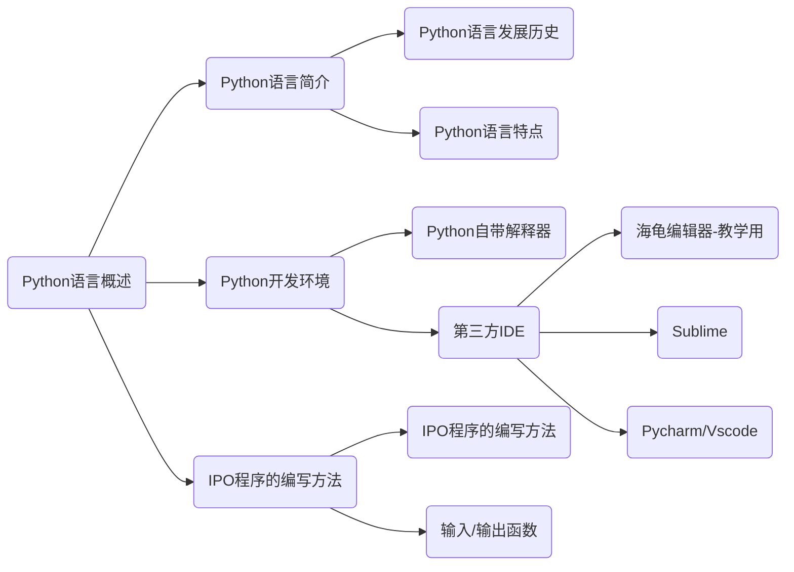

# 编程能力等级划分

## 图形化编程能力等级划分

|     等 级      |    能 力 要 求     |                      等 级 划 分 说 明                       |
| :------------: | :----------------------: | :-----------------------:|
| 图形化编程一级 | 基本图形化编程能力 | 掌握图形化编程平台的使用，应用顺序、循环、选择三种基本的程序结构，编写结构良好的简单程序，解决简单问题 |
| 图形化编程二级 |  初步程序设计能力  | 掌握更多编程知识和技能，能干根据实际问题的需求设计和编写程序，解决复杂问题，创作编程作品，具备一定的计算思维 |
| 图形化编程三级 | 算法设计与应用能力 | 综合应用所学的编程知识和技能，合理地选择数据结构和算法，设计和编写程序以解决实际问题，完成复杂项目，具备良好的计算思维和设计思维 |

## Python编程能力等级划分

|   等 级    | 能 力 要 求  |                 等 级 划 分 说 明                  |
| :--------: | :----------: | :------------------------------------------------: |
| Python一级 | 基本编程思维 |         具备以编程逻辑为目标的基本编程能力         |
| Python二级 | 模块编程思维 | 具备以函数、模块和类等形式抽象为目标的基本编程能力 |
| Python三级 | 基本数据思维 | 具备以数据理解、表达和简单运算为目标的基本编程能力 |
| Python四级 | 基本算法思维 |   具备以常见、常用且典型算法为目标的基本编程能力   |


# 专题1 Python 语言概述

## 考查方向




## 知识点清单

### 知识点1 Python语言简介

1. Python 语言发展历史

   ​		Python语言的创始人是吉多范罗苏姆。1989年圣诞节期间，吉多在阿姆斯特丹利用圣诞节的休假时间，决心开发一个新的脚本解释程序Python，以作为ABC语言的一种继承。

2. Python 语言特点

   ​		Python语言的设计哲学是“优雅”、“明确”、“简单”。Python语言具有简单、开发速度快和容易学习等特点。

### 知识点2 Python开发环境

1. Python自带解释器

   ​		Python是解释型编程语言，安装程序自带IDLE，可使用交互与文本两种模式

2. 第三方IDE

   ​		教学用简易编辑器：海龟编辑器，登录NCT官网在线使用

   ​		轻量级个人编辑器：Sublime,功能丰富体积小巧，使用多种语言简易开发

   ​		专业级复杂编辑器：Pychartm，Vscode，功能强大且复杂多用于企业与专业程序员

### 知识点3 IPO程序的编写方法

IPO程序的编写方法是每个程序都需要具备的模式，即输入数据、处理数据和输出数据。

I表示input，P表示process，O表示output

**请编写下面的一个小程序**：

要求从键盘输入两个数据，对这两个数据进行求和运算，显示输出求和的结果

~~~python
a=input("请输入第一个数据：")
b=input("请输入第二个数据：")
c=int(a)+int(b)
print(c)
~~~

**释义**：

- input()函数用于接收键盘输入，参数为字符串类型的提示性语句，参数为可选参数（可以省略）
- print()函数用于在控制台显示输出内容，输出的内容可以是字符串，数字或者变量
- int()函数用于将字符串类型的数字转换为数字类型的数字
- a，b，c为三个变量，分别用于存储两个输入的数据和求和的值

## 知识点探秘

<font color=blue>----></font>下列选项中不属于IPO程序编写方法的是（）

​		A. 输入数据	B. 删改数据	C. 处理数据	D. 输出数据

​		答案：<font color='white'>B</font>

## 巩固练习

1. 在控制台打印输出：hello world！
2. 从键盘输入两个数，计算它们的差值并在控制台输出显示结果。

------

<center><font color=blue>...End!...</font></center>

------

## 复习

一、编写一段代码，实现以下功能：

​		从键盘输入你的年龄，

​		如果年龄小于18岁，打印输出：未成年！

​		如果大于等于18岁，打印输出：已成年！

二、[极客战记](https://codecombat.163.com/#/)

# 专题2 Python 基础语法

## 考查方向

~~~mermaid
graph LR
A(Python基础语法)-->B1(标识符与保留字)-->C1(标识符)
B1-->C2(保留字)
A-->B2(注释)-->C3(单行注释)
B2-->C4(多行注释)
A-->B3(变量的命名和使用)-->C5(变量的命名)
B3-->C6(变量的赋值)
A-->B4(缩进)-->C7(单层缩进)
B4-->C8(多层缩进)
~~~


## 知识点清单

### 知识点1 标识符、保留字

1. **标识符**

   在Python中，需要为变量、函数等指定名字，这些名字就是标识符。

   标识符的命名规则：

   - 标识符可以由英文字母、数字和下划线组成，如aCat，_Cat，Cat_at2
   - 第一个字符必须为英文字母或下划线，不能以数字开头
   - 命名区分大小写，大小写不同所代表的标识符不同
   - 不能使用保留字作为标识符
   - 不能使用内置函数名作为标识符，如input，print等
   - 标识符中间不能出现空格

2. **保留字**

   保留字也叫关键字（keyword），是具有特殊功能的字符串。

   目前一共33个保留字：

   and	as	assert	break	class	continue	def	del	elif	else	except	finally	for	from	Flase	global	if	

   import	in	is	lambda	nonlocal	not	None	or	pass	raise	return	try	True	while	with	yield		

### 知识点2 注释

注释是在程序中加入的对代码的解释和说明。运行程序时，注释不被计算机执行。Python语言中，注释分为单行注释和多行注释。

1. **单行注释**

   单行注释以#开头，可以单独写一行，也可以写在代码后面

2. **多行注释**

   多行注释可以写成多个单行注释或以3引号（3个单引号或3个双引号）开头和结尾

==说明==：

- 同一个程序中注释格式尽量统一
- 注释多用于标注代码的作用或编程思路，也可用于临时调试用
- 复杂代码中一定要合理添加注释，以用于备忘备查或他人理解

### 知识点3 变量的命名和使用

1. **变量的命名**

   在Python语言中，创建变量时不需要为它指定数据类型，只要给一个标识符赋值就可以创建一个变量。

2. **变量的赋值**

   在Python语言中，赋值用 “=” 表示，表示将右侧的数值或结果赋给左侧的变量。这样的语句叫赋值语句

   - 书写格式

     ```javascript
     a = 999
     ```

   - 变量可以接受不同类型的数值，如字符型，数值型，其他变量，列表等等

     ~~~python
     a = 1.12
     t = 0
     t = a
     data = "hello，world！"
     li=[1,2,3,4]
     ~~~

   ==说明==：变量可以被多次赋值

### 知识点4 缩进

代码的缩进表示代码之间的包含和层次关系。可以使用键盘上Tab键实现，也可以使用4个空格实现，习惯使用Tab键。

缩进分为单层缩进和多层缩进

1. **单层缩进**

   单层缩进是指所编写的程序只包含一层缩进，注意观察以下代码：

   ~~~python
   a = int(input('请输入一个正整数：'))
   if a>3:
   	print('这是一个大于3的数')
       print('这个数是：'，a)
   else：
       print('a<=3')
   ~~~

   

2. **多层缩进**

   多层缩进表示代码的多层嵌套关系，程序结构可以互相嵌套，注意观察以下代码：

   ~~~python
   sex = input('请输入你的性别：')
   age = int(input('请输入你的年龄：'))
   if sex=='男':
       if age>=22:
           print('可以结婚')
       else：
       	print('不可以结婚')
   if sex=='女':
       if age>=20:
           print('可以结婚')
       else：
       	print('不可以结婚')
   ~~~

   ==说明==：Python语言对语法的要求非常严格，未正确缩进会破坏程序结构，致使程序报错而无法正确运行

## 知识点探秘

<font color=blue>----></font>下列选项中不属于Python语言保留字的是（）

​		A. False	B. if	C. static	D. for

​		答案：<font color='white'>C</font>

<font color=blue>----></font>下列选项中属于Python语言保留字的是（）

​		A. Today	B. geomerty	C. while	D. Physics

​		答案：<font color='white'>C</font>

<font color=blue>----></font>在Python语言中，进行注释的方法不包括（）

​		A. #这是注释，使用“#”号

​		B. ”“”

​			这是注释，使用3个双引号

​			“”“

​		C.%

​			这是注释，使用百分号

​			%

​		C. ‘’‘

​			这是注释，使用3个单引号

​			’‘’

​		答案：<font color='white'>C</font>

<font color=blue>----></font>以下选项中不符合Python语言变量命名规则的是（）

​		A. xyz	B. 5_five	C. _a123	D. Cat

​		答案：<font color='white'>B</font>

## 巩固练习

1. 按要求写程序
   - 创建两个变量x和y
   - 将3.14和5.20分别赋值给x、y
   - 创建变量\_SUM,并将x+y的值赋给\_SUM
   - 打印_SUM

------

<center><font color=blue>...End!...</font></center>

------

## 复习

一、自编一个带有多层缩进的小程序

# 专题3 运算符和数据类型

## 考查方向

~~~mermaid
graph LR
A(运算符和数据类型)-->B(运算符)
A-->C(数据类型)
A-->D(布尔类型)
A-->E(运算符的优先级)
B-->X1(算术运算符)
B-->X2(赋值运算符)
B-->X3(关系运算符)
C-->Y1(整型int数据类型)
C-->Y2(浮点型float数据类型)
D-->Z1(布尔bool类型)
D-->Z2(逻辑运算)
~~~


## 知识点清单

### 知识点1 运算符

1. **算术运算符**

   算术运算符是指对数值进行加、减、乘、除等算术运算的符号

   | 运算符 |               描述               |
   | :----: | :------------------------------: |
   |   +    |            两个数相加            |
   |   -    |          负数或两数相减          |
   |   *    |             两数相乘             |
   |   /    |             两数相除             |
   |   %    |      取模，求两数相除的余数      |
   |   **   |              幂运算              |
   |   //   | 整除，求两数相除的商（向下取整） |

   随堂练习：

   - 要求用两个整数演示各种运算符的运算
   - 试一试除数是0的情况

   ==说明==：pow(x,y)函数也可以进行幂运算，x表示底数，y表示幂指数

2. **赋值运算符**

   赋值运算符用 “=” 表示，是将符号右侧的内容赋值给左侧的变量

   | 运算符 |    =     |    +=    |    -=    |    *=    |    /=    |    %=    |   //=    |   **=    |
   | :----: | :------: | :------: | :------: | :------: | :------: | :------: | :------: | :------: |
   |  描述  | 简单赋值 | 加法赋值 | 减法赋值 | 乘法赋值 | 除法赋值 | 取模赋值 | 取整赋值 | 求幂赋值 |

3. **关系运算符**

   关系运算符也称比较运算符，如果比较结果为真，返回True；如果为假，返回Flase。多用于条件语句中的比较判断

   | 运算符 |   描述 举例    |
   | :----: | :------------: |
   |   ==   |   相等  a==b   |
   |  ！=   |   不等  a!=b   |
   |   >    |   大于  a>b    |
   |   <    |   小于  a<b    |
   |   >=   | 大于等于  a>=b |
   |   <=   | 小于等于  a<=b |

   注意比较区分“=”与“==”的区别

   随堂练习：

   - 打印输出3！=5的值
   - 如果6**2小于37，控制台打印输出“真的”，否则输出“假的”

### 知识点2 数据类型

1. **整型（int）数据类型**
   - 整型是用来表示整数的数据类型，没有小数部分，包含正整数，负整数和0
   - 整型数据类型包括二进制整数、八进制整数、十进制整数、和十六进制整数
     - 二进制：由0和1构成，逢二进一，表示方法为以0b或0B开头；如0b111转成十进制为7
     - 八进制：由0~7组成，逢八进一，表示方法为以0o或0O开头；如0o122转成十进制为82
     - 十进制：由0~9组成，逢十进一
     - 十六进制：由0~9，A-F组成，逢十六进一，表示方法为以0x或0X开头；如0x1A转成十进制为26
   
   随堂练习：
   
   ~~~python
   print(0b111)
   print(0o122)
   print(12)
   print(0x1A)
   ~~~
   
   ==说明==：int(x)函数可以将浮点数x或字符串型整数x转化为整型
   
2. **浮点数（float）数据类型**

   浮点型数据由整数与小数两部分构成，如3.14，-6.68

   浮点型可以用科学计数法表示，如2.5e2，-6.66e5

   随堂练习：

   ~~~python
   print(-66.68)
   print(-66.88e5)
   ~~~

   ==说明==：round(x[,n])函数可以对浮点数x进行四舍五入，并保留n位小数

   例如：

   ~~~python
   print(round(3.1415926,2))
   ~~~
   
   ==说明==：float(x)函数可以将整数x或字符串型数字x转化为浮点型

### 知识点3 布尔类型

1. **波尔类型**

   布尔类型只有真值和价值，真值用True表示，假值用False表示

   另外波尔值也可以表示为数值，True用1表示，False用0表示

   随堂练习：

   ~~~python
   a = 10
   b = 11
   print(a>b)
   print(a<b)
   ~~~

2. 逻辑运算

   逻辑运算是对真和假两种波尔值进行运算，运行后的结果仍为一个波尔值
   
   | 运算符 | 逻辑表达式 | 描述 |           结果           |
   | :----: | :--------: | :--: | :----------------------: |
   |  and   |  x and y   |  与  | x和y同时为真，结果才为真 |
   |   or   |   x or y   |  或  | x和y一个为真，结果即为真 |
   |  not   |   not x    |  非  |       对x的值取反        |
   
   示例代码：
   
   ~~~python
   a = 10
   b = 5
   print(a<b or a>b)
   print(a<b and a>b)
   print(not(a!=b))
   ~~~

### 知识点4 运算符的优先级

运算符的优先级是指哪一个运算符先计算，哪一个运算符后计算

规则是：先高级后低级；同级从左到右执行；括号内的优先执行

| 运算符优先级排列表（由高到底） |
| :----------------------------: |

|        运算符        |        描述        |
| :------------------: | :----------------: |
|          **          |       幂运算       |
|     *，/，%，//      | 乘、除、取模、取整 |
|         +，-         |        加减        |
| <，<=，>，>=，==，!= |      关系运算      |
|         not          |       非运算       |
|         and          |       与运算       |
|          or          |       或运算       |

## 知识点探秘

<font color=blue>----></font>运行下列代码，输出结果是（）

~~~python
print(124 + 3.0)
~~~

A.  127	B.  127.0	C.  154	D.  程序有误，输入错误

答案：<font color='white'>B</font>

<font color=blue>----></font>运行下列代码，输入为5.1，则输出结果是（）

~~~python
a=input('请输入一个整数')
a=int(a)+5
print(a)
~~~

A.  报错	B.  5	C.  10	D.  10.0

答案：<font color='white'>A</font>

<font color=blue>----></font>运行下列代码，x的值为（）

~~~python
x=3
x*=6
print(x)
~~~

A.  3	B.  6	C.  9	D.  18

答案：<font color='white'>D</font>

<font color=blue>----></font>下列代码输出结果为（）

~~~python
print(3==5 or 4>2)
print(5>=5 and 6>5)
~~~

A.  True  False	B.  True  True	C.  False  False	D.  False True

答案：<font color='white'>B</font>

<font color=blue>----></font>运行下列代码，输出结果是（）

~~~python
print('a'<='b')
~~~

A.  None	B.  True	C.  False	D.  以上答案都是错误的

答案：<font color='white'>B</font>

<font color=blue>----></font>运行下列代码，输出结果是（）

~~~python
print(100-25*3%4)
~~~

A.  1	B.  97	C.  25	D.  0

答案：<font color='white'>B</font>

## 巩固练习

1. 按要求写程序
   - 输入任意数字，使程序能判断其为正数，负数或者零
   - 如输入3.1415926，输出为正数，输入-2.333，输出为负数，输入0，输出为零

------

<center><font color=blue>...End!...</font></center>

------

## 复习

1. 用**pgzero**库，制作碰到边缘就反弹的反弹球

   主要任务：

   - 学习python库的安装

     国内清华镜像：pip install -i https://pypi.tuna.tsinghua.edu.cn/simple pgzero

   - 学习pgzero库的基本框架

     - 创建目录结构

     ```text
     ├── images/
     │   └── ball.png
     └── ball_game.py
     ```

     - 创建最小程序框架

     ~~~python
     import pgzrun
     WIDTH = 600
     HEIGHT = 400 
     ball = Actor('ball')
     ball.pos = 100,100
     def draw():
         screen.fill((255,255,255))
         ball.draw()
     def update():
         pass
     pgzrun.go()
     ~~~

     

   - 理解游戏编程的逻辑（程序循环，碰撞检测）

     - 游戏窗口坐标系

       

     - 角色的常用属性（方块属性）
     
       x，y，pos，left，right，top，bottom
     
     - 创建逻辑结构
   
   ~~~python
   	ball.dx,ball.dy=2,1
       def update():
           ball.x+=ball.dx
           ball.y+=ball.dy
           if ball.right>=WIDTH or ball.left<=0:
               ball.dx=-ball.dx
           if ball.top<=0 or ball.bottom>=HEIGHT:
               ball.dy=-ball.dy
   ~~~
   
   

# 专题4 字符串类型

## 考查方向

~~~mermaid
graph LR
Y1(字符串表示方式)-->A(字符串类型)-->X1(字符串常用方法和函数)
Y2(字符串运算)-->A(字符串类型)-->X2(字符串格式化)
X1-->a("count()方法")
X1-->b("find()方法")
X1-->c("join()方法")
X1-->d("splite()方法")
X1-->e("len()函数")
X2-->f(格式化字符串和整数)
X2-->g(格式化浮点数)
h(单/双引号字符串)-->Y1
i(三引号字符串)-->Y1
j(转义字符)-->Y1
k(字符串加法)-->Y2
l(字符串乘法)-->Y2
m(字符串索引)-->Y2
n(字符串切片)-->Y2
o(成员运算符)-->Y2
~~~


## 知识点清单

### 知识点1 字符串表示方法

1. 单引号/双引号字符串

   在**Python**语言中，一般使用一对单引号或一对双引号表示字符串

   ~~~python
   s1 = 'hello world'
   s2 = "hello python"
   print(s1)
   print(s2)
   ~~~

2. 三引号字符串

   使用三引号往往表示多行字符串，可以使用三单引号或三双引号

   ~~~python
   s1 = '''hello world!
   hello world!'''
   s2 = """hello python!
   hello python!"""
   print(s1)
   print(s2)
   ~~~

3. 转义字符

   在python语言中，将具有特殊含义的字符（如引号，反斜杠）或无法被键盘录入的字符（如换行，回车）以反斜杠”\\"开头的字符序列进行表示，这种字符序列叫转义字符。

   - 常用的转义字符

     | 转义字符 |           含义           |
     | :------: | :----------------------: |
     |   \\'    |          单引号          |
     |   \\"    |          双引号          |
     |    \\    |          反斜杠          |
     |    \r    |  回车符（光标回到行首）  |
     |    \n    | 换行符（光标换到下一行） |
     |    \t    |          制表符          |
   
   - 转义字符示例
   
     ~~~python
     s1="I'm Andy"
     s2='I\'m Lily'
     s3="你好！\nPython！"
     print(s1)
     print(s2)
     print(s3)
     # print('\')
     print('\\')
     ~~~

### 知识点2 字符串运算

| 运算符 |            描述            |
| :----: | :------------------------: |
|   +    |         字符串连接         |
|   *    |       字符串重复输出       |
|   []   | 通过索引获取字符串中的字符 |
|  [:]   |  字符串截取，左闭右开原则  |
|   in   |    成员运算符，表示包含    |
| not in |   成员运算符，表示不包含   |

1. 字符串加法

   用于将2个以上字符串连接成一个字符串，例如：

   ~~~python
   a,b='rain','bow'
   print(a+b)
   ~~~

2. 字符串乘法

   字符串与**整数**相乘，输出一个原字符串重复组成的字符串(如果与<=0的整数相乘，将得到一个空字符串)

   ~~~python
   s='he'
   print(s*2)
   ~~~

3. 字符串索引

   - 字符串索引是指字符串中每个字符对应的位置编号

   - 通过索引可以访问字符串中的单个字符

   - 索引分正向索引和反向索引

   - 正向索引从0开始，反向索引从-1开始，且索引值必须为整数

     例如, 字符串"PYTHON"其索引值如下表：

     |  索 引   |  P   |  Y   |  T   |  H   |  O   |  N   |
     | :------: | :--: | :--: | :--: | :--: | :--: | :--: |
     | 正向索引 |  0   |  1   |  2   |  3   |  4   |  5   |
     | 反向索引 |  -6  |  -5  |  -4  |  -3  |  -2  |  -1  |

     获取索引值的方法：str[index]

     ~~~python
     s = "hello python"
     print(s[7])
     print(s[-3])
     ~~~

4. 字符串切片

   切片是通过索引的方法截取指定区间内的子字符串

   字符串切片的格式：str[start : end : step],其中start，end，step可省略

   切片遵循左闭右开原则

   ~~~python
   s="hello world"
   print(s[2:5])
   print(s[3:-1])
   print(s[1:9:2])
   print(s[:5])
   print(s[3:])
   print([:])
   ~~~

5. 成员运算

   ​        成员运算符用于检测包含与不包含关系，一般用于分支结构或循环结构的条件判断，用in或not in进行判断，返回结果为布尔值True或Flase  
   
   ~~~python
   s = "hello python"
   print("h" in s)
   print("h" not in s)
   print("ab" not in s)
   ~~~

### 知识点3 字符串常用方法和常用函数

| 方法或函数 |                             描述                             |
| :--------: | :----------------------------------------------------------: |
|  count( )  |                统计字符串在字符串中出现的次数                |
|  find( )   |                查找字符串在字符串中的索引位置                |
|  join( )   |       将序列中的元素以指定的字符连接生成一个新的字符串       |
|  split( )  | 指定分隔字符串对字符串进行拆分，并将拆分的结果以列表的形式返回 |
|   len( )   |                       统计字符串的长度                       |

1. count( )方法

   count( )方法用于统计子字符串在字符串指定的搜索范围内出现的次数

   使用格式：str.count(sub, start, end)

   参数说明如下：

   sub：子字符串

   start：指定查找范围的起始索引（可省略）

   end：指定查找范围的结束索引（可省略）

   ~~~python
   s = 'hello python'
   print(s.count('o'))
   print(s.count('o',0,5))
   ~~~

2. find( )方法

   ​		find( )方法用于检查子字符串在字符串中的位置，如果子字符串在指定的搜索范围内被找到，则返回找到的最小索引值，否则返回-1

   使用格式：str.find(sub, start, end)

   参数说明如下：

   sub：子字符串

   start：指定查找范围的起始索引（可省略）

   end：指定查找范围的结束索引（可省略）

   ~~~python
   s = 'hello python'
   print(s.find('o'))
   print(s.find('p',0,5))
   ~~~

3. join( )方法

   ​		join( )方法用于将可迭代对象中的元素以指定的字符串作为分隔符，连接生成一个新的字符串。该迭代对象只能包含字符串类型的元素。

   使用格式：str.join(iterable)

   参数说明如下：

   sep：字符串类型分隔符

   iterable：由字符串类型元素组成的可迭代对象（可迭代对象：能够使用for循环进行循环遍历的对象，如字符串，列表等）

   ~~~python
   a = '-'
   b = 'hello'
   print(a.join(b))
   ~~~

   ~~~python
   x=['A','B','C','D']
   print('#'.join(x))
   ~~~

4. split( )方法

   split( )方法是以指定的分隔符对字符串进行拆分，并将拆分结果以列表的形式返回

   使用格式：str.split(sep, maxsplit=-1)

   参数说明如下：

   sep：分隔符，若不指定默认为空字符（空格，换行(\\n)，制表符(\\t)等）

   maxsplit：最多拆分次数，可省略（默认maxsplit=-1，代表不限制拆分次数）

   ~~~python
   s = 'hello python！'
   print(s.split())
   print(s.split('o'))
   print(s.split('o',maxsplit=1))
   ~~~

5. len( )函数

   len( )函数用于计算字符串的长度，也可用于计算列表、元祖等的长度

   ~~~python
   s = 'hello python！'
   print(len(s))
   ~~~

6. 字符串的遍历

   Python语言中用for循环实现遍历，语法为：

   ~~~python
   for <变量> in <可迭代的对象>：
   	<需要循环的语句>
   ~~~

   for循环主要有以下两种方法：

   - 遍历循环

     ~~~python
     s = 'hello pyhon!'
     for i in s:
         print(i)
     ~~~

   - 计数循环(结合range( )函数实现)

     ~~~python
     for i in range(0,10):
         print(i)
     ~~~

     ~~~python
     s = 'hello pyhon!'
     for i in range(0,len(s)):
         print(s[i])  
     ~~~

### 知识点4 字符串格式化

字符串的格式化也叫字符串的插值运算，是将一个值插入另一个含有标记符“%”的字符串中。“%”用于在字符串中标记转换符的位置，待插入的值放入一个序列中

| 转换符 |     描述     | 格式符 |     描述     |
| :----: | :----------: | :----: | :----------: |
|   s    |    字符串    |   %s   | 格式化字符串 |
|   d    |  十进制整数  |   %d   |  格式化整数  |
|   f    | 十进制浮点数 |   %f   | 格式化浮点数 |

- 格式化输出整数或字符串：

~~~python
print('我的语文成绩是%d分'%98)
print('我的%s成绩是98分'%'语文')
print('我的%s成绩是%d分'%('语文',98))
~~~

~~~python
a = '小明'
b = int(input('请输入分数：'))
print('%s的数学成绩是%d分'%(a,b))
~~~

- 格式化输出浮点数：

~~~python
a = 3.1415926
b = 30
print('%.2f'%a)
print('%f'%b)
print('将%d打印成一位小数是%.1f'%(b,b))
~~~

## 知识点探秘

<font color=blue>----></font>运行下列代码，输出结果是（）

~~~python
a = 'Code'
b = 'Python'
print('a+b输出结果是:',a+b)
~~~

A.  Code+Python	B.  CodePython	C.  a+b输出结果是:CodePython	D.  a+b输出结果是:  CodePython

答案：<font color='white'>D</font>

<font color=blue>----></font>运行下列代码，输出结果是（）

~~~python
a = '我爱你我的祖国!'
print(a[:-1]+a[-1])
~~~

A.  我爱你我的祖国!	B. 我爱你我的祖国!!	C. !!	D.  我爱你我的祖国

答案：<font color='white'>A</font>

<font color=blue>----></font>运行下列代码，输出结果是（）

~~~python
a = 'Code Python'
print((a[1:3]+a[-1])*2)
~~~

A.  CodeCode	B. CodnCodn	C. odenoden	D.  odnodn

答案：<font color='white'>D</font>

<font color=blue>----></font>运行下列代码，输入30C，输出结果是（）

~~~python
a = input('请输入温度值，例如30C：')
b = 1.8*float(a[0:-1])+32
print("%.1fF"%(b,))
~~~

A.  86.0C	B. 86.0F	C. 86F	D.  86C

答案：<font color='white'>B</font>

<font color=blue>----></font>运行下列代码，输出结果是（）

~~~python
st = '两个黄鹂鸣翠柳，一行白鹭上青天'
print(st[1:10:2])
~~~

A.  两黄鸣柳一	B. 个鹏翠，行	C. 个黄鹂鸣翠柳，一行	D.  个鹂翠，

答案：<font color='white'>B</font>

<font color=blue>----></font>运行下列代码，输出结果是（）

~~~python
s = 'aphyfaspypypvnepyndd'
sub = 'py'
print(s.count(sub,0,8))
~~~

A.  0	B.  1	C.  2	D.  3

答案：<font color='white'>A</font>

<font color=blue>----></font>运行下列代码，输出结果是（）

~~~python
print("\\n是换行符，加入\\n，后面的内容就会自动换行。\n我们来试一下。")
~~~

A.  \\n是换行符，加入\\n，后面的内容就会自动换行。\n我们来试一下。	

B.  "\\n是换行符，加入\\n，后面的内容就会自动换行。\n我们来试一下。"	

C.  是换行符，加入，后面的内容就会自动换行。\n我们来试一下。	

D.  \\n是换行符，加入\\n，后面的内容就会自动换行。

​	  我们来试一下。

答案：<font color='white'>D</font>

<font color=blue>----></font>运行下列代码，输出结果是（）

~~~python
s = 'aphyfaspypypvnepyndd'
if 'ne' in s:
    print(s.find('ne',0,12))
else:
    print(0)
~~~

A.  0	B.  1	C.  2	D.  -1

答案：<font color='white'>D</font>

<font color=blue>----></font>运行下列代码，输出结果是（）

~~~python
lis = ['中','国','加','油']
s = ''.join(lis)  #''这里是空字符串，没有空格
print(s)
~~~

A.  中，国，加，油	B.  中 国 加 油	C.  中国加油	D.  程序报错

答案：<font color='white'>C</font>

## 巩固练习

---->打印输出下面的话：

​		python中使用“\\”对字符进行转义，

​		例如：换行使用转义字符“\\n”表示。

答案：见下面隐藏代码块

<div style="color:white";>
print('python中使用"\\"对字符进行转义，\n例如：换行使用转义字符"\\n"表示。')
</div>
---->按要求写程序(采用两种方法)：

​		从键盘输入一个字符串，输出该字符串中字母a的个数

​		如输入：abstract，输出：2

答案：见下面**两段**隐藏代码块

<div style="color:white";>
s1 = input('请输入任意字符串：')
n = 0
for i in s1:
    if i=='a':
        n+=1
print(n)
</div>

<div style="color:white";>
s1 = input('请输入任意字符串：')
print(s1.count('a'))
</div>
--->编写一段程序，查找出两个字符串中相同的字母，例如：

输入

~~~python
asdghlkjgf
fhoub
~~~

输出

~~~python
h
f
~~~

答案：见下面隐藏代码块

<div style="color:white";>
s1 = input()
s2 = input()
for i in s1:
    if i in s2:
    	print(i)
</div>

--->按要求写程序

输入：用户一次输入若干整数，用空格隔开

输出：依次输出这些整数（不限制数据类型）

输入样例：

~~~python
10 2 5 6
~~~

输出样例：

~~~python
10
2
5
6
~~~

答案：见下面隐藏代码块

<div style="color:white";>
s1 = input()
s2 = s1.split()
for i in s2:
    print(i)
</div>

--->按要求写程序

输入：用户随机输入一串字符

输出：输出该字符串的前半个子字符串

**注：若字字符串中字符个数为奇数，将中间位置的字符划入前半个子字符串**

输入样例：

~~~python
落霞与孤鹜齐飞，秋水共长天一色
~~~

输出样例：

~~~python
落霞与孤鹜齐飞，
~~~

答案：见下面隐藏代码块

<div style="color:white";>
s1 = input()
if len(s1)%2==0:
    print(s1[:int(len(s1)/2)])
else:
    print(s1[:round(len(s1)/2)])
</div>


------

<center><font color=blue>...End!...</font></center>

------

## 复习

1. 利用**socket**库，制作简易udp聊天收发程序

   - 客户端发送程序

     ~~~python
     import socket
     BUFSIZE = 1024
     ip_port = ('192.168.0.100', 9999) #服务器局域网地址
     client = socket.socket(socket.AF_INET,socket.SOCK_DGRAM)
     while True:
         msg = input(">> ").strip()
         client.sendto(msg.encode('utf-8'),ip_port)
      
         data,server_addr = client.recvfrom(BUFSIZE)
         print('客户端recvfrom ',data,server_addr) #接受服务器的回测数据进行回显
     
     client.close()
     ~~~

     

   - 服务端接受程序

     ~~~python
     import socket
     BUFSIZE = 1024
     ip_port = ('192.168.0.100', 9999) #本机局域网地址
     server = socket.socket(socket.AF_INET, socket.SOCK_DGRAM)  # IPV4,udp协议
     server.bind(ip_port)
     while True:
         data,client_addr = server.recvfrom(BUFSIZE)
         print('服务器收到的来自%d的数据：%d'%(client_addr,data))
      
         server.sendto(data.upper(),client_addr) #发送给客户端回测
      
     server.close()
     ~~~

     

   

# 专题5 列表

## 考查方向

~~~mermaid
graph LR
b1(列表的创建和删除)-->a(列表)
b2(列表的索引和访问)-->a(列表)
b3(列表元素的添加)-->a(列表)
x1(列表的创建)-->b1
x2(列表的删除)-->b1
y1(列表的索引)-->b2
y2(列表的访问)-->b2
a(列表)-->c1(列表元素的移除)
a(列表)-->c2(列表元素的修改)
a(列表)-->c3(列表的统计)
a(列表)-->c4(列表的排序)

~~~


## 知识点清单

### 知识点1 列表的创建和删除

1. 列表的创建

   格式

   ~~~python
   listname = [元素1，元素2，...]  #列表中的元素可以为任意数据类型
   ~~~

   示例

   ~~~python
   lis1 = []
   lis2 = [10,20,30,40]
   lis3 = ['a','b','c']
   #虽然元素可以是混杂的类型，但为了保证可读性，往往只放同一数据类型元素
   ~~~

2. 列表的删除

   格式

   ~~~python
   del listname  
   ~~~

   示例

   ~~~python
   lis2 = [10,20,30,40]
   del lis2
   print(lis2) 
   ~~~

### 知识点2 列表的索引和访问

1. 列表的索引

   列表的索引与字符串索引类似，例如, 列表 lis = ['P','Y','T','H','O','N']其索引值如下表：

   |  索 引   |  P   |  Y   |  T   |  H   |  O   |  N   |
   | :------: | :--: | :--: | :--: | :--: | :--: | :--: |
   | 正向索引 |  0   |  1   |  2   |  3   |  4   |  5   |
   | 反向索引 |  -6  |  -5  |  -4  |  -3  |  -2  |  -1  |

2. 列表的访问

   格式

   ~~~python
   listname[索引]
   ~~~

   示例

   ~~~python
   lis2 = [10,20,30,40]
   print(lis2[-2])
   ~~~

### 知识点3 列表元素的添加

|   方法    |                描述                |
| :-------: | :--------------------------------: |
| append( ) |       在列表末尾追加一个元素       |
| extent( ) | 在列表末尾追加另一个列表的所有元素 |
| insert( ) |     在列表指定位置插入一个元素     |

格式

~~~python
listname.append(新元素)
listname.extend(新列表)
listname.insert(索引,新元素)
~~~

示例

~~~python
#listname.append(新元素)
grade = ['a','b','c','d']
grade.append('e')
print(grade)
~~~

~~~python
#listname.extend(新列表)
grade = ['a','b','c','d']
new = ['e','f','g']
grade.extend(new)
print(grade)
~~~

~~~python
#listname.insert(索引,新元素)
grade = ['a','b','c','d']
grade.insert(1,'e') #向当前索引位置的前面插入
print(grade)
~~~


### 知识点4 列表元素的移除

|   方法    |               描述               |
| :-------: | :------------------------------: |
|    del    |   删除列表中指定索引位置的元素   |
| remove( ) |      移除列表中第一个匹配项      |
|  pop( )   | 移除索引位置的元素后返回该元素值 |
| clear( )  |           清空列表元素           |

格式

~~~python
del listname[索引]
listname.remove(元素)
listname.pop(索引)
listname.clear()
~~~

示例

~~~python
#del listname[索引]
grade = ['a','b','c','d']
del grade[1]
print(grade)
~~~

~~~python
#listname.remove(元素)
grade = ['a','b','c','d','e','d','f']
grade.remove('d')
print(grade)
~~~

~~~python
#listname.pop(索引)
grade = ['a','b','c','d']
grade.pop()
print(grade)
grade.pop(1) 
print(grade)
a = grade.pop(0) 
print(a)
~~~

~~~python
#listname.clear()
grade = ['a','b','c','d']
grade.clear()
print(grade)
~~~


### 知识点5 列表元素的修改

格式

~~~python
listname[索引] = 新元素
~~~

示例

~~~python
list1 = ['90','100','87']
list1[0] = '92'
print(list1)
~~~


### 知识点6 列表的统计

| 方法或函数 |               描述               |
| :--------: | :------------------------------: |
|  count( )  |   返回列表中指定元素出现的次数   |
|  index( )  | 返回列表中指定元素首次出现的索引 |
|   len( )   |         返回列表长度数值         |
|   sum( )   |      返回列表中所有元素的和      |
|   max( )   |       返回列表中最大的元素       |
|   min( )   |       返回列表中最小的元素       |

格式

~~~python
listname.count(元素)
listnam.index(元素)
len(listname)
sum(listname)
max(listname)
min(listname)
~~~

示例

~~~python
list1 = [1,2,3,4,4,4,3,2,1]
print(list1.count(3))
print(list.index(2))
print(len(list1))
print(sum(list1))
print(max(list1))
print(min(list1))
~~~


### 知识点7 列表的排序

|  方法   |        描述        |
| :-----: | :----------------: |
| sort( ) | 对列表元素进行排序 |

格式

~~~python
listname.sort(key=None,reverse=False)
#key:表示指定从每个元素中提取一个用于比较的键，参数是带有一个返回值的函数，一般使用默认值
#reverse：False为升序，True为降序，如果省略默认值为False
~~~

示例

~~~python
list1 = [100,92,90,98,77,89,99,95,100,82]
list1.sort()
print(list1)
list1.sort(reverse=True)
print(list1)
~~~

~~~python
#了解内容不做要求,
list1 = [100,-92,90,-98,77,89,-99,95,-100,82]
list1.sort(key=lambda x:abs(x))#按绝对值排序
print(list1)
~~~

## 知识点探秘

<font color=blue>----></font>运行下列代码，输出结果是（）

~~~python
lis = ['西瓜','荔枝','哈密瓜','芒果','榴莲'] 
print(list[1],list[-1])
~~~

A. 西瓜 芒果	B.  西瓜 榴莲	C.  荔枝 芒果  	D. 荔枝 榴莲

答案：<font color='white'>D</font>

<font color=blue>----></font>运行下列代码，输出结果是（）

~~~python
str = ''
for i in ['a','b','c','d']:
    str = str + i
print(str)
~~~

A. a b c d	B.  abcd	C.  a+b+c+d  	D. ['a','b','c','d']

答案：<font color='white'>B</font>

<font color=blue>----></font>运行下列代码，输出结果是（）

~~~python
lis1 = ['北京','上海','广州']
lis1.append('深圳')
print(lis1)
~~~

A. ['深圳','北京','上海','广州']	B.  ['北京','深圳','上海','广州']	C.  ['北京','上海','深圳','广州']  	D. ['北京','上海','广州','深圳']

答案：<font color='white'>D</font>

<font color=blue>----></font>运行下列代码，输出结果是（）

~~~python
lis1 = [1,2,3,4]
print(lis1.remove(3),lis1.pop(2))
~~~

A. 4 3	B.  None 4	C. 4 [1,2,3]   	D.  [1,2,4] [1,2]

答案：<font color='white'>B</font>

<font color=blue>----></font>列表[90,100,78]分别存储着阿短的语文、数学、英语的成绩，老师在统计期末成绩时，发现阿短的英语成绩实际为87，但在成绩列表中显示的是78。下列选项能帮助老师正确输出阿短成绩列表的是（）

A. 

~~~python
lis1 = [90,100,78]
lis1[3] = 87
~~~

B.

~~~PYTHON
lis1 = [90,100,78]
lis1[2] = 87
~~~

C.

~~~PYTHON
lis1 = [90,100,78]
lis1[3] = 87
print(lis1)
~~~

D.

~~~PYTHON
lis1 = [90,100,78]
lis1[2] = 87
print(lis1)
~~~

答案：<font color='white'>D</font>

<font color=blue>----></font>运行下列代码，输出结果是（）

~~~python
lis1 = [2,45,1,45,99]
print(max(lis1),min(lis1))
~~~

A. 99 1	B.  45 45	C. 1 99   	D.  45 2

答案：<font color='white'>A</font>

<font color=blue>----></font>运行下列代码，输出结果是（）

~~~python
mylist = ['a1b1','a1b2','a2b1','a2b2']
mylist.sort()
print(mylist)
#字符串比较大小根据ASCII码对应的数值比较
#数字0-9对应编码号48-57
#大写字母A-Z对应编码号65-90
#小写字母a-z对应编码号97-122
#ord函数将字母转换成ASCII码值，chr函数将ASCII码值转换成字母
~~~

A. [''a1b2',a1b1',  'a2b1', 'a2b2']	   B.  [ 'a2b1', 'a1b1', 'a1b2','a2b2']	

C. [ 'a2b2','a1b1', 'a1b2', 'a2b1']   	D.  ['a1b1', 'a1b2', 'a2b1', 'a2b2']

答案：<font color='white'>D</font>

<font color=blue>----></font>运行下列代码，输出结果与选项中输出结果相同的是（）

~~~python
L = [3,5,27,9,11,33,15,17,49]
total = 0
for i in L:
    total = total+i
print(total)
~~~

A. print(max(L))	B.  print(min(L))	C. print(sum(L))  	D.  print(len(L))

答案：<font color='white'>C</font>

<font color=blue>----></font>运行下列代码，输出结果与选项中输出结果相同的是（）

~~~python
L = [2,34,65,23,44,109,3,17]
L.sort(reverse = True)
print(L[3],L[-3])
~~~

A. 23 109	B.  65 109	C. 44 17  	D. 34 17

答案：<font color='white'>D</font>

<font color=blue>----></font>运行下列代码，输出结果是（）

~~~python
name = ['Tom','flower','China','jng','bei']
name.sort(key = str.lower)
print(name)
~~~

输出结果是_____________________________

答案：<font color='white'>'['bei', 'China', 'flower', 'jng', 'Tom']</font>

<font color=blue>----></font>编写一段程序可以手工输入一个列表（）

~~~python
#eval()函数返回一个字符串表达式的值，就是先去除字符串的引号（去除后不能为变量），然后对可以计算的表达式进行计算
~~~

答案：见下面隐藏代码块

<div style="color:white";>
lis1=eval(input('请输入一个列表：'))
print(lis1)
</div>


## 巩固练习

<font color=blue>----></font>运行下列代码，输出结果是（）

~~~python
L = ['77','80','87']
L[-1] = 92
print(L)	
~~~

输出结果是_____________________________

答案：<font color='white'>['77', '80', 92]</font>

<font color=blue>----></font>运行下列代码，输出结果是（）

~~~python
L = [100,90,100,91,91]
L.remove(91)
L.pop(3)
print(L)	
~~~

输出结果是_____________________________

答案：<font color='white'>[100, 90, 100]</font>

------

<center><font color=blue>...End!...</font></center>

------

## 复习

1. 对于列表[1,2,3,3,1.33,4,2]编写一段程序，实现l查找某个数的个数（要求：不使用count()方法）

   答案：见下面隐藏代码块

   <div style="color:white";>
   lis = [1,2,3,3,1.33,1,2]
   content = eval(input('请输入你要查找的内容：')) 
   count = 0
   for i in lis:
       if i==content:
       	count+=1
   print(count)
   </div>

2. 对于列表[1,2,3,3,1.33,4,2]编写一段程序，实现计算列表的数据和（要求：不使用sum()方法）

   答案：见下面隐藏代码块

   <div style="color:white";>
   lis = [1,2,3,3,1.33,1,2]
   sum = 0
   for i in lis:
       if type(i) is int or float :
           sum+=i
   print(sum)
   </div>

3. 对于列表[1,2,3,3,1.33,4,2]编写一段程序，实现l查找列表的最大值（要求：不使用max()方法）

   答案：见下面隐藏代码块

   <div style="color:white";>
   lis=[1,2,3,3,1.33,4,2]
   max = 1
   for i in lis:
       if i>max:
       	max=i
   print(max)
   </div>
   
   
5. 编写一段程序，将列表  [3,1,7,2,4,8,5]，用冒泡法按照从小到大排序(如果从大到小排序有该如何修改代码呢？)

   答案：见下面隐藏代码块

   <div style="color:white";>
   lis = [3,1,7,2,4,8,5]
   for i in range(0,len(lis)-1):
       for j in range(0,len(lis)-1-i):
           if lis[j]>lis[j+1]: #逆序只需把大于改成小于
               lis[j],lis[j+1]=lis[j+1],lis[j]
   print(lis)
   </div>
   

# 专题6 类型转换

## 考查方向

~~~mermaid
graph LR
A(类型转换)-->B("int( )函数：转换为整数")
A-->C("float( )函数：转换为浮点数")
A-->D("str( )函数：转换为字符串")
A-->E("list( )函数：转换为列表")
~~~


## 知识点清单

| **函数** |          **描述**           |
| :------: | :-------------------------: |
|  int(x)  |         将x转为整数         |
| float(x) |        将x转为浮点数        |
|  str(x)  |        将x转为字符串        |
| list(x)  | 将可迭代的数据x转为一个列表 |

备注：print函数是能够进行格式化打印的，可以将整数打印成小数，例如：

~~~python
a = 3
print("%.2f"%a)
~~~

其中“%f”表示打印成浮点数默认保留6位小数，“%.2f”表示打印成保留2位小数的浮点数，%a代表要打印成浮点数的变量

## 知识点探秘

## 巩固练习

<font color=blue>----></font>运行下列代码，输出结果是（）

~~~python
a = 6.42
b = 'python'
print(int(a),float(b))
~~~

A.  6 ['p','y','t','h','o','n']	B.  6.42  ['p','y','t','h','o','n']	C.  6 "python"	D.  程序报错

答案：<font color='white'>D</font>

<font color=blue>----></font>表达式list(range(1,5))的值为（）

A.  [1,2,3,4]	B.   [1,2,3,4,5]	C.   [1,4]	D.   [1,5]

答案：<font color='white'>A</font>

<font color=blue>----></font>编写一段代码：要求实现键盘输入5打印输出11.0，键盘输入10打印输出21.0

------

<center><font color=blue>...End!...</font></center>

------

## 复习

1. 编写一段程序：将列表['a','b','c']转换成字符串‘abc’

   答案：见下面隐藏代码块

   <div style="color:white";>
   list1 = ['a','b','c']
   str1 = ''.join(list1)
   print(str1)
   或者
   list1 = ['a','b','c']
   str1=''
   for i in list1:
       str1+=i
   print(str1)
   </div>
   
   
2. 编写一段程序：不使用list( )函数，将字符串‘abc’转换成列表['a','b','c']

   答案：见下面隐藏代码块

   <div style="color:white";>
   str1 = 'abc'
   list1=[i for i in str1]
   print(list1)
   </div>


# 专题7 分支结构

## 考查方向

~~~mermaid
graph LR
A(分支结构)-->B(分支结构的形式)-->L(单分支结构)
A-->C(分支结构的嵌套)
B-->M(二分支结构)
B-->N(多分支结构)
~~~


## 知识点清单

### 知识点1 分支结构的形式

1. 单分支结构

   ~~~python
   if <判断条件>:
       <语句块>
   ~~~

   例：打印输出列表[1，3，2，5，6，8，10]中为偶数的元素

2. 二分支结构

   ~~~python
   if <判断条件>:
       <语句块a>
   else：
   	<语句块b>
   ~~~

   例：简单验证用户输入的用户名和密码是否正确。如果键盘输入的用户名为“admin”，密码为“123”，则输出验证成功；否则输出验证失败。

3. 多分支结构

   ~~~python
   if <判断条件1>:
       <语句块1>
   elif <判断条件2>：
   	<语句块2>
   elif <判断条件3>：
   	<语句块3>
   ``````
   else：
   	<语句块n>
   ~~~

   例：将列表[3，2，-10，8，199，-121，0，333，9999，1，-0.5]按照以下要求处理
   
   - 将大于100的数值存放在lis1列表中
   - 将小于100但大于1的数值存放在lis2列表中
   - 将介于-1和1之间的数值存放在lis3列表中（包含-1和1）
   - 将小于-1的数值存放在lis4列表中，并输出元素的和

### 知识点2 分支结构的嵌套

1. 分支结构嵌套（条件判断中嵌套条件判断，例如以下结构就是常见的嵌套样式）

   ~~~python
   if <判断条件1>:
       <语句块1>
       if <判断条件2>:
       	<语句块2>
       else：
       	<语句块3>
   else：
   	<语句块4>
   ~~~

   例：要求对学生的成绩进行评定，低于60分者为不及格，高于或等于60分为及格；
   
   ​		60分以上分三档，60~79为合格，80~89为良好，90分及以上为优秀；

## 知识点探秘

<font color=blue>----></font>运行以下猜年龄程序，输入28，最终输出的结果是（）

~~~python
print("请猜一下我多大了？")
age = int(input("请输入你猜测的年龄"))
if age<27:
    print("你猜小了")
elif age==27：
	print("恭喜你，猜对了")
else：
	print("你猜大了")
~~~

A. 请猜一下我多大了	B.   你猜小了	C.   恭喜你，猜对了	D.  你猜大了

答案：<font color='white'>D</font>

<font color=blue>----></font>运行下列代码，分别输入3,6,7，输出的结果是（）

~~~python
a=int(input('请输入三角形a的边长'))
b=int(input('请输入三角形b的边长'))
c=int(input('请输入三角形c的边长'))
if (a+b>c)&(a+c>b)&(b+c>a):
    l=a+b+c
    print("三角形的周长为："+str(l))
else:
    print("不是三角形")
~~~

A. 没有任何输出	B.   16	C. 三角形的周长为：16  	D.  不是三角形

答案：<font color='white'>C</font>

<font color=blue>----></font>敲七游戏中，从某个数字开始顺序数数，数到的数字包含7或是7的倍数时要拍手，违反规则要惩罚。请在___填写以下代码（）

~~~python
n=int(input("请说出一个数："))
if n___7==0 or "7"___str(n):
    print("拍手")
~~~

A. / , in	B.    / , not in	C.  % , in  	D. % , not in 

答案：<font color='white'>C</font>

## 巩固练习------

1. 我国《婚姻法》规定，男性22岁为合法结婚年龄，女性20岁为合法结婚年龄，请编写一个程序判断一个人是否达到合法结婚年龄。如输入：女，22，则输出：已达到法定结婚年龄；输入：男，20，则输出：未达到法定结婚年龄

2. 编写程序，要求判断输入的x，y坐标在坐标系里的位置（原点，x轴，y轴，第一象限，第二象限，第三象限，第四象限）

3. 编写程序完成华氏温度C和摄氏温度F的转换（公式F=C×1.8+32） 

   例如    输入：30C或30c ,  输出：86.00F    

   ​			输入：60F或60f ,  输出： 15.56C   

   ​			输入：30 ,    输出： 输入格式错误
   
   答案：见下面隐藏代码块
   
   <div style="color:white";>
   tep=input("请输入温度值，例如50f或30C：")
   if tep[-1] in ['F','f']:
       a=(float(tep[0:-1])-32)/1.8
       print("%.2fC"%a)
   elif tep[-1] in ['C','c']:
       b=float(tep[0:-1])*1.8+32
       print("%.2fF"%b)
   else:
       print("输入格式错误")
   </div>
   

<center><font color=blue>...End!...</font></center>


------

## 复习

1. 用**PySimpleGUI**库制作简单的登录界面，登录成功后(用户名：admin，密码：123)访问百度页面

   主要任务

   - 学习PySimpleGUI创建程序的基本框架

   ~~~python
   import PySimpleGUI as sg
   
   layout=[[sg.Text('请输入3'),sg.Input()],
           [sg.Button('ok')]]
   window=sg.Window('window_title',layout)
   
   while True:
       event,values=window.read()
       if event==sg.WIN_CLOSED:
           break   
       # print(event,values)
       # if event=='ok'and values[0]=='3':
       #     sg.popup('输入正确')
       # else:
       #     sg.popup('输入错误')
   window.close()
   ~~~

   - 手绘登录图形界面

     

   - 编写界面代码

     - 书写框架

     ~~~python
     import PySimpleGUI as sg
     
     layout=[[sg.Text('账号'),sg.Input(key='user')],
             [sg.Text('密码'),sg.Input(key='password')],
             [sg.Button('提交',key='login')]]
     window=sg.Window('登录',layout)
     
     while True:
         event,values=window.read()
         if event==sg.WIN_CLOSED:
             break 
         #此处编写逻辑代码
         
     window.close()
     ~~~

     ==说明==：key 用来标识控件,用于接收事件或者获取用户输入。

     - 美化界面

     ~~~python
     # sg.theme_previewer() 查看主题
     sg.theme('Light Blue7')
     layout=[[sg.Text('账号',size=(6,1), font=("雅黑", 15), text_color='blue'),sg.Input(key='user',size=(16,1))],
             [sg.Text('密码',size=(6,1), font=("雅黑", 15), text_color='blue'),sg.Input(key='password',size=(16,1))],
             [sg.Text(' '*15),sg.Button('提交',key='login',font=("雅黑", 15))]]
     ~~~

     

   - 编写逻辑代码
   
     ~~~python
     if event == 'login':  
         if values['user'] == 'admin' and values['password'] == '123':
             sg.popup('登录成功!') 
             #此处编写访问百度代码
          else:
             sg.popup('登录失败!', text_color='red')            
     ~~~
   
     ~~~python
     #访问百度代码
     import webbrowser #在程序开头引入
     webbrowser.open('https://www.baidu.com/')  
     ~~~
     
     

# 专题8 循环结构

## 考查方向

~~~mermaid
graph LR
ORI(循环结构)-->a(for循环结构)
a-->a1(语法格式)
a-->a2(计数循环)
a-->a3(遍历循环)
ORI-->b(while循环结构)
b-->b1(条件循环)
b-->b2(无限循环)
b-->b3(循环条件)
x(break与continue语句)-->ORI
y(循环结构嵌套)-->ORI
z(循环与分支结构组合)-->ORI
x1(break语句)-->x
x2(continue语句)-->x
z1(循环和单分支结构组合)-->z
z2(循环和多分支结构组合)-->z
~~~


## 知识点清单

### 知识点1 for 循环语句

1. 语法格式

   ~~~python
   for <变量> in <遍历结构>:
       <循环体>
   ~~~

2. 计数循环

   for循环语句与range( )函数组合在一起，构成计数循环

   - range( )函数

     range( )函数用于生成一个整数序列，其语法结构如下：

     ~~~python
     range(start,end,step)
     ~~~

     start：计数起始值，默认为0（可省略）

     end：计数结算值，但不包含该值

     step：步长，默认为1（可省略），可以为负数，如range(6,1,-1)生成6,5,4,3,2的整数序列
     
     ~~~python
     for i in range(5,0,-1):
         print(i)
     ~~~
     
     ~~~python
     s = ['a','b','c']
     for i in range(len(s)):
         print(i)
     ~~~
   
3. 遍历循环

   用for循环的变量遍历读取字符串或列表的每一项

   ~~~python
   lis_books = ['西游记','红楼梦','三国演义','水浒传']
   for i in lis_books:
       print(i)
   ~~~

   ~~~python
   for i in '我爱你中国':
       print(i)
   ~~~

### 知识点2 while 循环语句

1. 条件循环

   while循环用于在某种条件下重复执行多次代码块的场景，这种循环称为条件循环

   ~~~python
   while <判断条件>：
   	<循环体>
   ~~~

   条件循环执行次数取决于判断条件，一般循环体中会出现影响判断条件的语句，从而使得判断失效结束循环

   例如，计算20以内奇数的和：

   ~~~python
   i = 1
   s = 0
   while i<20:
       s+=i
       i+=2
   print(s)
   ~~~

2. 无限循环

   无限循环又叫死循环，判断条件永远为True，循环会一直执行下去

   ~~~python
   while True:
       num = input('请输入任意内容：')
       print('你输入的是：'，num)
   print('我无法执行')
   ~~~

3. 循环条件

   在while循环中，0、空字符串、空列表都可以用来做判断条件，表示False；同理，非0，非空也可以作为判断条件表示True

   ~~~python
   i = int(input('请输入整数：'))
   while i:
       print(i)
       i = int(input('请输入整数：'))
   ~~~

### 知识点3 break 语句和 continue语句

1. break语句

   在for或者while循环结构中使用break语句，用于退出当前循环体

   例如，修改上一个示例

   ~~~python
   while True:
       i = int(input('请输入整数：'))
       if i==0:
           break
       print(i)
   ~~~

2. continue语句

   在for或者while循环结构中使用break语句，会跳出当前循环进入下一次循环
   
   ~~~python
   lis_books = ['西游记','红楼梦','三国演义','水浒传']
   for i in lis_books:
       if i=='三国演义':
           continue
       print(i)
   ~~~

### 知识点4 循环结构的嵌套

若一个循环结构作为另一个循环结构的循环体，就称为循环结构的嵌套

猜一猜以下代码想做什么？

~~~python
for i in range(1,10):
    for j in range(1,i+1):
        print('%d*%d=%d\t'%(i,j,i*j),end='')
	print('\n')
~~~

### 知识点5 循环结构和分支结构的组合

1. 循环单分支组合

   编写程序，输出0~100中7的倍数的个数

   答案：见下面隐藏代码块

   <div style="color:white";>
   n = 0
   for i in range(0,101):
       if i%7==0:
       	n+=1
   print(n)
   </div>
   
   
2. 循环多分支组合

   编写程序，将列表[1,-1,5,-5,7-7,2,-2]中的正数和负数分开，分别存储在两个新列表中

   答案：见下面隐藏代码块

   <div style="color:white";>
   L1 = [1,-1,5,-5,7,-7,2,-2]
   L2 = []
   L3 = []
   for i in L1:
       if i>0:
           L2.append(i)
       else:
           L3.append(i)
   print(L2)
   print(L3)
   </div>


## 知识点探秘

<font color=blue>----></font>运行下列代码，输出的结果是（）

~~~python
s = 0
for i in range(5):
    s+=i
print(s)
~~~

A.  4	B.   5	C.   10	D.  15

答案：<font color='white'>B</font>

<font color=blue>----></font>运行下列代码，输出的结果是（）

~~~python
s = 0
for i in range(0,10,2):
    s+=i
print(s)
~~~

A.  20	B.   55	C.   25	D.  45

答案：<font color='white'>A</font>

<font color=blue>----></font>运行下列代码，输出的结果是（）

~~~python
a = 1
n = 0
while a<10:
    a+=2
    n+=1
print(a,n)
~~~

A.  10 5	B.   11 5	C.   10 4	D.  11 6

答案：<font color='white'>B</font>

<font color=blue>----></font>运行下列代码，输出的结果是（）

~~~python
lst = [1,2,3,4,5,6,7,8,9,10]
sum = 0
while lst:
    sum+=lst.pop()
print(sum)
~~~

A.  10	B.   1	C.   55	D.  45

答案：<font color='white'>C</font>

<font color=blue>----></font>运行下列代码，输出的结果是（）

~~~python
#代码1
n = 5
while n>0:
    n = n-1
    if n==2:
        n=n-1
        break
print('代码1：'，n)
~~~

~~~python
#代码2
n = 5
while n>0:
    n = n-1
    if n==2:
        n=n-1
        continue
print('代码1：'，n)
~~~


A.  代码1: 2   代码2: 0   B.   代码1: 1   代码2: 0	C.   代码1: 1   代码2:1	D.  代码1: 1   代码2: 2

答案：<font color='white'>B</font>

<font color=blue>----></font>运行下列代码，输出的结果是（）

~~~python
a = [[1,2,3],[4,5,6],[7,8,9]]
s = 0
for c in a:
    for j in range(3):
        s+=c[j]
print(s)
~~~

A.  0	B.   45	C.   24	D.  以上答案都不对

答案：<font color='white'>B</font>

<font color=blue>----></font>下列代码，不能求解1+3+5+7+...+17+19的是（）

A.

~~~python
i = 1
s = 0
while i<=19:
    s+=i
    i+=2
print(s)
~~~

B.

~~~python
i = 1
s = 0
while True:
    s+=i
    i+=2
    if i==19:
        break
print(s)
~~~

C.

~~~python
s = 0
for i in range(1,20,2):
	s+=i
print(s)
~~~

D.

~~~python
s = 0
for i in range(1,10):
	s+=2*i+1
print(s)
~~~

答案：<font color='white'>D</font>

## 巩固练习

1. 编写程序，计算1+2+3+......+99+100的值

   答案：见下面隐藏代码块

   <div style="color:white";>
   s = 0
   for i in range(1,101):
       s+=i
   print(s)
   </div>
   
   
2. 编写程序，求出列表[64,34,25,12,22,11,90]元素中的最大值

   答案：见下面隐藏代码块

   <div style="color:white";>
   ls = [64,34,25,12,22,11,90]
   max = ls[0]
   for i in range(len(ls)-1):
       if ls[i]<=ls[i+1]:
           max = ls[i+1]
   print('列表中最大的元素：%d'%max)
   </div>
   
   
3. 编写程序，输出0~100中7的倍数的个数

   答案：见下面隐藏代码块

   <div style="color:white";>
   n = 0
   for i in range(0,101):
       if i%7==0:
       	n+=1
   print(n)
   </div>
   
   
4. 按要求编写程序

   ​		小朋友们在玩报数游戏，从1开始，除了报到3的倍数或含有3的数字，每次报数都需要拍手一次。指定一个数n，假设报数到n时，结算游戏，小朋友们需要拍手多少次呢？例如，

   输入样例：10

   输出样例：7

   答案：见下面隐藏代码块

   <div style="color:white";>
   n=int(input("请说出一个数："))
   count=0
   while n>0:
       if n%3!=0 and "3" not in str(n):
           count+=1
       n-=1
   print("拍手次数：%d"%count)
   </div>


------

<center><font color=blue>...End!...</font></center>

------

## 复习

1. 编写一段程序，对列表  [3,1,7,2,4,8,5]排序，分别打印输出它的升序和降序。

   要求学会使用两种方法

   - 使用内置函数

     答案：见下面隐藏代码块

     <div style="color:white";>
     #使用内置函数
     lis = [3,1,7,2,4,8,5]
     lis.sort()
     print(lis)
     lis.sort(reverse=True)
     print(lis)
     </div>

   - 冒泡排序法(相邻数两两比较,将极大（或小）值后移冒出)

     答案：见下面隐藏代码块

     <div style="color:white";>
     #冒泡排序法
     lis = [3,1,7,2,4,8,5]
     for i in range(0,len(lis)):
         for j in range(0,len(lis)-1-i):
             if lis[j]>lis[j+1]:
                 lis[j],lis[j+1] = lis[j+1],lis[j]
     print(lis)
     for i in range(0,len(lis)):
         for j in range(0,len(lis)-1-i):
             if lis[j]<lis[j+1]:
                 lis[j],lis[j+1] = lis[j+1],lis[j]
     print(lis)
     </div>

# 专题9 异常处理

## 考查方向

~~~mermaid
graph LR
a(异常处理)-->x(常见的异常)
a-->b(try...except语句)
a-->c(try...except...else语句)
a-->d(try...except...finally语句)
~~~


## 知识点清单

### 知识点1 常见的异常

使用python语言编程时，会碰到各种报错信息，这些错误统称为异常。常见的异常如下：

- TypeError：类型错误

  ~~~python
  age=18
  print(‘我的年龄是’+age)
  ~~~

- AttributeError：属性错误

  ~~~python
  tp='123456'
  tp.append('7')
  print(tp)
  ~~~

- NameError：命名错误

  ~~~python
  name = 'xiaoming'
  print('你好，'+nane)
  ~~~

- SyntaxError：语法错误

  ~~~python
  age = int(input('请输入你的年龄：'))
  if age==18
  	print('你已成年！')
  ~~~

- IndexError：索引错误

  ~~~python
  li=[2,8,1,4,5,3]
  for i in range(0,6):
      if li[i]>li[i+1]:
          print(li[i])
  ~~~

- IndentationError：缩进错误

  ~~~python
  if 5>3:
      print('真')
  else:
  print('假')
  ~~~

### 知识点2 异常的处理

异常处理就是捕获异常并处理异常

1. try...except 语句

   ~~~python
   try：
   	<可能抛出异常的语句>
   except：
   	<处理异常时使用的语句>
   ~~~

   **当try代码块中语句抛出异常时，except中的代码块将被执行**

   例如下面这段功能代码：要求输入一个整数，输出这个数是几位数。

   ~~~python
   a = int(input('请输入一个整数：'))
   L = 0
   while True:
       a = a//10
       L += 1
       if a==0:
           break
   print(L)     
   ~~~

   运行后如果输入是65，输出结果是2；如果输入是“abc”呢？？？当然会发生异常！

   为了处理异常所以我们可以这样写：

   ~~~python
   try:
       a = int(input('请输入一个整数：'))
       L = 0
       while True:
           a = a//10
           L += 1
           if a==0:
               break
       print(L)
   except:
   	print('你确定你输入的是整数吗？会不会是火星文！')
   ~~~

2. try...except...else 语句

   ~~~python
   try：
   	<可能抛出异常的语句>
   except：
   	<处理异常时使用的语句>
   else:
       <无异常时使用的语句>
   ~~~

   **当try代码块中语句抛出异常时，except中的代码块将被执行，无异常时else中的代码块将被执行**

   例如修改之前的代码：

   ~~~python
   try:
       a = int(input('请输入一个整数：'))
       L = 0
       while True:
           a = a//10
           L += 1
           if a==0:
               break
       print(L)
   except:
   	print('你确定你输入的是整数吗？会不会是火星文！')
   else:
   	print('输入正确，你输入的是%d位整数！'%L)
   ~~~

3. try...except...finally

   ~~~python
   try：
   	<可能抛出异常的语句>
   except：
   	<处理异常时使用的语句>
   finally:
       <无论是否异常都将执行的语句>
   ~~~

   **当try代码块中语句抛出异常时，except中的代码块将被执行，无论是否异常finally中的代码块都将被执行**

   ~~~python
   name = 'xiaoming'
   try:
   	print('你是%s'%nane)
   except:
       print('你不是xiaoming')
   finally:
   	print('你是不是xiaoming无所谓，我们一起踢球吧！')
   ~~~

## 知识点探秘

<font color=blue>----></font>输入12,0 下列代码输出的结果是（）

~~~python
try:
	a = int(input('输入被除数：'))
	b = int(input('输入除数：'))
    c=a/b
except:
	print('输入有误')
else:
	print(c)
~~~

A. 12	B. 0	C.  程序没有任何输出  	D. 输入有误 

答案：<font color='white'>D</font>

<font color=blue>----></font>运行下列代码，输入3.14，输出结果是（）

~~~python
try:
	a = float(input('请输入PI的值：'))
except:
	print('输入有误')
finally:
	print('完成PI值的输入')
~~~

A.  3.14	B.  输入有误	C.  完成PI值的输入  	D. 3.14  完成PI值的输入

答案：<font color='white'>C</font>

## 巩固练习

1. 自行编写任意一个小程序，程序代码要满足以下两个要求：

   - 对字符串进行索引

   - 发生异常，类型为索引错误

2. 运行下列代码，输入5.0，输出结果是（）

   ~~~python
   while True:
       try:
           x=int(input('请输入一个整数：'))
           print(x)
           break
       except:
           print('你输入的不是整数，请再次尝试输入！')
   ~~~

   答案：<font color='white'>你输入的不是整数，请再次尝试输入！</font>

------

<center><font color=blue>...End!...</font></center>

------

## 复习

1. 运用**pgzero**库实现小游戏：小鸟跳一跳简易版

   

   - 创建程序

   ~~~python
   import pgzrun
   import random
   
   WIDTH=401
   HEIGHT=706
   
   bg=Actor('background')
   
   bird=Actor('0')
   bird.pos=30,HEIGHT/2
   
   to=Actor('top')
   to.pos=300,0
   
   bo=Actor('bottom')
   bo.pos=300,700
   
   def draw():
       bg.draw()
       bird.draw()
       to.draw()
       bo.draw()
   
   def on_mouse_down():
       bird.y-=50
   def on_key_down():
       if keyboard.a or keyboard.up:
           bird.y-=50
   
   
   def update():
       if bird.colliderect(to) or bird.colliderect(bo) or bird.top<0 or bird.bottom>HEIGHT:
           return #return必须写在update函数内的最前面，才能使游戏结束
       bird.y+=2
       to.x-=2
       bo.x-=2
       if to.right<0:
           mov_y=random.randint(-200,200)
           to.pos=401+49,mov_y
           bo.pos=401+47,700+mov_y
   
   pgzrun.go()
   ~~~

   

# 专题10 Python 标准库入门

## 考查方向

~~~mermaid
graph LR
A(python标准库入门)-->a1(turtle库的函数及使用)
A(python标准库入门)-->a2(turtle库的综合使用)
a1-->b1(基本画笔控制函数)
a1-->b2(设置画笔属性的函数)
a1-->b3(其它常用函数)
a2-->c1(与for循环语句结合)
a2-->c2(与while循环语句结合)
a2-->c3(与分支结构结合)
b1-->x1("forward()函数")
b1-->x2("left()函数")
b1-->x3("right()函数")
b1-->x4("go()函数")
b1-->x5("penup()函数")
b1-->x6("pendown()函数")
b2-->y1("pensize()函数")
b2-->y2("pencolor()函数")
b2-->y3("penspeed()函数")
b3-->z1("hideturtle()函数")
b3-->z2("done()函数")
~~~


## 知识点清单

turtle库是一个直观、有趣的绘图库，我们可以使用turtle库绘制各种各样的图形

### 知识点1 turtle 库的函数及使用

1. 基本画笔控制函数

   |    函数    |          描述          |
   | :--------: | :--------------------: |
   | forward( ) |        画笔前进        |
   |  left( )   |        画笔左转        |
   |  right( )  |        画笔右转        |
   |  goto( )   | 画笔移动到指定坐标位置 |
   |  penup( )  |          抬笔          |
   | pendown( ) |          落笔          |

   - forward()函数

     使用格式：

     ~~~python
     turtle.forward(distance)
     #distance参数：表示画笔前进的距离，单位为像素
     ~~~

     示例：

     ~~~python
     import turtle
     turtle.forward(100)
     turtle.done()
     ~~~

   - left()函数

     使用格式：

     ~~~python
     turtle.left(angle)
     #angle参数：表示为画笔左转的角度
     ~~~

     示例：

     ~~~python
     import turtle
     turtle.forward(100)
     turtle.left(90)
     turtle.forward(100)
     turtle.done()
     ~~~

   - right()函数

     使用格式：

     ~~~python
     turtle.right(angle)
     #angle参数：表示为画笔右转的角度
     ~~~

     示例：

     ~~~python
     import turtle
     turtle.forward(100)
     turtle.right(90)
     turtle.forward(100)
     turtle.done()
     ~~~

   - goto()函数

     使用格式：

     ~~~python
     turtle.goto(x,y)
     #x,y参数：分别表示为横、纵坐标
     #画布的中心为0,0点坐标
     ~~~

     示例：

     ~~~python
     import turtle
     turtle.goto(100,100)
     turtle.done()
     ~~~

   - penup()函数

     使用格式：

     ~~~python
     turtle.penup()
     #penup表示抬笔，抬笔后移动时不能绘制线条
     ~~~

     示例：

     ~~~python
     import turtle
     turtle.penup()
     turtle.forward(100)
     turtle.done()
     ~~~

   - pendown()函数

     使用格式：

     ~~~python
     turtle.pendown()
     #pendown表示落笔，常与penup成对出现
     ~~~

     示例：

     ~~~python
     import turtle
     turtle.forward(100)
     turtle.penup()
     turtle.forward(100)
     turtle.pendown()
     turtle.forward(100)
     turtle.done()
     ~~~

2. 设置画笔属性的函数

   |    函数     |     描述     |
   | :---------: | :----------: |
   | pensize( )  | 设置画笔宽度 |
   | pencolor( ) | 设置画笔颜色 |
   |  speed( )   | 设置画笔速度 |

   - pensize()函数

     使用格式：

     ~~~python
     turtle.pensize(width)
     #width表示画笔宽度，默认值为1
     ~~~

   - pencolor()函数

     使用格式：

     ~~~python
     turtle.pencolor(color)
     #color表示画笔颜色，如red，green，yellow，black，blue等
     ~~~

   - speed()函数

     使用格式：

     ~~~python
     turtle.speed(speed)
     #speed用来设置画笔的速度，范围0~10；1-10速度递增，0为最大速度（大于10或小于0.5均按0计算）
     ~~~

     示例：

     ~~~python
     import turtle as t
     t.speed(2)
     for x in range(100):
         if x==10:
             t.speed(9)
         t.forward(x)
         t.left(60)
     t.done()
     ~~~

3. 其它常用函数

   |     函数      |   描述   |
   | :-----------: | :------: |
   | hideturtle( ) | 隐藏画笔 |
   | showturtle( ) | 显示画笔 |
   |    done( )    | 停止画笔 |
   
   - hideturtle()函数
   
     使用格式：
   
     ~~~python
     turtle.hideturtle()
     #隐藏画笔，绘制复杂图形或克隆时会显著提高绘图速度
     ~~~
   
     示例代码：
   
     ~~~python
     import turtle
     turtle.hideturtle()
     for i in range(3):
         turtle.forward(200)
         turtle.left(120)
     turtle.done()
     ~~~
   
   - done()函数
   
     使用格式：
   
     ~~~python
     turtle.done()
     #停止画笔并阻止绘画窗口关闭
     ~~~

备注：画笔的移动和旋转数值可以是负值，表示反向移动或旋转

### 知识点2 turtle库的综合应用

1. 与for循环语句结合

   ~~~python
   import turtle
   for i in range(5):
       turtle.forward(200)
       turtle.right(144)
   turtle.done()
   ~~~

2. 与while循环语句结合

   ~~~python
   import turtle as t
   i = 0
   while i<5:
       t.forward(200)
       t.right(144)
       i+=1
   t.done()
   ~~~

3. 与分支结构结合

   ~~~python
   import turtle as t
   t.pensize(5)
   t.hideturtle()
   for i in range(5):
       if i%2==0:
           t.pencolor('orange')
       else:
           t.pencolor('green')
       t.forward(200)
       t.right(144)
   t.done()
   ~~~

## 知识点探秘

<font color=blue>----></font>以下代码不正确的是（）

A.  turtle.right(-45)	B.  turtle.left(-90)	C.  turtle.forward(-50)  	D.  turtle.pencolor(-10)

答案：<font color='white'>D</font>

<font color=blue>----></font>使用turtle库绘制以下图形，则___处应填写（）


~~~python
import turtle as t
for i in range(__):
    t.forward(100)
    t.right(-60)
    t.forward(100)
    t.right(__)
t.hideturtle()
t.done()
~~~

A.  5, 60	B.  5, 120	C.  6, 60 	D.  6, 120

答案：<font color='white'>D</font>

## 巩固练习

1. 使用turtle库绘制以下图形

   

   答案：见下面隐藏代码块

   <div style="color:white";>
   import turtle as t
   for i in range(4):
       for i in range(2):
           t.forward(100)
           t.left(90)
           t.forward(50)
           t.left(90)
       t.left(90)
   t.hideturtle()
   t.done()
   </div>

2. 使用turtle库绘制以下图形

   

   答案：见下面隐藏代码块

   <div style="color:white";>
   import turtle as t
   t.speed(5)
   t.left(90)
   for i in range(6):
       for j in range(6):
           t.forward(80)
           t.left(60)
       t.left(60)
   t.hideturtle()
   t.done()
   </div>

------

<center><font color=blue>...End!...</font></center>

------

## 复习

利用turtle库制作以下效果图


~~~python
import turtle as t     #参考文档https://docs.python.org/zh-cn/3/library/turtle.html
from random import randint,random
#设置屏幕
width,height=800,600
t.title('漫天星')                                #窗口标题
t.setup(width,height)                           #窗口大小
t.bgcolor('black')                              #背景颜色
t.delay(0)                                      #延时毫秒

#设置画笔
t.shape('circle')                               #画笔形状
t.pencolor('blue')                              #画笔颜色
t.fillcolor('white')                            #填充颜色
t.penup()                                       #抬笔
t.setheading(180)                               #初始朝向
t.hideturtle()                                  #隐藏画笔
t.goto(width/2,randint(-height/2, height/2))    #初始坐标

stars=[]
for i in range(200):
    star=t.clone()                                  #克隆画笔
    star.setx(width/2+randint(0, width))            #设置克隆体x坐标
    star.sety(randint(-height/2, height/2))         #设置克隆体y坐标                                  
    s = random()/3                                  #random()产生0,1之间的随机数
    star.shapesize(s,s)                             #s,s横纵拉伸比例
    stars.append(star)

while True:
    for star in stars:
        if star.xcor()<-width/2:    #如果向左运动超出屏幕，将画笔隐藏将star回到初始位置；否则显示在屏幕上
            star.hideturtle()
            star.setx(width/2 + randint(0,width))
            star.sety( randint(-height/2,height/2))
        else:
            star.showturtle()           
        star.forward(randint(5, 10))
~~~


## 竞赛综合

自然语言处理是人工智能的一个分支，为了让计算机具有人的智慧，我们需要让他们能给理解人类的语言。今天我们就来做一个简单的自然语言处理。

以一个字符串的形式输入一句英文，对这句话中的英文单词(word)、数字(number)、符号(punc)做标记。

例如：You have 1 candy, and I have 2 candies.

应标记为：\<word>\<word>\<number>\<word>\<punc>\<word>\<word>\<word>\<number>\<word>\<punc>

如：The number is 1!

应标记为：\<word>\<word>\<word>\<number>\<punc>

注意：在英文输入中，句内标点符号一般紧跟在前面一个英文单词后面，标点之后紧跟一个空格，接着才是下一个英文单词，如上面例子中“candy, and”。句末标点符号一般紧跟在前面一个英文单词后面。因此在输入数据中标点符号可能会紧跟在数字或单词后面，在你的程序中记得对这种情况做特别处理。

【输入】一个字符串，仅由空格、大小写英文字母、数字（一定是正整数）、英文句号“.”、英文逗号“,”、英文叹号"!"，英文问号"?"组成。输入数据保证是一句标准英文句子，不会出现连续两个标点符号、连续两个空格等特殊情况。输入句子长度在1000个字符以内。

【输出】一个字符串，为题目中叙述的标记序列。标记序列由一串标记组成，每个标记的格式如\<word>,由尖括号包围，内部为标记种类。标记间没有空格问题。

【输入输出范例】

输入：You have 1 candy, and I have 2 candies.

输出：\<word>\<word>\<number>\<word>\<punc>\<word>\<word>\<word>\<number>\<word>\<punc>

【测试用例】

输入：Hi!

输出：\<word>\<punc>

输入：I am 40 years old.

输出：\<word>\<word>\<number>\<word>\<word>\<punc>

答案：见下面隐藏代码块

<div style="color:white";>
s = input('输入：')
out = ''
ls=s.split()
for i in ls:
    if i[0] in '123456789':
        out+='<number>'
    else:
        out+='<word>'
    if i[-1] in ',.!?':
        out+='<punc>'
print(out)
</div>

# 附录

## 附录一	真题演练及参考答案<a href="./pdf/py1_result.pdf"><font color="white">py1_result</font></a>

真题演练： <a href="./pdf/py1_test.pdf"><font color="red">py1_test</font></a>

参考答案： 详见附录一标题

