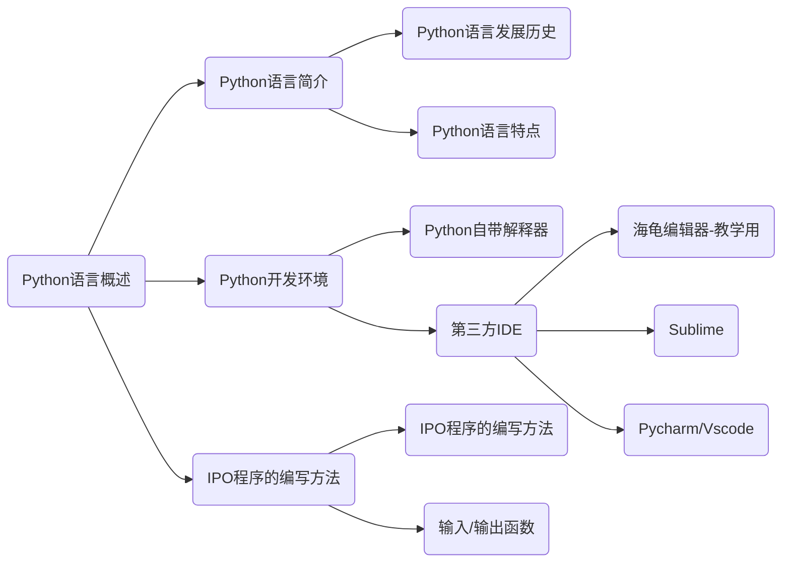

# NCT编程能力等级划分

## 图形化编程能力等级划分

|     等 级      |    能 力 要 求     |                      等 级 划 分 说 明                       |
| :------------: | :----------------------: | :-----------------------:|
| 图形化编程一级 | 基本图形化编程能力 | 掌握图形化编程平台的使用，应用顺序、循环、选择三种基本的程序结构，编写结构良好的简单程序，解决简单问题 |
| 图形化编程二级 |  初步程序设计能力  | 掌握更多编程知识和技能，能干根据实际问题的需求设计和编写程序，解决复杂问题，创作编程作品，具备一定的计算思维 |
| 图形化编程三级 | 算法设计与应用能力 | 综合应用所学的编程知识和技能，合理地选择数据结构和算法，设计和编写程序以解决实际问题，完成复杂项目，具备良好的计算思维和设计思维 |

## Python编程能力等级划分

|   等 级    | 能 力 要 求  |                 等 级 划 分 说 明                  |
| :--------: | :----------: | :------------------------------------------------: |
| Python一级 | 基本编程思维 |         具备以编程逻辑为目标的基本编程能力         |
| Python二级 | 模块编程思维 | 具备以函数、模块和类等形式抽象为目标的基本编程能力 |
| Python三级 | 基本数据思维 | 具备以数据理解、表达和简单运算为目标的基本编程能力 |
| Python四级 | 基本算法思维 |   具备以常见、常用且典型算法为目标的基本编程能力   |


#专题1 Python 语言概述

## 考查方向


```mermaid
graph LR
A(Python语言概述)-->B1(Python语言简介)
A(Python语言概述)-->B2(Python开发环境)
A(Python语言概述)-->B3(IPO程序的编写方法)
B1-->C1(Python语言发展历史)
B1-->C2(Python语言特点)
B2-->D1(Python自带解释器)
B2-->D2(第三方IDE)
B3-->E1(IPO程序的编写方法)
B3-->E2(输入/输出函数)
D2-->x(海龟编辑器-教学用)
D2-->y(Sublime)
D2-->z(Pycharm/Vscode)
```


## 知识点清单

### 知识点1 Python语言简介

1. Python 语言发展历史

   ​		Python语言的创始人是吉多范罗苏姆。1989年圣诞节期间，吉多在阿姆斯特丹利用圣诞节的休假时间，决心开发一个新的脚本解释程序Python，以作为ABC语言的一种继承。

2. Python 语言特点

   ​		Python语言的设计哲学是“优雅”、“明确”、“简单”。Python语言具有简单、开发速度快和容易学习等特点。

### 知识点2 Python开发环境

1. Python自带解释器

   ​		Python是解释型编程语言，安装程序自带IDLE，可使用交互与文本两种模式

2. 第三方IDE

   ​		教学用简易编辑器：海龟编辑器，登录NCT官网在线使用

   ​		轻量级个人编辑器：Sublime,功能丰富体积小巧，使用多种语言简易开发

   ​		专业级复杂编辑器：Pychartm，Vscode，功能强大且复杂多用于企业与专业程序员

### 知识点3 IPO程序的编写方法

IPO程序的编写方法是每个程序都需要具备的模式，即输入数据、处理数据和输出数据。

I表示input，P表示process，O表示output

**请编写下面的一个小程序**：

要求从键盘输入两个数据，对这两个数据进行求和运算，显示输出求和的结果

~~~python
a=input("请输入第一个数据：")
b=input("请输入第二个数据：")
c=int(a)+int(b)
print(c)
~~~

**释义**：

- input()函数用于接收键盘输入，参数为字符串类型的提示性语句，参数为可选参数（可以省略）
- print()函数用于在控制台显示输出内容，输出的内容可以是字符串，数字或者变量
- int()函数用于将字符串类型的数字转换为数字类型的数字
- a，b，c为三个变量，分别用于存储两个输入的书局和求和的值

## 知识点探秘

<font color=blue>----></font>下列选项中不属于IPO程序编写方法的是（）

​		A. 输入数据	B. 删改数据	C. 处理数据	D. 输出数据

​		答案：<font color='white'>B</font>

## 巩固练习

1. 在控制台打印输出：hello world！
2. 从键盘输入两个数，计算它们的差值并在控制台输出显示结果。

------

<center><font color=blue>...End!...</font></center>

------

## 复习

一、编写一段代码，实现以下功能：

​		从键盘输入你的年龄，

​		如果年龄小于18岁，打印输出：未成年！

​		如果大于等于18岁，打印输出：已成年！

二、[极客战记](https://codecombat.163.com/#/)

# 专题2 Python 基础语法

## 考查方向

~~~mermaid
graph LR
A(Python基础语法)-->B1(标识符与保留字)-->C1(标识符)
B1-->C2(保留字)
A-->B2(注释)-->C3(单行注释)
B2-->C4(多行注释)
A-->B3(变量的命名和使用)-->C5(变量的命名)
B3-->C6(变量的赋值)
A-->B4(缩进)-->C7(单层缩进)
B4-->C8(多层缩进)
~~~


## 知识点清单

### 知识点1 标识符、保留字

1. **标识符**

   在Python中，需要为变量、函数等指定名字，这些名字就是标识符。

   标识符的命名规则：

   - 标识符可以由英文字母、数字和下划线组成，如aCat，_Cat，Cat_at2
   - 第一个字符必须为英文字母或下划线，不能以数字开头
   - 命名区分大小写，大小写不同所代表的标识符不同
   - 不能使用保留字作为标识符
   - 不能使用内置函数名作为标识符，如input，print等
   - 标识符中间不能出现空格

2. **保留字**

   保留字也叫关键字（keyword），是具有特殊功能的字符串。

   目前一共33个保留字：

   and	as	assert	break	class	continue	def	del	elif	else	except	finally	for	from	Flase	global	if	

   import	in	is	lambda	nonlocal	not	None	or	pass	raise	return	try	True	while	with	yield		

### 知识点2 注释

注释是在程序中加入的对代码的解释和说明。运行程序时，注释不被计算机执行。Python语言中，注释分为单行注释和多行注释。

1. **单行注释**

   单行注释以#开头，可以单独写一行，也可以写在代码后面

2. **多行注释**

   多行注释可以写成多个单行注释或以3引号（3个单引号或3个双引号）开头和结尾

==说明==：

- 同一个程序中注释格式尽量统一
- 注释多用于标注代码的作用或编程思路，也可用于临时调试用
- 复杂代码中一定要合理添加注释，以用于备忘备查或他人理解

### 知识点3 变量的命名和使用

1. **变量的命名**

   在Python语言中，创建变量时不需要为它指定数据类型，只要给一个标识符赋值就可以创建一个变量。

2. **变量的赋值**

   在Python语言中，赋值用 “=” 表示，表示将右侧的数值或结果赋给左侧的变量。这样的语句叫赋值语句

   - 书写格式

     ```javascript
     a = 999
     ```

   - 变量可以接受不同类型的数值，如字符型，数值型，其他变量，列表等等

     ~~~python
     a = 1.12
     t = 0
     t = a
     data = "hello，world！"
     li=[1,2,3,4]
     ~~~

   ==说明==：变量可以被多次赋值

### 知识点4 缩进

代码的缩进表示代码之间的包含和层次关系。可以使用键盘上Tab键实现，也可以使用4个空格实现，习惯使用Tab键。

缩进分为单层缩进和多层缩进

1. **单层缩进**

   单层缩进是指所编写的程序只包含一层缩进，注意观察以下代码：

   ~~~python
   a = int(input('请输入一个正整数：'))
   if a>3:
   	print('这是一个大于3的数')
       print('这个数是：'，a)
   else：
       print('a<=3')
   ~~~

   

2. **多层缩进**

   多层缩进表示代码的多层嵌套关系，程序结构可以互相嵌套，注意观察以下代码：

   ~~~python
   sex = input('请输入你的性别：')
   age = int(input('请输入你的年龄：'))
   if sex=='男':
       if age>=22:
           print('可以结婚')
       else：
       	print('不可以结婚')
   if sex=='女':
       if age>=20:
           print('可以结婚')
       else：
       	print('不可以结婚')
   ~~~

   ==说明==：Python语言对语法的要求非常严格，未正确缩进会破坏程序结构，致使程序报错而无法正确运行

## 知识点探秘

<font color=blue>----></font>下列选项中不属于Python语言保留字的是（）

​		A. False	B. if	C. static	D. for

​		答案：<font color='white'>C</font>

<font color=blue>----></font>下列选项中属于Python语言保留字的是（）

​		A. Today	B. geomerty	C. while	D. Physics

​		答案：<font color='white'>C</font>

<font color=blue>----></font>在Python语言中，进行注释的方法不包括（）

​		A. #这是注释，使用“#”号

​		B. ”“”

​			这是注释，使用3个双引号

​			“”“

​		C.%

​			这是注释，使用百分号

​			%

​		C. ‘’‘

​			这是注释，使用3个单引号

​			’‘’

​		答案：<font color='white'>C</font>

<font color=blue>----></font>以下选项中不符合Python语言变量命名规则的是（）

​		A. xyz	B. 5_five	C. _a123	D. Cat

​		答案：<font color='white'>B</font>

## 巩固练习

1. 按要求写程序
   - 创建两个变量x和y
   - 将3.14和5.20分别赋值给x、y
   - 创建变量\_SUM,并将x+y的值赋给\_SUM
   - 打印_SUM

------

<center><font color=blue>...End!...</font></center>

------

## 复习

一、自编一个带有多层缩进的小程序

# 专题3 运算符和数据类型

## 考查方向

~~~mermaid
graph LR
A(运算符和数据类型)-->B(运算符)
A-->C(数据类型)
A-->D(布尔类型)
A-->E(运算符的优先级)
B-->X1(算术运算符)
B-->X2(赋值运算符)
B-->X3(关系运算符)
C-->Y1(整型int数据类型)
C-->Y2(浮点型float数据类型)
D-->Z1(布尔bool类型)
D-->Z2(逻辑运算)
~~~


## 知识点清单

### 知识点1 运算符

1. **算术运算符**

   算术运算符是指对数值进行加、减、乘、除等算术运算的符号

   | 运算符 |               描述               |
   | :----: | :------------------------------: |
   |   +    |            两个数相加            |
   |   -    |          负数或两数相减          |
   |   *    |             两数相乘             |
   |   /    |             两数相除             |
   |   %    |      取模，求两数相除的余数      |
   |   **   |              幂运算              |
   |   //   | 整除，求两数相除的商（向下取整） |

   随堂练习：

   - 要求用两个整数演示各种运算符的运算
   - 试一试除数是0的情况

   ==说明==：pow(x,y)函数也可以进行幂运算，x表示底数，y表示幂指数

2. **赋值运算符**

   赋值运算符用 “=” 表示，是将符号右侧的内容赋值给左侧的变量

   | 运算符 |    =     |    +=    |    -=    |    *=    |    /=    |    %=    |   //=    |   **=    |
   | :----: | :------: | :------: | :------: | :------: | :------: | :------: | :------: | :------: |
   |  描述  | 简单赋值 | 加法赋值 | 减法赋值 | 乘法赋值 | 除法赋值 | 取模赋值 | 取整赋值 | 求幂赋值 |

3. **关系运算符**

   关系运算符也称比较运算符，如果比较结果为真，返回True；如果为假，返回Flase。多用于条件语句中的比较判断

   | 运算符 |   描述 举例    |
   | :----: | :------------: |
   |   ==   |   相等  a==b   |
   |  ！=   |   不等  a!=b   |
   |   >    |   大于  a>b    |
   |   <    |   小于  a<b    |
   |   >=   | 大于等于  a>=b |
   |   <=   | 小于等于  a<=b |

   注意比较区分“=”与“==”的区别

   随堂练习：

   - 打印输出3！=5的值
   - 如果6**2小于37，控制台打印输出“真的”，否则输出“假的”

### 知识点2 数据类型

1. **整型（int）数据类型**
   - 整型是用来表示整数的数据类型，没有小数部分，包含正整数，负整数和0
   - 整型数据类型包括二进制整数、八进制整数、十进制整数、和十六进制整数
     - 二进制：由0和1构成，逢二进一，表示方法为以0b或0B开头；如0b111转成十进制为7
     - 八进制：由0~7组成，逢八进一，表示方法为以0o或0O开头；如0o122转成十进制为82
     - 十进制：由0~9组成，逢十进一
     - 十六进制：由0~9，A-F组成，逢十六进一，表示方法为以0x或0X开头；如0x1A转成十进制为26
   
   随堂练习：
   
   ~~~python
   print(0b111)
   print(0o122)
   print(12)
   print(0x1A)
   ~~~
   
   ==说明==：int(x)函数可以将浮点数x或字符串型整数x转化为整型
   
2. **浮点数（float）数据类型**

   浮点型数据由整数与小数两部分构成，如3.14，-6.68

   浮点型可以用科学计数法表示，如2.5e2，-6.66e5

   随堂练习：

   ~~~python
   print(-66.68)
   print(-66.88e5)
   ~~~

   ==说明==：round(x[,n])函数可以对浮点数x进行四舍五入，并保留n位小数

   例如：

   ~~~python
   print(round(3.1415926,2))
   ~~~
   
   ==说明==：float(x)函数可以将整数x或字符串型数字x转化为浮点型

### 知识点3 布尔类型

1. **波尔类型**

   布尔类型只有真值和价值，真值用True表示，假值用False表示

   另外波尔值也可以表示为数值，True用1表示，False用0表示

   随堂练习：

   ~~~python
   a = 10
   b = 11
   print(a>b)
   print(a<b)
   ~~~

2. 逻辑运算

   逻辑运算是对真和假两种波尔值进行运算，运行后的结果仍为一个波尔值
   
   | 运算符 | 逻辑表达式 | 描述 |           结果           |
   | :----: | :--------: | :--: | :----------------------: |
   |  and   |  x and y   |  与  | x和y同时为真，结果才为真 |
   |   or   |   x or y   |  或  | x和y一个为真，结果即为真 |
   |  not   |   not x    |  非  |       对x的值取反        |
   
   示例代码：
   
   ~~~python
   a = 10
   b = 5
   print(a<b or a>b)
   print(a<b and a>b)
   print(not(a!=b))
   ~~~

### 知识点4 运算符的优先级

运算符的优先级是指哪一个运算符先计算，哪一个运算符后计算

规则是：先高级后低级；同级从左到右执行；括号内的优先执行

| 运算符优先级排列表（由高到底） |
| :----------------------------: |

|        运算符        |        描述        |
| :------------------: | :----------------: |
|          **          |       幂运算       |
|     *，/，%，//      | 乘、除、取模、取整 |
|         +，-         |        加减        |
| <，<=，>，>=，==，!= |      关系运算      |
|         not          |       非运算       |
|         and          |       与运算       |
|          or          |       或运算       |

## 知识点探秘

<font color=blue>----></font>运行下列代码，输出结果是（）

~~~python
print(124 + 3.0)
~~~

A.  127	B.  127.0	C.  154	D.  程序有误，输入错误

答案：<font color='white'>B</font>

<font color=blue>----></font>运行下列代码，输入为5.1，则输出结果是（）

~~~python
a=input('请输入一个整数')
a=int(a)+5
print(a)
~~~

A.  报错	B.  5	C.  10	D.  10.0

答案：<font color='white'>A</font>

<font color=blue>----></font>运行下列代码，x的值为（）

~~~python
x=3
x*=6
print(x)
~~~

A.  3	B.  6	C.  9	D.  18

答案：<font color='white'>D</font>

<font color=blue>----></font>下列代码输出结果为（）

~~~python
print(3==5 or 4>2)
print(5>=5 and 6>5)
~~~

A.  True  False	B.  True  True	C.  False  False	D.  False True

答案：<font color='white'>B</font>

<font color=blue>----></font>运行下列代码，输出结果是（）

~~~python
print('a'<='b')
~~~

A.  None	B.  True	C.  False	D.  以上答案都是错误的

答案：<font color='white'>B</font>

<font color=blue>----></font>运行下列代码，输出结果是（）

~~~python
print(100-25*3%4)
~~~

A.  1	B.  97	C.  25	D.  0

答案：<font color='white'>B</font>

## 巩固练习

1. 按要求写程序
   - 输入任意数字，使程序能判断其为正数，负数或者零
   - 如输入3.1415926，输出为正数，输入-2.333，输出为负数，输入0，输出为零

------

<center><font color=blue>...End!...</font></center>

------

## 复习

1. 用**pgzero**库，制作碰到边缘就反弹的反弹球

   主要任务：

   - 学习python库的安装

     国内清华镜像：pip install -i https://pypi.tuna.tsinghua.edu.cn/simple pgzero

   - 学习pgzero库的基本框架

     - 创建目录结构

     ```text
     ├── images/
     │   └── ball.png
     └── ball_game.py
     ```

     - 创建最小程序框架

     ~~~python
     import pgzrun
     WIDTH = 600
     HEIGHT = 400 
     ball = Actor('ball')
     ball.pos = 100,100
     def draw():
         screen.fill((255,255,255))
         ball.draw()
     def update():
         pass
     pgzrun.go()
     ~~~

     

   - 理解游戏编程的逻辑（程序循环，碰撞检测）

     - 游戏窗口坐标系

       

     - 角色的常用属性（方块属性）
     
       x，y，pos，left，right，top，bottom
     
     - 创建逻辑结构
   
   ~~~python
   	ball.speedx,ball.speedy=2,1
       def update():
       ball.x+=ball.dx
       ball.y+=ball.dy
       if ball.right>=WIDTH or ball.left<=0:
       	ball.dx=-ball.dx
       if ball.top<=0 or ball.bottom>=HEIGHT:
       	ball.dy=-ball.dy
   ~~~
   
   

# 专题4 字符串类型

## 考查方向

~~~mermaid
graph LR
Y1(字符串表示方式)-->A(字符串类型)-->X1(字符串常用方法和函数)
Y2(字符串运算)-->A(字符串类型)-->X2(字符串格式化)
X1-->a("count()方法")
X1-->b("find()方法")
X1-->c("join()方法")
X1-->d("splite()方法")
X1-->e("len()函数")
X2-->f(格式化字符串和整数)
X2-->g(格式化浮点数)
h(单/双引号字符串)-->Y1
i(三引号字符串)-->Y1
j(转义字符)-->Y1
k(字符串加法)-->Y2
l(字符串乘法)-->Y2
m(字符串索引)-->Y2
n(字符串切片)-->Y2
o(成员运算符)-->Y2
~~~


## 知识点清单

### 知识点1 字符串表示方法

1. 单引号/双引号字符串

   在**Python**语言中，一般使用一对单引号或一对双引号表示字符串

   ~~~python
   s1 = 'hello world'
   s2 = "hello python"
   print(s1)
   print(s2)
   ~~~

2. 三引号字符串

   使用三引号往往表示多行字符串，可以使用三单引号或三双引号

   ~~~python
   s1 = '''hello world!
   hello world!'''
   s2 = """hello python!
   hello python!"""
   print(s1)
   print(s2)
   ~~~

3. 转义字符

   在python语言中，将具有特殊含义的字符（如引号，反斜杠）或无法被键盘录入的字符（如换行，回车）以反斜杠”\\"开头的字符序列进行表示，这种字符序列叫转义字符。

   - 常用的转义字符

     | 转义字符 |  含义  |
     | :------: | :----: |
     |   \\'    | 单引号 |
     |   \\"    | 双引号 |
     |    \\    | 反斜杠 |
     |    \r    | 回车符 |
     |    \n    | 换行符 |

     

   - 转义字符示例

     ~~~python
     s1="I'm Andy"
     s2='I\'m Lily'
     s3="你好！\nPython！"
     print(s1)
     print(s2)
     print(s3)
     # print('\')
     print('\\')
     ~~~

### 知识点2 字符串运算

| 运算符 |            描述            |
| :----: | :------------------------: |
|   +    |         字符串连接         |
|   *    |       字符串重复输出       |
|   []   | 通过索引获取字符串中的字符 |
|  [:]   |  字符串截取，左闭右开原则  |
|   in   |    成员运算符，表示包含    |
| not in |   成员运算符，表示不包含   |

1. 字符串加法

   用于将2个以上字符串连接成一个字符串，例如：

   ~~~python
   a,b='rain','bow'
   print(a+b)
   ~~~

2. 字符串乘法

   字符串与**整数**相乘，输出一个原字符串重复组成的字符串(如果与<=0的整数相乘，将得到一个空字符串)

   ~~~python
   s='he'
   print(s*2)
   ~~~

3. 字符串索引

   - 字符串索引是指字符串中每个字符对应的位置编号

   - 通过索引可以访问字符串中的单个字符

   - 索引分正向索引和反向索引

   - 正向索引从0开始，反向索引从-1开始，且索引值必须为整数

     例如, 字符串"PYTHON"其索引值如下表：

     |  索 引   |  P   |  Y   |  T   |  H   |  O   |  N   |
     | :------: | :--: | :--: | :--: | :--: | :--: | :--: |
     | 正向索引 |  0   |  1   |  2   |  3   |  4   |  5   |
     | 反向索引 |  -6  |  -5  |  -4  |  -3  |  -2  |  -1  |

     获取索引值的方法：str[index]

     ~~~python
     s = "hello python"
     print(s[7])
     print(s[-3])
     ~~~

4. 字符串切片

   切片是通过索引的方法截取指定区间内的子字符串

   字符串切片的格式：str[start : end : step],其中start，end，step可省略

   切片遵循左闭右开原则

   ~~~python
   s="hello world"
   print(s[2:5])
   print(s[3:-1])
   print(s[1:9:2])
   print(s[:5])
   print(s[3:])
   print([:])
   ~~~

5. 成员运算

   ​        成员运算符用于检测包含与不包含关系，一般用于分支结构或循环结构的条件判断，用in或not in进行判断，返回结果为布尔值True或Flase  
   
   ~~~python
   s = "hello python"
   print("h" in s)
   print("h" not in s)
   print("ab" not in s)
   ~~~

### 知识点3 字符串常用方法和常用函数

| 方法或函数 |                             描述                             |
| :--------: | :----------------------------------------------------------: |
|  count( )  |                统计字符串在字符串中出现的次数                |
|  find( )   |                查找字符串在字符串中的索引位置                |
|  join( )   |       将序列中的元素以指定的字符连接生成一个新的字符串       |
|  split( )  | 指定分隔字符串对字符串进行拆分，并将拆分的结果以列表的形式返回 |
|   len( )   |                       统计字符串的长度                       |

1. count( )方法

   count( )方法用于统计子字符串在字符串指定的搜索范围内出现的次数

   使用格式：str.count(sub, start, end)

   参数说明如下：

   sub：子字符串

   start：指定查找范围的起始索引（可省略）

   end：指定查找范围的结束索引（可省略）

   ~~~python
   s = 'hello python'
   print(s.count('o'))
   print(s.count('o',0,5))
   ~~~

2. find( )方法

   ​		find( )方法用于检查子字符串在字符串中的位置，如果子字符串在指定的搜索范围内被找到，则返回找到的最小索引值，否则返回-1

   使用格式：str.find(sub, start, end)

   参数说明如下：

   sub：子字符串

   start：指定查找范围的起始索引（可省略）

   end：指定查找范围的结束索引（可省略）

   ~~~python
   s = 'hello python'
   print(s.find('o'))
   print(s.find('p',0,5))
   ~~~

3. join( )方法

### 知识点4 字符串格式化

## 知识点探秘

## 巩固练习

---->打印输出下面的话：

​		python中使用“\\”对字符进行转义，

​		例如：换行使用转义字符“\\n”表示。

答案：见下面隐藏代码块

<div style="color:white";>
print('python中使用"\\"对字符进行转义，\n例如：换行使用转义字符"\\n"表示。')
</div>


------

<center><font color=blue>...End!...</font></center>

------

## 复习

1. 利用**socket**库，制作简易udp聊天收发程序

# 专题5 列表

## 考查方向

## 知识点清单

### 知识点1 列表的创建和删除

### 知识点2 列表的索引和访问

### 知识点3 列表元素的添加

### 知识点4 列表元素的移除

### 知识点5 列表元素的修改

### 知识点6 列表的统计

### 知识点7 列表的排序

## 知识点探秘

## 巩固练习

------

<center><font color=blue>...End!...</font></center>

------

## 复习

1. 编写三段程序，分别实现l列表的count()方法以及sum()，max()函数功能
2. 编写一段程序，将列表  [3,1,7,2,4,8,5]，用冒泡法按照从小到大排序

# 专题6 类型转换

## 考查方向

~~~mermaid
graph LR
A(类型转换)-->B("int( )函数：转换为整数")
A-->C("float( )函数：转换为浮点数")
A-->D("str( )函数：转换为字符串")
A-->E("list( )函数：转换为列表")
~~~


## 知识点清单

| **函数** |          **描述**           |
| :------: | :-------------------------: |
|  int(x)  |         将x转为整数         |
| float(x) |        将x转为浮点数        |
|  str(x)  |        将x转为字符串        |
| list(x)  | 将可迭代的数据x转为一个列表 |

备注：print函数是能够进行格式化打印的，可以将整数打印成小数，例如：

~~~python
a = 3
print("%.2f"%a)
~~~

其中“%f”表示打印成浮点数默认保留6位小数，“%.2f”表示打印成保留2位小数的浮点数，%a代表要打印成浮点数的变量

## 知识点探秘

## 巩固练习

<font color=blue>----></font>运行下列代码，输出结果是（）

~~~python
a = 6.42
b = 'python'
print(int(a),float(b))
~~~

A.  6 ['p','y','t','h','o','n']	B.  6.42  ['p','y','t','h','o','n']	C.  6 "python"	D.  程序报错

答案：<font color='white'>D</font>

<font color=blue>----></font>表达式list(range(1,5))的值为（）

A.  [1,2,3,4]	B.   [1,2,3,4,5]	C.   [1,4]	D.   [1,5]

答案：<font color='white'>A</font>

<font color=blue>----></font>编写一段代码：要求实现键盘输入5打印输出11.0，键盘输入10打印输出21.0

------

<center><font color=blue>...End!...</font></center>

------

## 复习

1. 编写一段程序：将列表['a','b','c']转换成字符串‘abc’

   答案：见下面隐藏代码块

   <div style="color:white";>
   list1 = ['a','b','c']
   str1 = ''.join(list1)
   print(str1)
   或者
   list1 = ['a','b','c']
   str1=''
   for i in list1:
       str1+=i
   print(str1)
   </div>
   
   
2. 编写一段程序：不使用list( )函数，将字符串‘abc’转换成列表['a','b','c']

   答案：见下面隐藏代码块

   <div style="color:white";>
   str1 = 'abc'
   list1=[i for i in str1]
   print(list1)
   </div>


# 专题7 分支结构

## 考查方向

~~~mermaid
graph LR
A(分支结构)-->B(分支结构的形式)-->L(单分支结构)
A-->C(分支结构的嵌套)
B-->M(二分支结构)
B-->N(多分支结构)
~~~


## 知识点清单

### 知识点1 分支结构的形式

1. 单分支结构

   ~~~python
   if <判断条件>:
       <语句块>
   ~~~

   例：打印输出列表[1，3，2，5，6，8，10]中为偶数的元素

2. 二分支结构

   ~~~python
   if <判断条件>:
       <语句块a>
   else：
   	<语句块b>
   ~~~

   例：简单验证用户输入的用户名和密码是否正确。如果键盘输入的用户名为“admin”，密码为“123”，则输出验证成功；否则输出验证失败。

3. 多分支结构

   ~~~python
   if <判断条件1>:
       <语句块1>
   elif <判断条件2>：
   	<语句块2>
   elif <判断条件3>：
   	<语句块3>
   ``````
   else：
   	<语句块n>
   ~~~

   例：将列表[3，2，-10，8，199，-121，0，333，9999，1，-0.5]按照以下要求处理
   
   - 将大于100的数值存放在lis1列表中
   - 将小于100但大于1的数值存放在lis2列表中
   - 将介于-1和1之间的数值存放在lis3列表中（包含-1和1）
   - 将小于-1的数值存放在lis4列表中，并输出元素的和

### 知识点2 分支结构的嵌套

1. 分支结构嵌套（条件判断中嵌套条件判断，例如以下结构就是常见的嵌套样式）

   ~~~python
   if <判断条件1>:
       <语句块1>
       if <判断条件2>:
       	<语句块2>
       else：
       	<语句块3>
   else：
   	<语句块4>
   ~~~

   例：要求对学生的成绩进行评定，低于60分者为不及格，高于或等于60分为及格；
   
   ​		60分以上分三档，60~79为合格，80~89为良好，90分及以上为优秀；

## 知识点探秘

<font color=blue>----></font>运行以下猜年龄程序，输入28，最终输出的结果是（）

~~~python
print("请猜一下我多大了？")
age = int(input("请输入你猜测的年龄"))
if age<27:
    print("你猜小了")
elif age==27：
	print("恭喜你，猜对了")
else：
	print("你猜大了")
~~~

A. 请猜一下我多大了	B.   你猜小了	C.   恭喜你，猜对了	D.  你猜大了

答案：<font color='white'>D</font>

<font color=blue>----></font>运行下列代码，分别输入3,6,7，输出的结果是（）

~~~python
a=int(input('请输入三角形a的边长'))
b=int(input('请输入三角形b的边长'))
c=int(input('请输入三角形c的边长'))
if (a+b>c)&(a+c>b)&(b+c>a):
    l=a+b+c
    print("三角形的周长为："+str(l))
else:
    print("不是三角形")
~~~

A. 没有任何输出	B.   16	C. 三角形的周长为：16  	D.  不是三角形

答案：<font color='white'>C</font>

<font color=blue>----></font>敲七游戏中，从某个数字开始顺序数数，数到的数字包含7或是7的倍数时要拍手，违反规则要惩罚。请在___填写以下代码（）

~~~python
n=int(input("请说出一个数："))
if n___7==0 or "7"___str(n):
    print("拍手")
~~~

A. / , in	B.    / , not in	C.  % , in  	D. % , not in 

答案：<font color='white'>C</font>

## 巩固练习------

1. 我国《婚姻法》规定，男性22岁为合法结婚年龄，女性20岁为合法结婚年龄，请编写一个程序判断一个人是否达到合法结婚年龄。如输入：女，22，则输出：已达到法定结婚年龄；输入：男，20，则输出：未达到法定结婚年龄

2. 编写程序，要求判断输入的x，y坐标在坐标系里的位置（原点，x轴，y轴，第一象限，第二象限，第三象限，第四象限）

3. 编写程序完成华氏温度C和摄氏温度F的转换（公式F=C×1.8+32） 

   例如    输入：30C或30c ,  输出：86.00F    

   ​			输入：60F或60f ,  输出： 15.56C   

   ​			输入：30 ,    输出： 输入格式错误
   
   答案：见下面隐藏代码块
   
   <div style="color:white";>
   tep=input("请输入温度值，例如50f或30C：")
   if tep[-1] in ['F','f']:
       a=(float(tep[0:-1])-32)/1.8
       print("%.2fC"%a)
   elif tep[-1] in ['C','c']:
       b=float(tep[0:-1])*1.8+32
       print("%.2fF"%b)
   else:
       print("输入格式错误")
   </div>
   

<center><font color=blue>...End!...</font></center>


------

## 复习

1. 用**PySimpleGUI**库制作简单的登录界面，登录成功后(用户名：admin，密码：123)访问百度页面

   主要任务

   - 学习PySimpleGUI创建程序的基本框架

   ~~~python
   import PySimpleGUI as sg
   
   layout=[[sg.Text('请输入3'),sg.Input()],
           [sg.Button('ok')]]
   window=sg.Window('window_title',layout)
   
   while True:
       event,values=window.read()
       if event==sg.WIN_CLOSED:
           break   
       # print(event,values)
       # if event=='ok'and values[0]=='3':
       #     sg.popup('输入正确')
       # else:
       #     sg.popup('输入错误')
   window.close()
   ~~~

   - 手绘登录图形界面

     

   - 编写界面代码

     - 书写框架

     ~~~python
     import PySimpleGUI as sg
     
     layout=[[sg.Text('账号'),sg.Input(key='user')],
             [sg.Text('密码'),sg.Input(key='password')],
             [sg.Button('提交',key='login')]]
     window=sg.Window('登录',layout)
     
     while True:
         event,values=window.read()
         if event==sg.WIN_CLOSED:
             break 
         #此处编写逻辑代码
         
     window.close()
     ~~~

     ==说明==：key 用来标识控件,用于接收事件或者获取用户输入。

     - 美化界面

     ~~~python
     # sg.theme_previewer() 查看主题
     sg.theme('Light Blue7')
     layout=[[sg.Text('账号',size=(6,1), font=("雅黑", 15), text_color='blue'),sg.Input(key='user',size=(16,1))],
             [sg.Text('密码',size=(6,1), font=("雅黑", 15), text_color='blue'),sg.Input(key='password',size=(16,1))],
             [sg.Text(' '*15),sg.Button('提交',key='login',font=("雅黑", 15))]]
     ~~~

     

   - 编写逻辑代码
   
     ~~~python
     if event == 'login':  
         if values['user'] == 'admin' and values['password'] == '123':
             sg.popup('登录成功!') 
             #此处编写访问百度代码
          else:
             sg.popup('登录失败!', text_color='red')            
     ~~~
   
     ~~~python
     #访问百度代码
     import webbrowser #在程序开头引入
     webbrowser.open('https://www.baidu.com/')  
     ~~~
     
     

# 专题8 循环结构

## 考查方向

## 知识点清单

### 知识点1 for 循环语句

### 知识点2 while 循环语句

### 知识点3 break 语句和 continue语句

### 知识点4 循环结构的嵌套

### 知识点5 循环结构和分支结构的组合

## 知识点探秘

## 巩固练习

------

<center><font color=blue>...End!...</font></center>

------

## 复习
# 专题9 异常处理

## 考查方向

## 知识点清单

### 知识点1 try...except 语句

### 知识点2 try...except...else 语句

### 知识点3 try...except...finally 语句

## 知识点探秘

## 巩固练习

------

<center><font color=blue>...End!...</font></center>

------

## 复习

运用pgzero实现小鸟跳一跳

# 专题10 Python 标准库入门

## 考查方向

## 知识点清单

### 知识点1 turtle 库的函数及使用

### 知识点2 turtle库的综合应用

## 知识点探秘

## 巩固练习

------

<center><font color=blue>...End!...</font></center>

------

## 复习

结合socket库与PySimpleGUI库

# 附录

## 附录一	青少年编程能力等级标准：第一部分

## 附录二	标准范围的Python标准函数列表

## 附录三	真题演练及参考答案